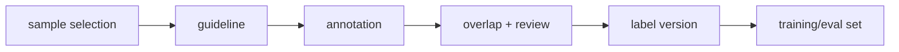

# 데이터 레이블링 (Data Labeling)

- Level: Intermediate
- Prerequisites: [AI/Machine-Learning/Bias-Variance.md](../Machine-Learning/Bias-Variance.md), [AI/MLOps/Data-Validation.md](Data-Validation.md)
- Status: Draft
- Reviewed-by: -
- Depth: Deep-dive (자기완결)

---

## 개념 (Concept)

데이터 레이블링은 학습·평가에 사용할 target이나 annotation을 수집하고 품질을 관리하는 과정이다. Label guideline, annotator agreement, sampling strategy, audit, privacy, versioning이 함께 필요하다.

## 직관 (Intuition)

레이블은 정답지처럼 보이지만 실제로는 사람과 절차가 만든 데이터다. 기준이 흐리면 모델은 기준의 모호함까지 배운다.

## 이론 (Theory)

좋은 labeling system은 명확한 taxonomy, edge case 규칙, gold sample, overlap labeling, disagreement resolution을 갖는다. Classification은 class balance와 ambiguity, detection·segmentation은 위치 정밀도, ranking·preference data는 비교 조건과 annotator bias가 중요하다.

Inter-annotator agreement는 품질 신호지만, 높은 합의가 반드시 올바른 label을 뜻하지는 않는다. Label noise는 irreducible error처럼 작동할 수 있고, systematic bias는 특정 segment 성능을 무너뜨린다.



### Guideline이 정답을 만든다

레이블링 기준서는 class 정의뿐 아니라 경계 사례, 제외 조건, 예시, 금지된 추론, 개인정보 처리, 불확실할 때의 선택지를 포함해야 한다. guideline이 바뀌면 같은 sample도 다른 label을 가질 수 있으므로 guideline version은 label version의 일부다.

### 품질 측정

| 품질 신호 | 의미 | 한계 |
| --- | --- | --- |
| Agreement | annotator 간 일치도 | 모두 같은 편향을 가질 수 있음 |
| Gold accuracy | 정답 샘플 정확도 | gold set 품질에 의존 |
| Review overturn rate | 검토에서 뒤집힌 비율 | reviewer 기준 편향 |
| Segment error | 특정 집단의 오류 | segment 정의 필요 |

합의가 낮은 샘플은 버릴 대상이 아니라 문제 정의가 모호하거나 모델이 어려워할 영역이라는 신호일 수 있다.

### Sampling 전략

무작위 표본은 전체 분포를 대표하지만 희귀 실패를 놓치기 쉽다. Active learning은 불확실한 샘플을 우선 수집해 효율적이지만 모델의 현재 편향에 끌려갈 수 있다. 운영 데이터에서는 random, stratified, high-uncertainty, high-impact segment를 섞는 것이 안전하다.

## 구현 (Implementation)

```python
label_task = {
    "sample_id": "img-001",
    "guideline_version": "v3",
    "labels": ["cat"],
    "annotators": ["a1", "a7"],
    "review_status": "resolved",
}
```

Guideline version과 label version을 dataset version에 포함해 학습 결과를 재현할 수 있게 한다.

```python
def label_version(guideline_version, batch_id, review_round):
    return f"{guideline_version}:{batch_id}:r{review_round}"
```

## 복잡도 (Complexity)

비용은 sample 수, annotator overlap, task 난이도, review 비율에 비례한다. Active learning은 불확실하거나 대표적인 sample을 우선 라벨링해 비용을 줄일 수 있지만 sampling bias를 관리해야 한다.

## 응용 (Applications)

- supervised learning dataset 구축
- evaluation set·benchmark 작성
- RLHF·preference data 수집
- data-centric model improvement

## 흔한 오해 (Common Misunderstandings)

- label 수가 많으면 항상 품질이 좋아지는 것은 아니다.
- annotator 합의가 낮은 sample을 모두 버리면 어려운 사례를 잃을 수 있다.
- test set label을 계속 고치면 과거 모델 비교가 어려워진다.
- instruction이 짧으면 빠르지만 기준이 제각각 될 가능성이 커진다.

## TMI

- 불일치 sample은 모델 개선보다 문제 정의 개선에 더 큰 힌트를 준다.
- Label audit은 무작위 표본과 고위험 segment 표본을 섞는 편이 좋다.
- "기타" class는 편하지만 너무 넓어지면 모델 해석이 흐려진다.

## 연습 / 확인 문제 (Exercises)

- 특정 분류 문제의 labeling guideline 목차를 작성하라.
- annotator disagreement 처리 정책을 설계하라.
- label version 변경이 기존 실험 비교에 미치는 영향을 설명하라.

## 이어서 읽기 (Reading Path)

- 이전: [데이터 검증](Data-Validation.md)
- 다음: [ML 파이프라인](ML-Pipeline.md), [모델 모니터링](Model-Monitoring.md)

## 참조 (References)

- [AI/Machine-Learning/Bias-Variance.md](../Machine-Learning/Bias-Variance.md)
- [Reference/Books.md](../../Reference/Books.md)
