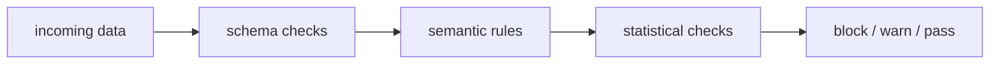

# 데이터 검증 (Data Validation)

- Level: Intermediate
- Prerequisites: [AI/MLOps/Data-Versioning.md](Data-Versioning.md), [Math/Probability-Statistics/Distributions.md](../../Math/Probability-Statistics/Distributions.md)
- Status: Draft
- Reviewed-by: -
- Depth: Deep-dive (자기완결)

---

## 개념 (Concept)

데이터 검증은 학습·추론에 들어가는 데이터가 schema, range, completeness, distribution, business rule을 만족하는지 확인하는 절차다. 모델 품질 문제를 학습 이후가 아니라 데이터 유입 지점에서 잡는 것이 목표다.

## 직관 (Intuition)

모델은 쓰레기통이 아니라 확대경에 가깝다. 잘못된 값, 빠진 컬럼, 달라진 단위가 들어가면 모델은 그 오류를 조용히 증폭해 예측으로 내보낸다.

## 이론 (Theory)

검증은 schema validation, semantic validation, statistical validation으로 나눌 수 있다. Schema는 column, type, nullability, allowed value를 검사한다. Semantic rule은 `start_time <= end_time` 같은 도메인 제약을 본다. Statistical validation은 분포, quantile, missing rate, cardinality, correlation 변화를 추적한다.

검증 기준은 data version과 함께 관리해야 한다. 새 feature나 source 변경이 있을 때 threshold를 code review 없이 임의로 낮추면 guardrail이 사라진다.



### 데이터 계약

데이터 검증은 consumer가 producer에게 기대하는 계약이다. 단순 column list보다 타입, 단위, 시간대, null 의미, freshness, primary key, 중복 허용 여부까지 포함해야 한다. 예를 들어 `amount`가 원화인지 달러인지, timestamp가 event time인지 ingestion time인지가 빠지면 schema가 맞아도 모델은 깨질 수 있다.

### Blocking과 warning

| 규칙 유형 | 처리 | 예 |
| --- | --- | --- |
| Blocking | pipeline 중단 | label null, 필수 컬럼 누락 |
| Warning | 알림 후 진행 | 특정 범주의 비율 변화 |
| Quarantine | 샘플 격리 | PII 의심 값, 비정상 payload |
| Manual review | owner 승인 필요 | 신규 category 대량 등장 |

모든 alert가 blocking이면 운영이 멈추고, 모든 alert가 warning이면 guardrail이 무력화된다. 규칙마다 owner, SLA, escalation 경로가 있어야 한다.

### 학습과 서빙의 검증 차이

학습 데이터 검증은 batch 전체의 분포와 label 품질을 볼 수 있지만, online request 검증은 latency budget 안에서 빠르게 판단해야 한다. serving에서는 schema/type/range 같은 cheap check를 앞단에 두고, drift나 segment 분석은 비동기 모니터링으로 넘긴다.

## 구현 (Implementation)

```python
rules = {
    "age": {"type": "int", "min": 0, "max": 120, "nullable": False},
    "country": {"type": "category", "max_unknown_rate": 0.02},
    "label": {"allowed": [0, 1], "nullable": False},
}

report = validate_batch(dataset, rules)
if report.has_blocking_errors():
    raise RuntimeError(report.summary())
```

Blocking rule과 warning rule을 구분해 pipeline 중단 조건을 명확히 둔다.

```python
def is_blocking(report):
    return any(issue["severity"] == "block" for issue in report["issues"])
```

## 복잡도 (Complexity)

단순 schema 검사는 행 수 `n`, column 수 `d`에 대해 대략 `O(nd)`다. Heavy distribution check와 segment별 검증은 feature×segment×window 수만큼 metric을 만든다.

## 응용 (Applications)

- training dataset quality gate
- online request validation
- upstream pipeline regression 탐지
- feature store publish gate

## 흔한 오해 (Common Misunderstandings)

- null check만으로 데이터 품질을 검증했다고 볼 수 없다.
- training data가 valid해도 serving data가 valid하다는 보장은 없다.
- threshold를 너무 엄격하게 잡으면 정상적인 계절성에도 pipeline이 멈춘다.
- alert를 만들었다고 owner와 대응 절차가 생기는 것은 아니다.

## TMI

- "unknown" 범주는 missing과 다른 의미일 수 있어 별도로 추적한다.
- 검증 실패 샘플을 안전하게 샘플링해 저장하면 debugging이 빨라진다.
- 데이터 계약은 producer와 consumer 사이의 API 문서처럼 다루는 편이 좋다.

## 연습 / 확인 문제 (Exercises)

- 학습 데이터셋에 필요한 blocking rule 5개를 설계하라.
- 경고로만 처리할 rule과 즉시 중단할 rule을 구분하라.
- distribution shift와 schema break를 구분하는 runbook을 작성하라.

## 이어서 읽기 (Reading Path)

- 이전: [데이터 버전 관리](Data-Versioning.md), [Feature Store](Feature-Store.md)
- 다음: [스트리밍 vs 배치](Streaming-vs-Batch.md), [데이터 드리프트](Data-Drift.md)
- 관련: [데이터 레이블링](Data-Labeling.md)

## 참조 (References)

- [Math/Probability-Statistics/Distributions.md](../../Math/Probability-Statistics/Distributions.md)
- [Reference/Books.md](../../Reference/Books.md)
