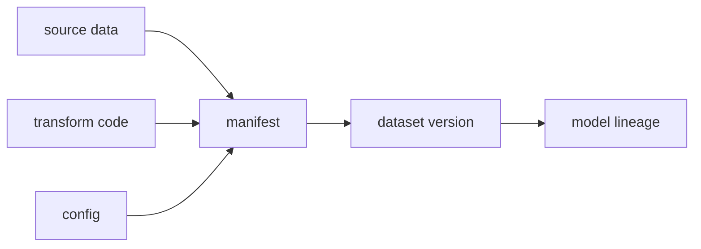

# 데이터 버전 관리 (Data Versioning)

- Level: Intermediate
- Prerequisites: [AI/MLOps/Reproducibility.md](Reproducibility.md), [Engineering/DevOps/Git/README.md](../../Engineering/DevOps/Git/README.md)
- Status: Draft
- Reviewed-by: -
- Depth: Deep-dive (자기완결)

---

## 개념 (Concept)

데이터 버전 관리는 dataset snapshot, schema, lineage, transformation과 접근 정책을 식별해 어떤 데이터가 model을 만들었는지 추적하는 실천이다.

## 직관 (Intuition)

파일 이름 `final_v2.csv` 대신 immutable ID와 생성 recipe를 남긴다. 원본이 같아도 filter·join·label correction이 다르면 다른 dataset version이다.

## 이론 (Theory)

Snapshot 방식은 재현이 쉽지만 저장이 크고, recipe+source 방식은 공간을 아끼지만 source immutability와 deterministic transform이 필요하다. Content hash, manifest, object storage URI, schema, partition, label policy를 함께 관리한다. 개인 삭제 요청과 retention은 immutability 정책에 예외 workflow가 필요하다.



### Snapshot과 recipe 방식

| 방식 | 장점 | 단점 |
| --- | --- | --- |
| Full snapshot | 재현이 단순함 | 저장 비용 큼 |
| Incremental snapshot | 변경분 저장 | compaction과 cleanup 필요 |
| Recipe + source | 공간 효율 | source와 transform 재현성 필요 |
| Time-travel table | 쿼리 편의 | table engine에 종속 |

대규모 조직에서는 원본은 time-travel 또는 immutable partition으로 관리하고, 학습용 dataset은 manifest로 row/partition/split을 고정하는 조합이 흔하다.

### Manifest에 들어갈 정보

dataset id만으로는 부족하다. source URI, partition 범위, schema version, transform commit, split seed, label guideline version, row count, checksum, 생성 시간, owner, 접근 등급을 함께 남겨야 한다. 특히 train/validation/test split은 dataset version의 일부로 고정해야 한다.

### 삭제 요청과 재현성

개인정보 삭제나 법적 retention 요구는 immutable snapshot과 충돌할 수 있다. 이 경우 원본 삭제, 파생 dataset 재생성, 영향받은 모델 식별, 재학습 필요성 판단까지 이어지는 예외 workflow가 필요하다. 재현성은 중요하지만 privacy 정책을 우회하는 근거가 될 수 없다.

## 구현 (Implementation)

```yaml
dataset_id: customer-churn-v7
sources:
  - uri: object://raw/events/2026-06/
transform_commit: abc123
schema_version: 4
row_count: 1250031
split_manifest: splits-v7.json
```

```python
required_manifest_fields = [
    "dataset_id", "sources", "schema_version", "transform_commit",
    "row_count", "split_manifest", "checksum",
]
```

## 복잡도 (Complexity)

Full copy는 version마다 `O(data size)` 공간, content-addressed chunking은 변경분 중심으로 저장할 수 있다. Hash 계산과 validation은 data size에 선형이다.

## 응용 (Applications)

- model lineage·rollback
- label correction audit
- train/serve consistency
- reproducible feature pipeline

## 흔한 오해 (Common Misunderstandings)

- Git에 대용량·민감 data를 직접 commit하면 안 된다.
- schema만 같다고 의미가 같은 dataset은 아니다.
- latest pointer만 저장하면 과거 재현이 어렵다.
- data versioning은 access control·privacy를 대체하지 않는다.

## TMI

- data diff는 row count뿐 아니라 distribution·label transition도 보여 줄 수 있다.
- time-travel table과 object manifest는 서로 다른 versioning 구현이다.
- feature definition version도 raw data version만큼 중요하다.

## 연습 / 확인 문제 (Exercises)

- dataset manifest schema를 설계하라.
- 삭제 요청과 재현성 요구를 함께 만족하는 정책을 논의하라.
- 두 version의 의미적 diff 항목을 정의하라.

## 이어서 읽기 (Reading Path)

- 이전: [재현 가능성](Reproducibility.md)
- 다음: [ML 파이프라인](ML-Pipeline.md)
- 관련: [Feature Store](Feature-Store.md)

## 참조 (References)

- [Engineering/DevOps/Git/README.md](../../Engineering/DevOps/Git/README.md)
- [Reference/Books.md](../../Reference/Books.md)
