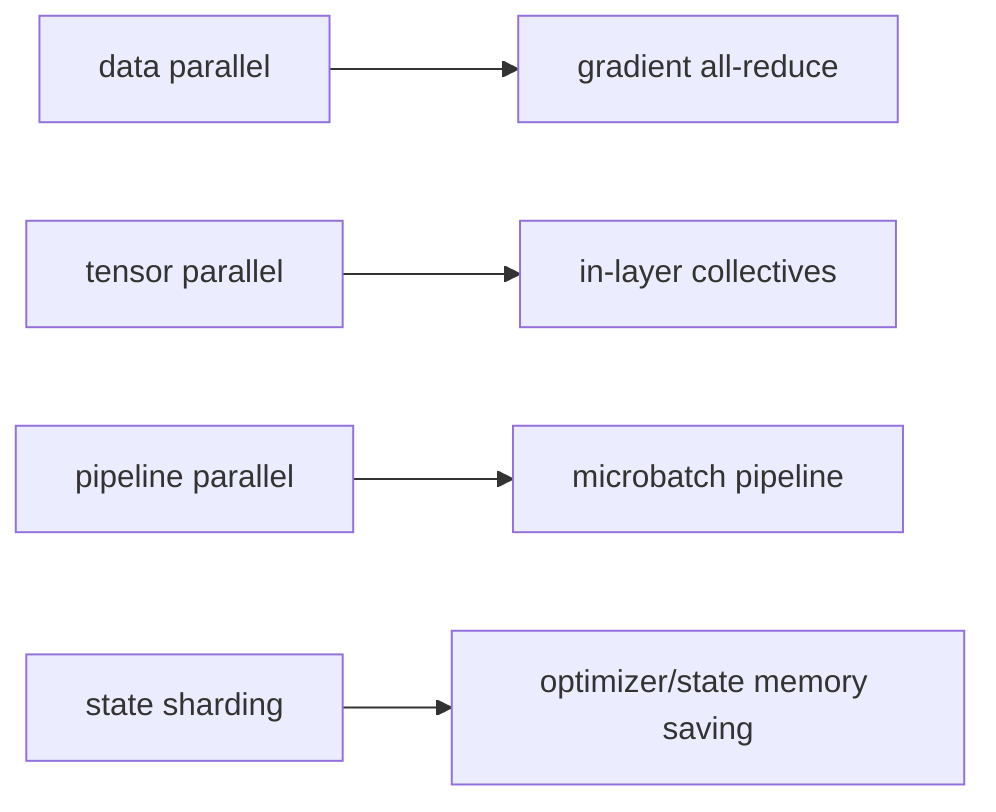

# 분산 학습 (Distributed Training)

- Level: Advanced
- Prerequisites: [Systems/Parallel-Computing/Parallel-Models.md](../../Systems/Parallel-Computing/Parallel-Models.md), [AI/Deep-Learning/Backpropagation.md](../Deep-Learning/Backpropagation.md)
- Status: Draft
- Reviewed-by: -
- Depth: Deep-dive (자기완결)

---

## 개념 (Concept)

분산 학습은 여러 accelerator·node에 data, model parameter, optimizer state, pipeline stage를 나눠 한 모델을 학습한다. Data parallelism은 model replica, model parallelism은 한 model 자체를 분할한다.

## 직관 (Intuition)

Data parallel은 같은 교재를 가진 학생들이 서로 다른 문제를 풀고 gradient를 합친다. Model parallel은 너무 큰 교재의 장을 나눠 순서대로 처리한다.

## 이론 (Theory)

Synchronous data parallel은 각 worker gradient를 all-reduce해 동일 update를 적용한다. Global batch는 local batch×worker×accumulation step이다. Worker 수가 늘면 communication, straggler, input pipeline이 speedup을 제한한다.

Tensor parallel은 matrix dimension, pipeline parallel은 layer stage, sharding은 parameter·gradient·optimizer state를 분산한다. Checkpoint는 topology와 failure recovery를 고려한다.



### 병렬화 방식 비교

| 방식 | 나누는 대상 | 장점 | 병목 |
| --- | --- | --- | --- |
| Data parallel | batch | 단순하고 강력함 | gradient all-reduce |
| Tensor parallel | layer 내부 행렬 | 큰 layer 처리 | 빈번한 collective |
| Pipeline parallel | layer stack | 모델 깊이 분할 | bubble, schedule |
| ZeRO/FSDP | parameter/state | 메모리 절감 | gather/scatter 비용 |

실무에서는 하나만 쓰기보다 data parallel + tensor parallel + sharding을 조합한다. 선택은 모델 크기, sequence length, interconnect, checkpoint 정책에 따라 달라진다.

### Global batch와 최적화 동역학

worker를 늘리면 global batch가 커지고 gradient noise가 줄어든다. 이때 learning rate warmup, schedule, gradient clipping, weight decay가 다시 맞아야 한다. 단순히 GPU 수만 늘리면 step당 처리량은 늘어도 최종 품질이 바뀔 수 있다.

### 장애와 checkpoint

multi-node 학습은 한 worker 장애가 전체 job 실패로 이어지기 쉽다. checkpoint는 모델뿐 아니라 optimizer, scheduler, data sampler position, RNG state를 포함해야 한다. 저장 주기는 장애 손실 비용과 checkpoint I/O 비용 사이의 tradeoff다.

## 구현 (Implementation)

```python
def global_batch(local_batch, workers, accumulation_steps=1):
    return local_batch * workers * accumulation_steps


print(global_batch(32, 8, 2))
```

```python
def scaling_efficiency(single_worker_time, workers, distributed_time):
    return single_worker_time / (workers * distributed_time)
```

## 복잡도 (Complexity)

Compute는 이상적으로 worker 수에 반비례하지만 gradient communication은 parameter size와 topology에 좌우된다. Scaling efficiency는 $T_1/(pT_p)$로 측정한다.

## 응용 (Applications)

- 대규모 language·vision model
- 긴 sequence·거대한 embedding
- multi-node training
- large batch experiment

## 흔한 오해 (Common Misunderstandings)

- GPU를 늘리면 자동으로 선형 speedup하지 않는다.
- global batch 변경 시 learning-rate·optimization dynamics가 달라진다.
- 같은 seed여도 distributed reduction 순서로 결과가 달라질 수 있다.
- network bandwidth만 보고 latency·collective topology를 무시하면 안 된다.

## TMI

- ring all-reduce는 parameter server 없이 gradient를 합친다.
- gradient accumulation은 통신 빈도와 effective batch를 바꾼다.
- mixed precision은 compute·memory를 줄이지만 numerical stability 관리가 필요하다.

## 연습 / 확인 문제 (Exercises)

- global batch와 step 수 변화를 계산하라.
- all-reduce communication bottleneck을 분석하라.
- data/tensor/pipeline parallel 선택 기준을 비교하라.

## 이어서 읽기 (Reading Path)

- 이전: [병렬 컴퓨팅 모델](../../Systems/Parallel-Computing/Parallel-Models.md)
- 다음: [모델 레지스트리](Model-Registry.md)
- 관련: [GPU 클러스터 관리](GPU-Cluster.md)

## 참조 (References)

- [Systems/Parallel-Computing/Parallel-Models.md](../../Systems/Parallel-Computing/Parallel-Models.md)
- [Reference/Papers.md](../../Reference/Papers.md)
- [Reference/Books.md](../../Reference/Books.md)
