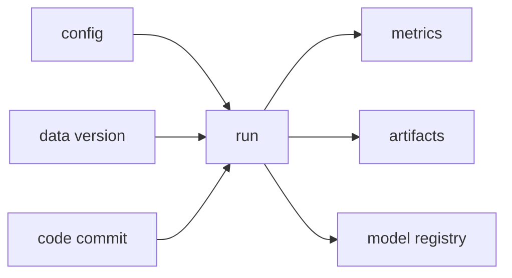

# 실험 추적 (Experiment Tracking)

- Level: Intermediate
- Prerequisites: [AI/Machine-Learning/Cross-Validation.md](../Machine-Learning/Cross-Validation.md)
- Status: Draft
- Reviewed-by: -
- Depth: Deep-dive (자기완결)

---

## 개념 (Concept)

실험 추적은 run마다 code·data·environment version, parameter, metric, artifact를 함께 기록해 결과를 비교하고 재현 가능한 근거를 남기는 실천이다.

## 직관 (Intuition)

좋은 점수만 적는 대신 어떤 코드와 데이터, 설정이 그 점수를 만들었는지 영수증처럼 묶는다. 그래야 우연한 run과 실제 개선을 구분한다.

## 이론 (Theory)

Run identity는 immutable input과 output을 연결해야 한다. 최소 기록은 git commit, data version, environment, seed, hyperparameter, metric definition, model artifact다. Metric 이름이 같아도 split·aggregation이 다르면 비교 불가능하다. Parent-child run과 tag로 탐색 구조를 만든다.



### 비교 가능한 run의 조건

두 run을 나란히 비교하려면 적어도 data split, metric definition, preprocessing, code lineage, random seed policy, evaluation environment가 같거나 차이가 명시되어야 한다. validation F1이라는 이름이 같아도 threshold, averaging 방식, excluded segment가 다르면 다른 metric이다.

| 기록 항목 | 없을 때 생기는 문제 |
| --- | --- |
| Dataset/split version | data leakage와 split 차이 구분 불가 |
| Metric schema | 같은 이름의 다른 계산 혼동 |
| Environment | dependency 차이 재현 불가 |
| Artifact digest | 어떤 모델이 평가됐는지 모호 |
| Parent run | sweep과 ablation 구조 추적 어려움 |

### Artifact와 sample logging

confusion matrix, prediction sample, calibration plot, feature importance, failed cases는 숫자 metric보다 원인 분석에 더 좋다. 다만 원문 데이터나 개인정보를 그대로 저장하면 안 되므로 sample logging은 마스킹, 해시, 접근 제어, retention 정책을 거쳐야 한다.

### 실패한 run의 가치

OOM, NaN, timeout, data validation fail 같은 실패 run도 탐색 공간을 좁히는 정보다. 실패 이유와 마지막 정상 metric을 기록하면 HPO나 분산 학습에서 같은 실패를 반복하지 않는다.

## 구현 (Implementation)

```python
run = {
    "code_commit": "abc123",
    "data_version": "dataset-v7",
    "params": {"lr": 0.001, "seed": 42},
    "metrics": {"validation_f1": 0.84},
    "artifacts": ["model.bin", "confusion-matrix.json"],
}
```

Secret·개인정보·원본 민감 데이터를 log하지 않는다.

```python
def comparable(a, b):
    keys = ["data_version", "split_version", "metric_schema", "code_family"]
    return all(a.get(k) == b.get(k) for k in keys)
```

## 복잡도 (Complexity)

저장 비용은 run 수와 metric sample·artifact 크기에 비례한다. Step마다 모든 값을 기록하면 I/O가 병목이므로 sampling·batch logging을 사용한다.

## 응용 (Applications)

- hyperparameter·model 비교
- regression 원인 추적
- model registry 승격 근거
- 협업·audit

## 흔한 오해 (Common Misunderstandings)

- dashboard가 있다고 재현성이 자동 확보되지 않는다.
- best metric 하나만 저장하면 variance와 failure를 잃는다.
- test metric으로 반복 선택하면 test leakage다.
- artifact와 code/data lineage가 끊기면 run ID만으로 부족하다.

## TMI

- metric schema를 versioning하면 이름 재사용 혼란을 줄인다.
- environment lockfile과 container digest를 함께 남기면 재현성이 좋아진다.
- failed run도 실패 원인 학습에 가치가 있다.

## 연습 / 확인 문제 (Exercises)

- 필수 run metadata schema를 설계하라.
- 두 run의 비교 가능 조건을 정의하라.
- 민감정보가 log되는 경로를 점검하라.

## 이어서 읽기 (Reading Path)

- 이전: [교차 검증](../Machine-Learning/Cross-Validation.md)
- 다음: [재현 가능성](Reproducibility.md), [데이터 버전 관리](Data-Versioning.md)
- 관련: [하이퍼파라미터 튜닝](Hyperparameter-Tuning.md)

## 참조 (References)

- [AI/Machine-Learning/Cross-Validation.md](../Machine-Learning/Cross-Validation.md)
- [Reference/Books.md](../../Reference/Books.md)
