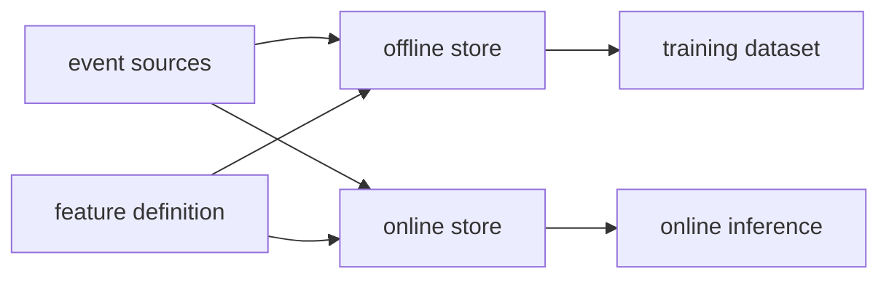

# Feature Store

- Level: Intermediate
- Prerequisites: [AI/MLOps/Data-Versioning.md](Data-Versioning.md), [Systems/Databases/Relational-Model-and-SQL.md](../../Systems/Databases/Relational-Model-and-SQL.md)
- Status: Draft
- Reviewed-by: -
- Depth: Deep-dive (자기완결)

---

## 개념 (Concept)

Feature Store는 모델이 사용하는 feature를 정의, 계산, 저장, 재사용, 서빙하는 계층이다. 핵심 목표는 train/serve feature 일관성, point-in-time correctness, lineage, 재사용성이다.

## 직관 (Intuition)

여러 모델이 같은 고객 활동량, 최근 결제 횟수, 상품 통계를 매번 다르게 계산하면 운영은 곧장 늪이 된다. Feature Store는 "이 feature는 언제 어떤 데이터로 어떻게 계산되었는가"를 공동 계약으로 만든다.

## 이론 (Theory)

Offline store는 학습과 backfill에 필요한 대량 feature를 저장하고, online store는 낮은 latency로 최신 feature를 제공한다. 두 저장소의 값이 달라지면 train/serve skew가 발생한다.

시간 의존 feature는 entity key와 event time을 기준으로 join해야 한다. 학습 시점 이후의 정보를 섞으면 label leakage가 생긴다. Feature definition은 code, input source, transformation, freshness, owner, schema, quality rule을 포함해야 한다.



### Point-in-time correctness

학습 데이터 생성 시 각 label 시점보다 늦게 생성된 feature 값을 join하면 미래 정보를 쓰는 leakage가 된다. point-in-time join은 entity id와 event time을 함께 사용해, 예측 시점에 실제로 알 수 있었던 최신 feature만 선택한다. 이 규칙은 feature store의 가장 중요한 품질 조건이다.

### Offline과 online store

| 구분 | Offline store | Online store |
| --- | --- | --- |
| 목적 | 학습, backfill, 분석 | 낮은 latency inference |
| 데이터 크기 | 큼 | serving에 필요한 subset |
| 접근 패턴 | scan, join | key-value lookup |
| 위험 | 느린 backfill, leakage | stale feature, availability |

두 저장소는 같은 feature definition에서 만들어져야 하며, 값 차이를 주기적으로 비교해야 한다. "이름이 같은 feature"보다 "같은 코드와 같은 시간 의미로 계산된 feature"가 중요하다.

### Freshness와 fallback

online feature가 freshness SLO를 넘기면 모델 입력을 어떻게 처리할지 정해야 한다. fallback 값, 이전 값 사용, request 거절, batch score로 대체 같은 정책이 가능하다. fallback도 학습 때 시뮬레이션하지 않으면 serving에서만 나타나는 분포 차이를 만든다.

## 구현 (Implementation)

```python
feature = {
    "name": "user_7d_purchase_count",
    "entity": "user_id",
    "event_time": "purchase_at",
    "window": "7d",
    "aggregation": "count",
    "freshness_slo": "30m",
}
```

Batch feature는 partition 단위로 backfill하고, online feature는 publish 시점과 serving version을 기록한다.

```python
def is_fresh(now, feature_timestamp, max_age_seconds):
    return (now - feature_timestamp).total_seconds() <= max_age_seconds
```

## 복잡도 (Complexity)

Feature 계산 비용은 source volume, window 크기, entity cardinality, freshness 요구에 따라 커진다. Online store는 latency와 availability를 위해 memory·replication 비용을 쓰고, offline store는 scan·join 비용이 커진다.

## 응용 (Applications)

- 추천·랭킹·사기 탐지 feature 공유
- training dataset 재현
- online inference feature lookup
- feature quality monitoring

## 흔한 오해 (Common Misunderstandings)

- Feature Store가 있으면 feature leakage가 자동으로 사라지지 않는다.
- offline과 online에 같은 이름이 있다고 같은 값이라는 뜻은 아니다.
- 모든 feature를 online으로 올리면 비용과 freshness 관리가 폭발한다.
- feature 재사용은 좋지만 잘못된 의미의 재사용은 모델 품질을 낮춘다.

## TMI

- point-in-time join은 feature store의 진짜 난이도다.
- feature owner를 명확히 두지 않으면 stale feature가 빠르게 쌓인다.
- feature lineage는 model debugging 때 생각보다 자주 생명줄이 된다.

## 연습 / 확인 문제 (Exercises)

- 온라인 추론용 feature와 배치 학습용 feature의 저장 전략을 비교하라.
- label leakage가 가능한 feature 예시를 만들고 방지 규칙을 세워라.
- feature freshness SLO와 fallback 정책을 정의하라.

## 이어서 읽기 (Reading Path)

- 이전: [데이터 버전 관리](Data-Versioning.md)
- 다음: [데이터 검증](Data-Validation.md), [온라인/배치 서빙](Online-vs-Batch-Serving.md)

## 참조 (References)

- [Systems/Databases/Relational-Model-and-SQL.md](../../Systems/Databases/Relational-Model-and-SQL.md)
- [Reference/Books.md](../../Reference/Books.md)
