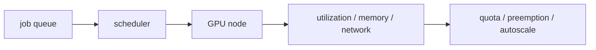

# GPU 클러스터 관리 (GPU Cluster Management)

- Level: Advanced
- Prerequisites: [AI/MLOps/Distributed-Training.md](Distributed-Training.md), [Engineering/DevOps/Kubernetes-Basics.md](../../Engineering/DevOps/Kubernetes-Basics.md), [Engineering/DevOps/Metrics-Alerts.md](../../Engineering/DevOps/Metrics-Alerts.md)
- Status: Draft
- Reviewed-by: -
- Depth: Deep-dive (자기완결)

---

## 개념 (Concept)

GPU 클러스터 관리는 accelerator 자원을 여러 학습·추론 작업에 안정적으로 배분하고 관측하는 운영 영역이다. Scheduling, quota, topology, driver/runtime, storage, network, utilization, failure recovery가 함께 얽힌다.

## 직관 (Intuition)

GPU는 비싼 계산기라서 "비어 있는가"만 보면 부족하다. 어떤 노드에 어떤 GPU가 붙어 있고, 서로 얼마나 빠르게 통신하며, 누가 얼마나 오래 점유하는지가 전체 생산성을 좌우한다.

## 이론 (Theory)

분산 학습은 GPU 간 communication topology에 민감하다. 같은 node 내부, 같은 rack, 다른 rack의 bandwidth와 latency가 다르면 scaling efficiency가 달라진다. Scheduler는 GPU type, memory, node affinity, gang scheduling, preemption, quota를 고려해야 한다.

학습 job은 긴 시간 자원을 점유하므로 checkpoint와 resume이 중요하다. 추론 workload는 latency와 autoscaling이 중요해 학습 workload와 분리하거나 priority를 다르게 둔다.



### Scheduling 요구사항

| workload | 중요한 것 | 정책 |
| --- | --- | --- |
| 대규모 학습 | gang scheduling, topology | 같은 node/rack 배치 |
| 작은 실험 | queue time, fairness | quota와 preemption |
| online inference | latency, availability | priority와 autoscaling |
| batch generation | throughput, cost | spot/preemptible 활용 |

분산 학습은 필요한 GPU가 모두 동시에 할당되지 않으면 시작할 수 없으므로 gang scheduling이 중요하다. 반면 inference는 일부 replica만 살아도 degraded serving이 가능할 수 있다.

### 관측해야 할 metric

GPU utilization, memory allocated/reserved, HBM bandwidth, PCIe/NVLink traffic, network throughput, data loader latency, job queue time, preemption count, checkpoint duration, failure reason을 함께 본다. GPU 사용률 하나로는 병목을 찾기 어렵다.

### 자원 단편화

큰 GPU에 작은 job이 흩어져 있으면 나중에 큰 job이 들어와도 연속 자원을 못 잡는다. GPU type, memory size, MIG partition, node affinity, priority class를 정책적으로 관리해야 한다.

## 구현 (Implementation)

```yaml
resources:
  limits:
    nvidia.com/gpu: 4
nodeSelector:
  accelerator: gpu
```

실제 운영에서는 driver version, CUDA/runtime compatibility, image size, dataset locality, shared filesystem, job queue policy를 함께 관리한다.

```yaml
metadata:
  labels:
    workload: training
spec:
  priorityClassName: research-batch
```

## 복잡도 (Complexity)

Utilization은 compute, memory, input pipeline, network all-reduce 중 가장 약한 부분에 제한된다. Cluster 효율은 job 대기 시간, GPU idle time, failed job 재시작 비용, data loading 병목에 의해 낮아진다.

## 응용 (Applications)

- multi-node model training
- GPU inference fleet
- research cluster quota 운영
- batch embedding generation

## 흔한 오해 (Common Misunderstandings)

- GPU 사용률이 높다고 end-to-end throughput이 최적인 것은 아니다.
- 작은 job을 큰 GPU에 무작정 올리면 fragmentation이 심해진다.
- driver/runtime mismatch는 모델 코드와 무관하게 job을 실패시킨다.
- checkpoint 없이 preemption을 쓰면 절약보다 손실이 클 수 있다.

## TMI

- GPU memory fragmentation은 사용률 지표만으로 잘 보이지 않는다.
- Data loader가 느리면 GPU는 계산기가 아니라 기다리는 난로가 된다.
- Quota는 공정성뿐 아니라 실험 남발을 줄이는 제품 정책이기도 하다.

## 연습 / 확인 문제 (Exercises)

- 학습 job과 추론 job의 scheduling 요구를 비교하라.
- GPU cluster에서 수집할 핵심 metric 8개를 정하라.
- preemptible training job의 checkpoint 전략을 설계하라.

## 이어서 읽기 (Reading Path)

- 이전: [분산 학습](Distributed-Training.md)
- 다음: [ML 파이프라인](ML-Pipeline.md), [모델 레지스트리](Model-Registry.md)

## 참조 (References)

- [Engineering/DevOps/Kubernetes-Basics.md](../../Engineering/DevOps/Kubernetes-Basics.md)
- [Engineering/DevOps/Metrics-Alerts.md](../../Engineering/DevOps/Metrics-Alerts.md)
- [Reference/Books.md](../../Reference/Books.md)
