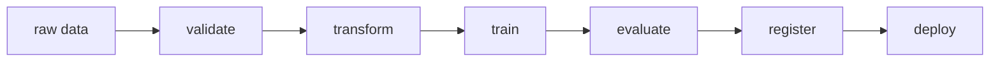

# ML 파이프라인 (Machine Learning Pipeline)

- Level: Intermediate
- Prerequisites: [AI/MLOps/Data-Versioning.md](Data-Versioning.md), [AI/MLOps/Experiment-Tracking.md](Experiment-Tracking.md)
- Status: Draft
- Reviewed-by: -
- Depth: Deep-dive (자기완결)

---

## 개념 (Concept)

ML 파이프라인은 data validation, transformation, training, evaluation, registration, deployment를 의존성 있는 재실행 가능한 step으로 구성한다.

## 직관 (Intuition)

노트북의 수동 순서를 입력·출력이 명시된 생산 라인으로 바꾼다. 한 단계 실패나 입력 변경 시 필요한 단계만 다시 실행하고 lineage를 추적한다.

## 이론 (Theory)

각 step은 immutable input artifact와 versioned code/config를 받아 output artifact와 metadata를 만든다. DAG orchestrator는 dependency, retry, timeout, schedule을 관리한다. Idempotency, atomic publish, backfill, partial failure가 중요하다.

Cache key는 code+input+config를 포함해야 한다. Evaluation gate를 통과하기 전 model을 production alias로 승격하지 않는다.



### Step contract

각 step은 함수처럼 입력과 출력 계약이 명확해야 한다. 입력에는 dataset version, code commit, config, secret reference, runtime image가 포함되고, 출력에는 artifact URI, schema, metrics, lineage, status가 포함된다. 이 계약이 없으면 같은 DAG라도 실행 환경에 따라 다른 모델이 만들어진다.

| 계약 항목 | 예 |
| --- | --- |
| Input artifact | `dataset:churn-v7`, `features:2026-06-01` |
| Code version | git commit, container digest |
| Config | hyperparameter, split seed, threshold |
| Output artifact | transformed data, model, eval report |
| Metadata | owner, start/end time, lineage, quality gate |

### Gate와 승격 정책

모델 등록은 단순 저장이고, production 승격은 정책 결정이다. evaluation gate는 offline metric, segment metric, fairness/safety check, latency budget, data validation 결과를 함께 본다. gate 실패 모델도 실험 기록으로 남기되 serving alias로 연결하지 않는다.

### 재실행과 backfill

backfill은 과거 partition을 현재 코드로 다시 계산할지, 당시 코드와 config를 복원해 계산할지 선택해야 한다. 데이터 수정, feature definition 변경, label correction은 재실행 범위가 다르므로 pipeline graph와 lineage가 이를 설명할 수 있어야 한다.

## 구현 (Implementation)

```python
pipeline = {
    "validate": {"needs": []},
    "transform": {"needs": ["validate"]},
    "train": {"needs": ["transform"]},
    "evaluate": {"needs": ["train"]},
    "register": {"needs": ["evaluate"]},
}
```

```python
def cache_key(step_name, input_versions, code_version, config_hash):
    return (step_name, tuple(sorted(input_versions)), code_version, config_hash)
```

## 복잡도 (Complexity)

Critical path가 최소 wall time을 결정하며 독립 step은 병렬화할 수 있다. Backfill 비용은 partition 수와 각 step 비용에 비례하고 artifact storage·transfer가 병목이 될 수 있다.

## 응용 (Applications)

- scheduled retraining
- reproducible training·evaluation
- feature/data backfill
- gated deployment

## 흔한 오해 (Common Misunderstandings)

- DAG가 있다고 step 내부가 재현 가능한 것은 아니다.
- 무조건 retry하면 non-idempotent side effect가 중복될 수 있다.
- orchestration tool이 data quality와 model gate를 대신 정의하지 않는다.
- latest artifact 의존은 lineage를 흐린다.

## TMI

- artifact-driven pipeline은 step 간 memory object 대신 durable reference를 전달한다.
- dynamic DAG는 편리하지만 실행 graph 추적을 어렵게 할 수 있다.
- backfill은 현재 code로 과거를 다시 계산할지 당시 code를 쓸지 정책이 필요하다.

## 연습 / 확인 문제 (Exercises)

- training DAG와 artifact를 그려라.
- retry-safe model registration을 설계하라.
- data partition backfill 전략을 작성하라.

## 이어서 읽기 (Reading Path)

- 이전: [데이터 버전 관리](Data-Versioning.md)
- 다음: [분산 학습](Distributed-Training.md), [모델 레지스트리](Model-Registry.md)

## 참조 (References)

- [AI/MLOps/Data-Versioning.md](Data-Versioning.md)
- [Reference/Books.md](../../Reference/Books.md)
