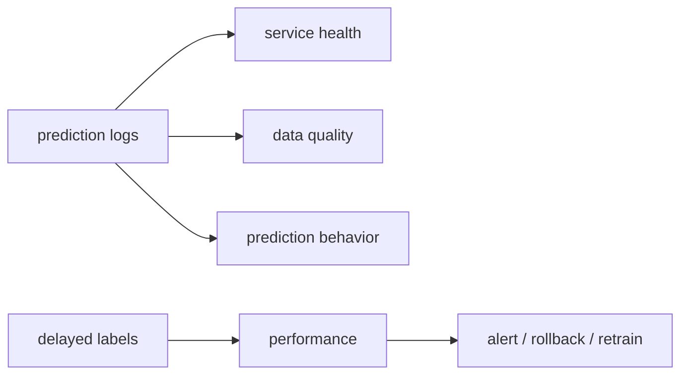

# 모델 모니터링 (Model Monitoring)

- Level: Intermediate
- Prerequisites: [AI/MLOps/Data-Drift.md](Data-Drift.md), [Engineering/DevOps/Metrics-Alerts.md](../../Engineering/DevOps/Metrics-Alerts.md)
- Status: Draft
- Reviewed-by: -
- Depth: Deep-dive (자기완결)

---

## 개념 (Concept)

모델 모니터링은 service health, input quality, prediction behavior, label 기반 성능과 business outcome을 함께 관찰해 운영 열화를 탐지하는 체계다.

## 직관 (Intuition)

API가 200을 반환해도 feature가 비거나 예측이 한 class로 쏠릴 수 있다. 시스템과 모델, 데이터 계기판을 한 흐름으로 연결해야 한다.

## 이론 (Theory)

| 층 | 대표 신호 |
|---|---|
| Service | traffic, error, latency, saturation |
| Data | schema, missing, range, drift |
| Prediction | class/range, confidence, abstention |
| Performance | accuracy, calibration, ranking metric |
| Outcome | conversion, harm, cost |

Request ID, model version, feature pipeline version을 연결하되 개인정보는 최소화한다. Label delay를 고려해 즉시 proxy와 나중의 ground-truth metric을 분리한다. Segment별 metric이 전체 평균의 문제를 드러낼 수 있다.



### Alert 설계

alert는 metric threshold보다 대응 절차가 핵심이다. 각 alert에는 owner, severity, dashboard link, 최근 배포와 upstream 변경, 즉시 mitigation, 장기 조치가 연결되어야 한다. 조치할 사람이 없는 alert는 noise가 된다.

### Label delay 처리

fraud, churn, 의료 outcome처럼 label이 늦게 오는 문제는 즉시 성능을 알 수 없다. 이때는 prediction distribution, input drift, proxy metric을 빠르게 보고, label이 도착하면 delayed join으로 실제 성능을 계산한다. join key와 event time이 잘못되면 monitoring 자체에 leakage가 생긴다.

### Privacy-preserving telemetry

원본 text, image, 개인정보 feature를 그대로 로그에 남기면 debugging은 쉬워져도 보안 위험이 커진다. 필요한 경우 bucket, hash, redaction, sampling, secure enclave, 제한된 retention을 사용한다. 모니터링 로그도 데이터 제품이므로 접근 제어가 필요하다.

## 구현 (Implementation)

```python
event = {
    "request_id": "opaque-id",
    "model_version": "model-v12",
    "latency_ms": 18,
    "prediction_bucket": "0.8-0.9",
    "feature_schema": "v4",
}
```

원본 민감 feature나 token을 그대로 telemetry에 넣지 않는다.

```python
def monitoring_key(request_id, model_version):
    return {"request_id": request_id, "model_version": model_version}
```

## 복잡도 (Complexity)

비용은 event rate, retention, label·segment cardinality에 비례한다. Sampling과 aggregation은 비용을 줄이지만 rare failure 관측력을 낮출 수 있다.

## 응용 (Applications)

- degradation·incident detection
- rollout guardrail·rollback
- retraining 판단
- audit·fairness segment monitoring

## 흔한 오해 (Common Misunderstandings)

- infrastructure uptime이 model quality를 보장하지 않는다.
- 평균 metric은 작은 중요 segment 실패를 숨긴다.
- training metric threshold를 production에 그대로 쓰면 안 된다.
- monitoring이 feedback loop와 owner 없이 문제를 해결하지 않는다.

## TMI

- Champion/challenger monitoring은 현재 모델과 후보를 같은 traffic에서 비교한다.
- delayed label join은 누락·중복·time leakage를 조심해야 한다.
- prediction distribution change는 upstream data bug의 빠른 신호가 될 수 있다.

## 연습 / 확인 문제 (Exercises)

- 5층 monitoring dashboard를 설계하라.
- label이 30일 늦게 오는 문제의 평가 pipeline을 그려라.
- alert별 owner와 action을 정의하라.

## 이어서 읽기 (Reading Path)

- 이전: [데이터 드리프트](Data-Drift.md)
- 다음: [ML 파이프라인](ML-Pipeline.md), [모델 피드백 루프](Feedback-Loop.md)

## 참조 (References)

- [Engineering/DevOps/Metrics-Alerts.md](../../Engineering/DevOps/Metrics-Alerts.md)
- [Reference/Books.md](../../Reference/Books.md)
