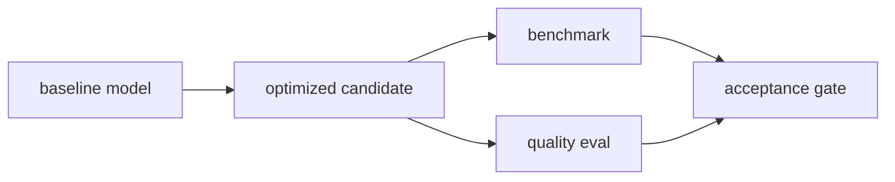

# 모델 최적화 (Model Optimization)

- Level: Advanced
- Prerequisites: [AI/MLOps/REST-Serving.md](REST-Serving.md), [Engineering/Performance/Benchmarking-Basics.md](../../Engineering/Performance/Benchmarking-Basics.md)
- Status: Draft
- Reviewed-by: -
- Depth: Deep-dive (자기완결)

---

## 개념 (Concept)

모델 최적화는 목표 hardware와 quality constraint 아래 latency, throughput, memory, energy를 개선한다. Quantization, pruning, distillation, graph/kernel optimization이 대표적이다.

## 직관 (Intuition)

정확도를 무작정 희생하는 압축이 아니라 배포 조건에 맞는 작은 숫자 표현과 불필요한 계산 제거를 검증한다. 최적화 전후를 실제 workload에서 비교한다.

## 이론 (Theory)

Quantization은 FP32를 FP16·INT8 등으로 바꾸며 calibration 또는 quantization-aware training을 사용한다. Pruning은 weight·channel을 제거하지만 irregular sparsity가 실제 hardware speedup으로 이어지지 않을 수 있다. Distillation은 teacher distribution을 student가 모방한다.



### 최적화 기법별 tradeoff

| 기법 | 줄이는 것 | 위험 |
| --- | --- | --- |
| Quantization | memory, bandwidth | calibration error, kernel 의존 |
| Pruning | parameter/FLOP | 실제 speedup 부재 |
| Distillation | model size | teacher bias 복사 |
| Operator fusion | memory traffic | runtime별 호환성 |
| Compilation | graph overhead | dynamic shape 취약 |

최적화는 목표 하드웨어와 runtime에서 측정해야 한다. 노트북 CPU에서 빠른 변경이 production GPU에서도 빠르다는 보장은 없다.

### Acceptance gate

품질 하락 허용치, p50/p95/p99 latency, throughput, memory peak, cold start, model size, segment별 성능을 gate로 둔다. 평균 accuracy만 통과하고 rare class recall이 무너지면 배포 모델로는 실패다.

### Export와 semantic parity

ONNX, TensorRT, CoreML 같은 runtime으로 export하면 operator 구현, dtype, padding, rounding이 달라질 수 있다. 최적화 전후로 같은 입력 샘플에 대한 logits 또는 prediction diff를 비교해 semantic parity를 확인한다.

## 구현 (Implementation)

```python
def accept_candidate(baseline, candidate):
    return (candidate["p99_ms"] <= baseline["p99_ms"] * 0.7
            and candidate["accuracy"] >= baseline["accuracy"] - 0.01)
```

```python
def relative_speedup(baseline_ms, candidate_ms):
    return baseline_ms / candidate_ms
```

## 복잡도 (Complexity)

이론적 FLOP 감소와 wall-clock speedup은 다르다. Benchmark에는 batch, sequence/input size, warmup, hardware, precision과 p50/p99를 고정한다.

## 응용 (Applications)

- edge/mobile inference
- accelerator throughput 개선
- serving cost 절감
- large model compression

## 흔한 오해 (Common Misunderstandings)

- file size 감소가 latency 감소를 보장하지 않는다.
- average accuracy만으로 rare class degradation을 숨기면 안 된다.
- export 성공이 operator semantic 일치를 보장하지 않는다.
- 최적 hardware 설정은 다른 hardware에 그대로 적용되지 않는다.

## TMI

- weight-only quantization은 activation precision을 유지한다.
- operator fusion은 intermediate memory traffic을 줄인다.
- calibration dataset은 production input range를 대표해야 한다.

## 연습 / 확인 문제 (Exercises)

- quality·latency acceptance gate를 정의하라.
- INT8 전후 class별 metric을 비교하라.
- FLOP은 줄었지만 느려지는 원인을 세 가지 들어라.

## 이어서 읽기 (Reading Path)

- 이전: [REST 서빙](REST-Serving.md)
- 다음: [모델 모니터링](Model-Monitoring.md)

## 참조 (References)

- [Engineering/Performance/Benchmarking-Basics.md](../../Engineering/Performance/Benchmarking-Basics.md)
- [Reference/Books.md](../../Reference/Books.md)
