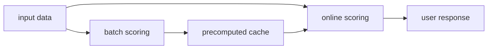

# 온라인 서빙 vs 배치 추론 (Online vs Batch Serving)

- Level: Intermediate
- Prerequisites: [AI/MLOps/Model-Registry.md](Model-Registry.md), [Engineering/System-Design/Scalability.md](../../Engineering/System-Design/Scalability.md)
- Status: Draft
- Reviewed-by: -
- Depth: Deep-dive (자기완결)

---

## 개념 (Concept)

온라인 서빙은 요청 시점에 낮은 latency로 예측을 반환하고, 배치 추론은 많은 데이터를 모아 주기적으로 예측을 계산한다. 선택 기준은 freshness, latency, throughput, 비용, failure tolerance다.

## 직관 (Intuition)

온라인은 손님이 주문할 때 바로 요리하는 식당이고, 배치는 도시락을 미리 대량 생산하는 주방이다. 바로 먹어야 하는 추천은 온라인이 맞고, 매일 한 번 고객 등급을 갱신하는 작업은 배치가 단순하고 싸다.

## 이론 (Theory)

온라인 서빙은 request schema, feature lookup, model version, timeout, autoscaling, fallback을 설계한다. Tail latency와 overload behavior가 중요하다. 배치 추론은 partitioning, checkpoint, idempotent output, backfill, downstream publish contract가 중요하다.

Hybrid pattern도 흔하다. 배치로 후보나 feature를 미리 만들고, 온라인에서 context를 반영해 rerank한다.



### 선택 기준

| 기준 | 온라인이 유리 | 배치가 유리 |
| --- | --- | --- |
| Freshness | 초·분 단위 필요 | 시간·일 단위 충분 |
| Latency | 즉시 응답 필요 | downstream이 비동기 |
| 비용 | QPS가 낮거나 가치가 큼 | 대량을 묶어 처리 가능 |
| 장애 허용 | fallback 설계 필요 | 재시도와 backfill 가능 |
| Feature | 실시간 context 필요 | 사전 계산 feature 충분 |

서비스 요구가 섞이면 hybrid가 자연스럽다. 추천에서는 배치로 후보를 만들고 온라인에서 최신 행동을 반영해 rerank하는 식이다.

### 배치 추론의 안전 조건

배치도 운영 시스템이다. output partition을 원자적으로 publish하고, 같은 job을 두 번 실행해도 결과가 중복되지 않아야 하며, model/data version을 output에 남겨야 한다. 실패한 partition만 재실행할 수 있게 checkpoint와 manifest를 둔다.

### 온라인 fallback

온라인 모델이 timeout이나 feature lookup 실패를 만나면 빈 응답보다 degrade된 안전 응답이 나을 수 있다. fallback은 rule, cached score, previous model, batch precompute 등으로 설계하되, fallback 발생률도 monitoring한다.

## 구현 (Implementation)

```python
def choose_serving_mode(freshness, latency_ms, volume):
    if freshness == "real_time" and latency_ms < 300:
        return "online"
    if volume == "large" and freshness in {"hourly", "daily"}:
        return "batch"
    return "hybrid"
```

실제 설계에서는 SLA, cost budget, feature availability, failure blast radius를 함께 본다.

```python
def publish_key(model_version, partition):
    return f"predictions/{model_version}/{partition}"
```

## 복잡도 (Complexity)

온라인 비용은 peak QPS, model latency, replica 수에 좌우된다. 배치 비용은 입력량, model cost, schedule frequency, output storage에 비례한다. 온라인은 tail latency와 availability가 어렵고, 배치는 freshness와 재처리가 어렵다.

## 응용 (Applications)

- 온라인 추천·검색 랭킹
- 일일 churn score 계산
- fraud detection 실시간 차단
- offline personalization cache 생성

## 흔한 오해 (Common Misunderstandings)

- 온라인 서빙이 항상 더 고급 선택은 아니다.
- 배치 추론도 idempotency와 versioning 없이는 운영 사고가 난다.
- 평균 latency만 보면 tail latency와 timeout을 놓친다.
- 모델만 빠르면 전체 요청이 빠른 것은 아니다. Feature lookup과 network도 포함된다.

## TMI

- Precompute+lookup은 매우 강력한 batch serving 패턴이다.
- Fallback prediction은 품질보다 안정성이 더 중요한 순간을 위해 존재한다.
- Canary와 shadow는 온라인 모델 교체의 위험을 낮춘다.

## 연습 / 확인 문제 (Exercises)

- 추천, 신용평가, 광고 입찰 각각의 serving mode를 선택하라.
- 온라인 endpoint의 timeout과 fallback 정책을 설계하라.
- 배치 추론 job의 재실행 안전 조건을 정의하라.

## 이어서 읽기 (Reading Path)

- 이전: [모델 레지스트리](Model-Registry.md)
- 다음: [REST 모델 서빙](REST-Serving.md), [gRPC 서빙](gRPC-Serving.md)

## 참조 (References)

- [Engineering/System-Design/Scalability.md](../../Engineering/System-Design/Scalability.md)
- [Reference/Books.md](../../Reference/Books.md)
