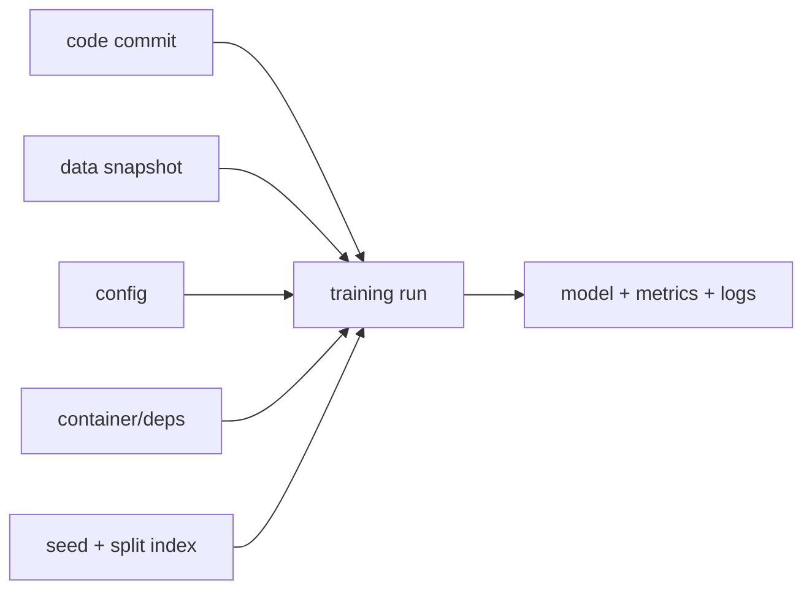

# 머신러닝 재현 가능성 (Reproducibility)

- Level: Intermediate
- Prerequisites: [AI/MLOps/Experiment-Tracking.md](Experiment-Tracking.md)
- Status: Draft
- Reviewed-by: -
- Depth: Deep-dive (자기완결)

---

## 개념 (Concept)

재현 가능성은 같은 code·data·configuration·environment에서 결과를 다시 만들고 차이를 설명할 수 있는 능력이다. 완전한 bitwise determinism과 통계적으로 일관된 재현은 구분한다.

## 직관 (Intuition)

실험 레시피에는 재료뿐 아니라 재료 버전, 도구, 순서, 온도까지 필요하다. seed 하나만 고정해도 library·hardware·parallel order가 바뀌면 결과가 달라질 수 있다.



## 이론 (Theory)

재현성 경계에는 source commit, data snapshot, dependency lock, container/runtime, hardware, seed, nondeterministic operator, split index가 포함된다. 여러 seed의 평균·분산을 보고해 stochastic training의 불확실성을 분리한다.

### bitwise와 statistical reproducibility

bitwise 재현은 산출물의 마지막 비트까지 같은 상태다. GPU 커널, 병렬 reduction, floating-point 순서 때문에 비용이 크거나 불가능할 수 있다. statistical 재현은 동일한 조건에서 metric 분포가 일관되게 나오는 상태다. 연구와 운영에서는 둘 중 어떤 재현성을 요구하는지 먼저 정해야 한다.

## 구현 (Implementation)

```python
import os
import random


def seed_everything(seed):
    os.environ["PYTHONHASHSEED"] = str(seed)
    random.seed(seed)
    return seed
```

각 numerical framework의 seed와 deterministic option은 별도로 설정하고 성능 비용을 기록한다.

실험 manifest 예:

```yaml
code: 8f31c2a
data: s3://bucket/dataset@2026-06-01
config: configs/baseline.yaml
seed: 42
split_index: splits/v3.json
image: registry/train:sha256-...
hardware: A100-80GB
```

이 manifest가 있어야 한 달 뒤 "같은 실험"을 다시 실행할 수 있다.

## 복잡도 (Complexity)

Deterministic algorithm은 더 느리거나 memory를 더 쓸 수 있다. 여러 seed $S$개 평가는 학습 비용을 대략 $S$배 늘리지만 결과 신뢰도를 높인다.

워크드 예제: 한 번 학습이 4시간이고 seed 5개를 돌리면 총 20 GPU-hour다. 평균 정확도 87.2%, 표준편차 0.4%라면 단일 run 87.6%가 개선인지 노이즈인지 판단할 근거가 생긴다.

## 응용 (Applications)

- 논문·실험 검증
- production regression debugging
- regulated audit
- team handoff

## 흔한 오해 (Common Misunderstandings)

- seed 하나가 모든 난수원을 고정하지 않는다.
- 같은 metric이 나왔다고 같은 model은 아니다.
- 최신 data로 다시 학습한 결과는 과거 실험 재현이 아니다.
- nondeterminism을 숨기기보다 범위와 variance를 보고해야 한다.

## TMI

- floating-point reduction 순서만 달라도 마지막 bit가 달라질 수 있다.
- deterministic mode가 일부 빠른 kernel을 비활성화할 수 있다.
- split index 자체를 artifact로 저장하면 data ordering 변화에 강하다.

## 연습 / 확인 문제 (Exercises)

- 재현성 checklist를 작성하라.
- seed 5개의 metric 평균·표준편차를 보고하라.
- dependency 한 개 변경의 영향을 추적하라.

## 이어서 읽기 (Reading Path)

- 이전: [실험 추적](Experiment-Tracking.md)
- 다음: [데이터 버전 관리](Data-Versioning.md)

## 참조 (References)

- [AI/MLOps/Experiment-Tracking.md](Experiment-Tracking.md)
- [Reference/Books.md](../../Reference/Books.md)
