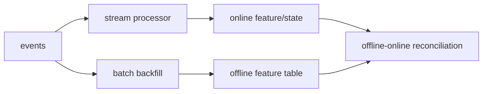

# 스트리밍 vs 배치 파이프라인 (Streaming vs Batch)

- Level: Intermediate
- Prerequisites: [Systems/Distributed-Systems/Message-Queues-Event-Streaming.md](../../Systems/Distributed-Systems/Message-Queues-Event-Streaming.md), [AI/MLOps/Data-Versioning.md](Data-Versioning.md)
- Status: Draft
- Reviewed-by: -
- Depth: Deep-dive (자기완결)

---

## 개념 (Concept)

배치 파이프라인은 일정 구간의 데이터를 모아 처리하고, 스트리밍 파이프라인은 이벤트가 도착하는 대로 계속 처리한다. ML에서는 feature freshness, retraining cadence, online monitoring 요구가 선택 기준이 된다.

## 직관 (Intuition)

배치는 하루 장부를 마감하는 방식이고, 스트리밍은 계산대에서 결제할 때마다 장부를 갱신하는 방식이다. 빠른 반응이 필요하면 스트리밍이 유리하지만, 늦게 도착하는 이벤트와 장애 복구까지 같이 어려워진다.

## 이론 (Theory)

Batch는 bounded data를 다루므로 재실행과 backfill이 상대적으로 쉽다. Streaming은 unbounded data를 window, watermark, state, checkpoint로 잘라 처리한다. Event time과 processing time이 다르면 늦게 도착한 이벤트 처리 정책이 필요하다.

ML feature는 aggregation window와 freshness가 중요하다. 동일 feature를 batch와 streaming으로 따로 구현하면 값이 어긋나기 쉬우므로 transformation 정의를 공유하거나 검증을 둔다.



### Event time, processing time, watermark

event time은 사건이 실제 발생한 시간이고 processing time은 시스템이 처리한 시간이다. 네트워크 지연, 모바일 offline, upstream retry 때문에 두 시간은 자주 다르다. watermark는 "이 시점 이전 이벤트는 대부분 도착했다"고 보고 window를 닫는 기준이다. lateness 정책은 feature 값과 label alignment를 직접 바꾼다.

### Exactly-once의 실제 의미

스트리밍에서 exactly-once는 source, processor, sink가 모두 협력해야 하는 end-to-end 성질이다. processor가 checkpoint를 해도 sink가 idempotent하지 않으면 중복 write가 생긴다. 그래서 event id, dedup key, upsert sink, transactional publish가 필요하다.

### Batch와 streaming reconciliation

streaming feature는 빠르지만 장애와 late event에 취약하고, batch backfill은 느리지만 더 완전한 데이터를 반영한다. 같은 feature를 두 경로로 만들 때는 주기적으로 diff를 계산해 허용 오차를 넘으면 online state를 보정한다.

## 구현 (Implementation)

```python
def update_count(state, event):
    key = event["user_id"]
    state[key] = state.get(key, 0) + 1
    return {"user_id": key, "purchase_count": state[key]}
```

실제 streaming job은 checkpoint, deduplication key, watermark, schema evolution, poison event 처리를 포함한다.

```python
def should_drop_late(event_time, watermark):
    return event_time <= watermark
```

## 복잡도 (Complexity)

Batch 비용은 처리 데이터 크기와 주기에 비례한다. Streaming 비용은 초당 이벤트 수, state 크기, window 수, checkpoint 빈도에 영향을 받는다. Exactly-once에 가까운 보장을 얻으려면 storage와 sink의 idempotency까지 맞아야 한다.

## 응용 (Applications)

- 실시간 fraud detection feature
- online recommendation context
- model input·prediction monitoring
- daily retraining dataset 생성

## 흔한 오해 (Common Misunderstandings)

- 스트리밍은 항상 배치보다 빠르지만 항상 간단하지는 않다.
- 이벤트가 한 번만 온다고 가정하면 재시도와 중복에서 깨진다.
- processing time window는 실제 사건 시간과 다를 수 있다.
- streaming feature가 있다고 label도 즉시 생기는 것은 아니다.

## TMI

- Lambda/Kappa architecture 논쟁의 핵심은 batch와 streaming logic 중복을 어떻게 줄일지다.
- Idempotent sink는 streaming pipeline의 안전벨트다.
- 작은 lateness 정책 하나가 feature 값과 모델 성능을 바꿀 수 있다.

## 연습 / 확인 문제 (Exercises)

- 실시간 feature가 꼭 필요한 모델과 배치로 충분한 모델을 구분하라.
- 늦게 도착한 이벤트를 처리하는 정책을 설계하라.
- batch backfill과 streaming state를 reconcile하는 절차를 작성하라.

## 이어서 읽기 (Reading Path)

- 이전: [Feature Store](Feature-Store.md), [데이터 검증](Data-Validation.md)
- 다음: [온라인/배치 서빙](Online-vs-Batch-Serving.md), [ML 파이프라인](ML-Pipeline.md)

## 참조 (References)

- [Systems/Distributed-Systems/Message-Queues-Event-Streaming.md](../../Systems/Distributed-Systems/Message-Queues-Event-Streaming.md)
- [Reference/Books.md](../../Reference/Books.md)
