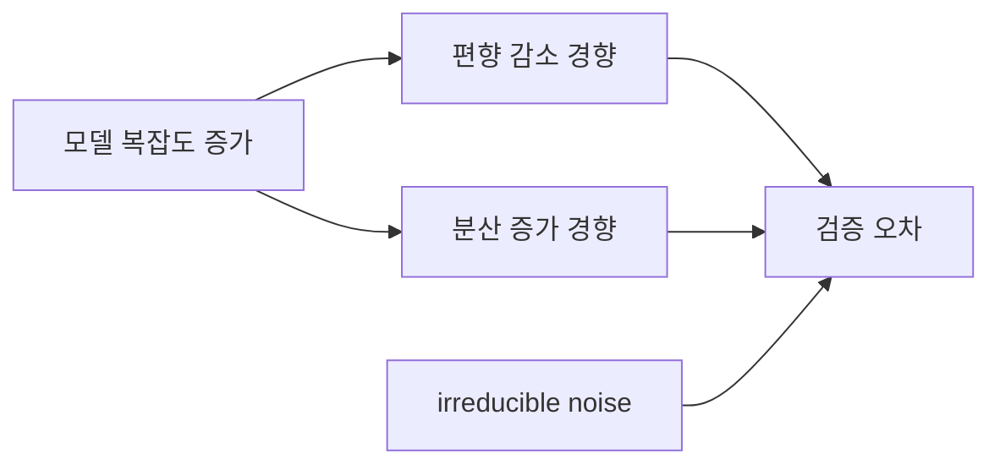

# 편향-분산 균형 (Bias-Variance Tradeoff)

- Level: Intermediate
- Prerequisites: [Math/Probability-Statistics/Expectation.md](../../Math/Probability-Statistics/Expectation.md), [AI/Machine-Learning/Linear-Regression.md](Linear-Regression.md)
- Status: Draft
- Reviewed-by: -
- Depth: Deep-dive (자기완결)

---

## 개념 (Concept)

편향은 모델의 평균 예측이 참 함수에서 체계적으로 벗어나는 정도, 분산은 훈련 데이터가 달라질 때 예측이 흔들리는 정도다. 모델 복잡도와 규제는 이 둘 사이의 균형을 조절한다.

## 직관 (Intuition)

너무 단순한 모델은 데이터의 규칙을 놓쳐 늘 비슷하게 틀린다. 너무 복잡한 모델은 훈련 표본의 우연한 잡음까지 따라가 데이터가 조금만 바뀌어도 예측이 크게 달라진다.



## 이론 (Theory)

회귀에서 $y=f(x)+\varepsilon$, $E[\varepsilon]=0$, $Var(\varepsilon)=\sigma^2$라 하면 한 점의 기대 제곱오차는

$$
E[(y-\hat f(x))^2]
=\operatorname{Bias}[\hat f(x)]^2+\operatorname{Var}[\hat f(x)]+\sigma^2
$$

로 분해된다. 마지막 항은 데이터의 irreducible noise다. 복잡도를 키우면 흔히 편향은 줄고 분산은 커지지만 모든 알고리즘에서 단조 법칙처럼 적용되는 것은 아니다.

### 분해식의 의미

기대는 가능한 훈련 데이터셋을 다시 뽑아 모델을 다시 학습하는 과정을 상상한 평균이다.

| 항 | 의미 | 흔한 신호 |
|---|---|---|
| Bias² | 평균 모델이 참 함수를 놓치는 정도 | train/valid 모두 나쁨 |
| Variance | 학습 데이터가 바뀔 때 예측이 흔들림 | train은 좋고 valid가 나쁨 |
| Noise | 관측 자체의 무작위성 | 어떤 모델도 제거 불가 |

실제 문제에서는 참 함수와 데이터 생성 분포를 모르기 때문에 이 항들을 직접 관측하기보다 learning curve와 재표집으로 간접 진단한다.

### 처방은 원인에 따라 다르다

| 진단 | 가능한 처방 |
|---|---|
| 높은 편향 | 더 표현력 큰 모델, feature 추가, 규제 완화, 더 오래 학습 |
| 높은 분산 | 데이터 추가, 규제 강화, 모델 단순화, bagging, early stopping |
| 높은 noise | 라벨 품질 개선, 더 좋은 target 정의, 측정 프로세스 개선 |
| 데이터 누출 | split/pipeline 수정, 중복 제거, 시간·그룹 기준 재평가 |

validation gap만 보고 바로 규제를 넣기보다, split 설계와 baseline을 먼저 확인해야 한다.

## 구현 (Implementation)

```python
def diagnose(train_error, validation_error):
    if train_error > 0.2 and validation_error > 0.2:
        return "high bias 후보"
    if validation_error - train_error > 0.1:
        return "high variance 후보"
    return "추가 진단 필요"


print(diagnose(0.03, 0.25))
```

임계값은 예시일 뿐이며 실제 판단은 learning curve, baseline, 불확실성과 함께 한다.

간단한 learning curve 해석 도우미:

```python
def learning_curve_hint(train_errors, valid_errors):
    train_last, valid_last = train_errors[-1], valid_errors[-1]
    if train_last > 0.2 and valid_last > 0.2:
        return "underfitting/high-bias 가능성"
    if valid_last - train_last > 0.1:
        return "overfitting/high-variance 가능성"
    return "baseline, noise, metric, split을 추가 점검"
```

## 복잡도 (Complexity)

개념 자체에 고정 비용은 없다. bootstrap으로 편향·분산을 추정하면 재표집 수 $B$만큼 모델을 학습하므로 원래 학습 비용의 약 $B$배가 든다.

## 응용 (Applications)

- 모델 복잡도와 규제 강도 선택
- 데이터 추가와 feature engineering 우선순위 판단
- bagging·boosting의 효과 이해
- learning curve 기반 오류 진단

## 흔한 오해 (Common Misunderstandings)

- 훈련 오차와 검증 오차 차이만으로 모든 원인을 확정할 수 없다.
- irreducible noise는 어떤 모델도 완전히 제거할 수 없다.
- 편향은 사회적·통계적 bias와 문맥이 다를 수 있다.
- 더 큰 모델이 항상 분산만 키우는 단순한 그림은 현대 overparameterized 모델을 완전히 설명하지 못한다.
- 데이터가 분포 밖으로 이동하면 bias-variance 진단보다 distribution shift 진단이 먼저다.
- 검증셋이 작으면 fold 변동 자체가 커서 gap 추정이 불안정할 수 있다.

## TMI

- bagging은 주로 분산을 줄이고 boosting은 순차 보정으로 편향을 줄이는 관점이 유용하다.
- double descent에서는 모델 크기가 interpolation threshold를 넘은 뒤 테스트 오차가 다시 감소하기도 한다.
- 데이터 누출은 낮은 검증 오차를 만들어 편향-분산 진단 자체를 속인다.

## 연습 / 확인 문제 (Exercises)

- 다항식 차수를 바꾸며 훈련·검증 오차를 그려라.
- 데이터 수가 늘 때 고분산 모델의 learning curve가 어떻게 변하는지 설명하라.
- 규제가 편향과 분산에 미치는 일반적 영향을 설명하라.
- 같은 모델을 bootstrap 표본 여러 개에 학습시켜 한 점의 예측 분산을 추정하라.
- 라벨 노이즈를 인위적으로 늘렸을 때 train/validation error 바닥이 어떻게 변하는지 관찰하라.

## 이어서 읽기 (Reading Path)

- 이전: [선형 회귀](Linear-Regression.md)
- 다음: [교차 검증](Cross-Validation.md), [과적합](Overfitting.md)

## 참조 (References)

- [Math/Probability-Statistics/Expectation.md](../../Math/Probability-Statistics/Expectation.md)
- [Reference/Books.md](../../Reference/Books.md)
- [Reference/Courses.md](../../Reference/Courses.md)
