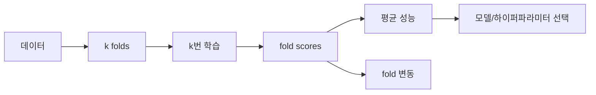

# 교차 검증 (Cross-Validation)

- Level: Intermediate
- Prerequisites: [AI/Machine-Learning/Bias-Variance.md](Bias-Variance.md)
- Status: Draft
- Reviewed-by: -
- Depth: Deep-dive (자기완결)

---

## 개념 (Concept)

교차 검증은 데이터를 여러 훈련·검증 분할로 반복 평가해 모델의 일반화 성능과 hyperparameter를 추정하는 방법이다. k-fold에서는 데이터를 $k$개 fold로 나누고 각 fold를 한 번씩 검증에 사용한다.

## 직관 (Intuition)

한 번의 train/validation split이 우연히 쉽거나 어려울 수 있다. 여러 조각을 번갈아 시험지로 사용하면 분할 운에 덜 민감한 평균 성능과 흔들림을 얻는다.



## 이론 (Theory)

각 fold의 점수를 $s_1,\dots,s_k$라 하면 평균과 표준편차를 보고한다. 분류의 stratified k-fold는 클래스 비율을 유지한다. 시간 순서가 있는 데이터는 미래로 과거를 학습하지 않도록 rolling/forward validation을 사용한다. 같은 사용자·환자의 여러 행은 group 단위로 분리해야 한다.

모델 선택에 쓴 validation 결과는 최종 성능의 독립 평가가 아니다. untouched test set을 마지막 한 번 사용하거나 nested CV로 바깥 평가와 안쪽 선택을 분리한다.

### split 단위가 모델링 단위보다 중요하다

데이터 행을 무작위로 나누는 것이 항상 옳지는 않다. 같은 사용자, 환자, 문서, 기기, 시간 구간에서 나온 여러 행은 서로 강하게 닮아 있다. 배포 시나리오가 "새 사용자" 예측이면 사용자 단위 group split을 해야 하고, "미래 예측"이면 시간 순서를 지켜야 한다.

### pipeline 전체를 fold 안에서 fit하기

표준화, 결측치 대체, feature selection, PCA, target encoding은 모두 학습 데이터에서 fit되어야 한다. 전체 데이터로 전처리를 fit한 뒤 CV를 돌리면 validation fold의 정보가 훈련 절차에 들어간다.

### nested CV

바깥 fold는 최종 성능 추정, 안쪽 fold는 하이퍼파라미터 선택에 쓴다. 계산량은 커지지만, 모델 선택을 반복한 결과가 성능 추정에 섞이는 편향을 줄인다.

## 구현 (Implementation)

```python
def kfold_indices(n, k):
    fold_sizes = [n // k + (i < n % k) for i in range(k)]
    start = 0
    for size in fold_sizes:
        valid = list(range(start, start + size))
        train = list(range(0, start)) + list(range(start + size, n))
        yield train, valid
        start += size


for train_idx, valid_idx in kfold_indices(10, 3):
    print(train_idx, valid_idx)
```

실전에서는 분할 전에 섞을지 여부와 seed를 기록하고 preprocessing도 각 fold의 훈련 부분에만 fit한다.

group split의 핵심은 같은 group id가 train과 valid에 동시에 나타나지 않게 하는 것이다.

```python
def has_group_leakage(train_groups, valid_groups):
    return bool(set(train_groups) & set(valid_groups))
```

## 복잡도 (Complexity)

모델 한 번의 학습 비용이 $C$라면 k-fold는 대략 `O(kC)`다. hyperparameter 후보 $H$개를 비교하면 `O(HkC)`로 늘어나 병렬화와 early stopping이 중요하다.

## 응용 (Applications)

- 모델·hyperparameter 선택
- 작은 데이터에서 일반화 성능 추정
- feature pipeline 비교
- 시계열·그룹 데이터의 현실적 평가 설계

## 흔한 오해 (Common Misunderstandings)

- 전체 데이터로 표준화한 뒤 CV를 돌리면 누출이다.
- 시계열을 무작위 k-fold로 섞으면 미래 정보가 들어갈 수 있다.
- CV 평균 하나만 보고 fold 간 변동을 숨기면 안 된다.
- test set으로 반복 선택하면 test도 validation set이 된다.
- fold 수를 늘리면 항상 더 좋은 추정이 되는 것은 아니다. 계산량과 추정 분산이 함께 변한다.
- stratification은 label 비율을 맞추는 장치이지 group leakage나 time leakage를 해결하지 않는다.

## TMI

- leave-one-out은 거의 모든 데이터를 훈련에 쓰지만 계산량과 추정 분산이 클 수 있다.
- nested CV는 비싸지만 모델 선택 편향을 줄인다.
- 데이터 분할은 모델보다 도메인 단위—사용자, 장비, 시간—를 먼저 이해해야 한다.

## 연습 / 확인 문제 (Exercises)

- 불균형 분류에서 stratified split이 필요한 이유를 설명하라.
- 사용자별 여러 기록이 있는 데이터의 group split을 설계하라.
- preprocessing 누출이 있는 CV와 올바른 pipeline CV를 비교하라.
- nested CV에서 outer fold와 inner fold의 역할을 분리해 설명하라.
- 시간 순서 데이터에서 rolling validation window를 직접 설계하라.

## 이어서 읽기 (Reading Path)

- 이전: [편향-분산](Bias-Variance.md)
- 다음: [규제](Regularization.md)
- 관련: [실험 추적](../MLOps/Experiment-Tracking.md), [하이퍼파라미터 튜닝](../MLOps/Hyperparameter-Tuning.md)

## 참조 (References)

- [AI/Machine-Learning/Bias-Variance.md](Bias-Variance.md)
- [Reference/Books.md](../../Reference/Books.md)
- [Reference/Courses.md](../../Reference/Courses.md)
