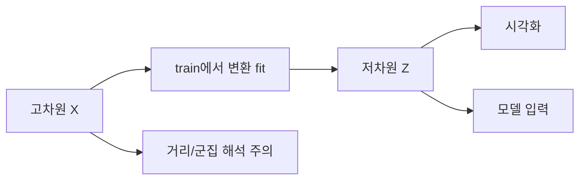

# 차원 축소 (Dimensionality Reduction)

- Level: Intermediate
- Prerequisites: [Math/Linear-Algebra/PCA.md](../../Math/Linear-Algebra/PCA.md), [AI/Machine-Learning/K-Means.md](K-Means.md)
- Status: Draft
- Reviewed-by: -
- Depth: Deep-dive (자기완결)

---

## 개념 (Concept)

차원 축소는 고차원 데이터를 중요한 구조를 최대한 유지하는 저차원 표현으로 바꾼다. 특징 선택은 원래 특징 일부를 고르고, 특징 추출은 PCA처럼 새 좌표를 만든다.

## 직관 (Intuition)

말린 종이 위의 점은 3차원에 있지만 종이 표면을 펼치면 2차원 좌표로 충분할 수 있다. 차원 축소는 데이터가 실제로 놓인 더 낮은 차원의 구조를 찾아 압축하거나 시각화한다.



## 이론 (Theory)

PCA는 선형 투영의 분산을 최대화한다. t-SNE는 이웃 확률을 저차원에서 보존하는 시각화 기법이고, UMAP은 이웃 그래프와 manifold 가정을 이용한다.

| 방법 | 주목적 | 주의점 |
|---|---|---|
| PCA | 선형 압축·전처리 | 전역 선형 구조만 표현 |
| Truncated SVD | 희소 행렬 저랭크 표현 | 중심화를 보통 생략 |
| t-SNE | 국소 군집 시각화 | 전역 거리·군집 크기 해석 주의 |
| UMAP | 빠른 manifold 시각화 | hyperparameter와 seed 영향 |

시각화에서 떨어진 군집처럼 보여도 원공간의 명확한 군집을 증명하지 않는다. 변환은 훈련 데이터에 fit하고 검증 데이터에는 transform만 해야 한다.

### 목적별 선택

| 목적 | 더 맞는 선택 |
|---|---|
| 선형 압축과 노이즈 제거 | PCA, SVD |
| sparse text matrix | Truncated SVD |
| 탐색 시각화 | t-SNE, UMAP |
| 지도학습 전처리 | CV 안에서 PCA/feature selection |
| 해석 가능한 feature 유지 | feature selection |

차원 축소는 downstream 목표와 함께 평가해야 한다. 2D plot이 예뻐도 분류·검색·군집 품질이 좋아진다는 보장은 없다.

### 누출과 재현성

PCA 평균, scaling, components는 train split에서만 fit한다. t-SNE/UMAP은 seed, 이웃 수, 거리 metric, 초기화에 민감하므로 그림을 보고 강한 결론을 내리기 전에 여러 seed와 파라미터를 비교한다.

### 거리 보존의 한계

저차원으로 많은 점을 내리면 모든 pairwise distance를 보존할 수 없다. t-SNE는 국소 이웃 보존에 강하고 전역 거리 해석에는 약하다. UMAP도 manifold 가정과 hyperparameter에 따라 구조가 달라진다.

## 구현 (Implementation)

```python
import numpy as np


def pca_transform(X, k):
    mean = X.mean(axis=0)
    centered = X - mean
    _, _, vt = np.linalg.svd(centered, full_matrices=False)
    components = vt[:k].T
    return centered @ components, mean, components


X = np.array([[1., 2., 3.], [2., 4., 5.], [3., 6., 7.]])
Z, mean, components = pca_transform(X, 2)
print(Z.shape)
```

새 데이터에는 저장한 평균과 component만 사용한다.

```python
def pca_apply(X_new, mean, components):
    return (X_new - mean) @ components
```

## 복잡도 (Complexity)

PCA 전체 SVD는 $n\ge d$에서 대략 `O(nd^2)`다. t-SNE와 UMAP은 구현·근사법·이웃 그래프 구성에 따라 달라지며 대규모 데이터에서는 sampling과 근사 최근접 탐색을 사용한다.

## 응용 (Applications)

- 2D·3D 탐색 시각화
- 압축과 잡음 제거
- 고차원 모델의 전처리
- 임베딩과 잠재 표현 분석

## 흔한 오해 (Common Misunderstandings)

- 2차원 그림의 군집 간 거리를 원공간 거리처럼 해석하면 안 된다.
- 차원이 줄면 항상 모델 성능이 좋아지는 것은 아니다.
- PCA는 비선형 manifold를 펼치지 못한다.
- 전처리를 전체 데이터에 fit하면 데이터 누출이다.
- 비지도 차원 축소도 validation/test 정보를 누출할 수 있다. label을 안 써도 분포 정보를 쓴다.
- t-SNE/UMAP 그림의 cluster 크기는 원공간 밀도나 개체 수를 그대로 의미하지 않을 수 있다.

## TMI

- t-SNE의 perplexity는 대략 고려하는 이웃 규모와 관련되지만 군집 수가 아니다.
- 차원의 저주는 거리 기반 방법과 밀도 추정을 동시에 어렵게 한다.
- representation learning은 신경망이 과제에 맞는 저차원 표현을 학습하게 한다.

## 연습 / 확인 문제 (Exercises)

- PCA의 $k$를 바꾸며 재구성 오차를 비교하라.
- 같은 데이터에서 seed를 바꾼 비선형 시각화가 얼마나 달라지는지 확인하라.
- feature selection과 feature extraction 예를 각각 들어라.
- train/test split 이전에 PCA를 fit했을 때와 pipeline 안에서 fit했을 때 평가 차이를 비교하라.
- 같은 데이터에 PCA와 UMAP을 적용하고 어떤 거리는 보존되고 어떤 해석은 위험한지 설명하라.

## 이어서 읽기 (Reading Path)

- 이전: [PCA](../../Math/Linear-Algebra/PCA.md)
- 다음: [편향-분산](Bias-Variance.md)

## 참조 (References)

- [Math/Linear-Algebra/PCA.md](../../Math/Linear-Algebra/PCA.md)
- [Math/Linear-Algebra/SVD.md](../../Math/Linear-Algebra/SVD.md)
- [Reference/Books.md](../../Reference/Books.md)
- [Reference/Papers.md](../../Reference/Papers.md)
