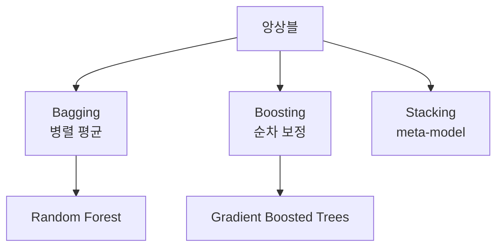

# 앙상블 학습 (Ensemble Learning)

- Level: Intermediate
- Prerequisites: [AI/Machine-Learning/Decision-Trees.md](Decision-Trees.md), [AI/Machine-Learning/Bias-Variance.md](Bias-Variance.md)
- Status: Draft
- Reviewed-by: -
- Depth: Deep-dive (자기완결)

---

## 개념 (Concept)

앙상블은 여러 모델의 예측을 결합해 단일 모델보다 안정적이고 정확한 예측을 만드는 방법이다. bagging은 병렬 모델의 분산을 줄이고, boosting은 이전 오차를 보완하는 모델을 순차적으로 더한다.

## 직관 (Intuition)

서로 다른 실수를 하는 여러 판단을 평균내면 우연한 흔들림이 상쇄된다. 반대로 boosting은 틀린 문제를 다음 학습자가 더 집중해서 풀도록 이어지는 팀 과외에 가깝다.



## 이론 (Theory)

상관이 낮고 분산이 $\sigma^2$인 $M$개 예측을 평균하면 독립에 가까울수록 평균의 분산이 약 $\sigma^2/M$로 줄어든다. Random Forest는 bootstrap 표본과 무작위 특징 부분집합으로 트리 사이 상관을 낮춘다.

Gradient boosting은 현재 모델 $F_t$에 손실을 줄이는 약한 학습기 $h_t$를 더한다.

$$F_{t+1}(x)=F_t(x)+\eta h_t(x)$$

학습률 $\eta$, 트리 깊이, 모델 수, subsampling이 편향·분산과 계산 비용을 조절한다.

### 다양성이 중요한 이유

모델들이 서로 같은 오류를 내면 평균을 내도 오류가 잘 줄지 않는다. 앙상블 이득은 개별 모델의 성능뿐 아니라 오류 상관에 달려 있다. Random Forest는 bootstrap과 feature subsampling으로 트리 간 상관을 낮춘다.

### Bagging과 Boosting 비교

| 항목 | Bagging | Boosting |
|---|---|---|
| 학습 순서 | 병렬 가능 | 순차적 |
| 주효과 | 분산 감소 | 편향 감소와 강한 fitting |
| 대표 모델 | Random Forest | Gradient Boosting, XGBoost류 |
| 과적합 제어 | 트리 수, feature sampling | learning rate, depth, early stopping |

### Stacking의 누출 방지

meta-model을 훈련할 때 base model이 자기 훈련 데이터에 대해 낸 예측을 쓰면 누출이 생긴다. 반드시 out-of-fold 예측으로 meta-model 학습 데이터를 만들고, test 예측은 전체 훈련 데이터로 다시 학습한 base model들의 예측을 결합한다.

## 구현 (Implementation)

```python
from collections import Counter


def majority_vote(predictions):
    return Counter(predictions).most_common(1)[0][0]


def average_predictions(predictions):
    return sum(predictions) / len(predictions)


print(majority_vote([1, 1, 0, 1, 0]))
print(average_predictions([2.8, 3.1, 2.9]))
```

실전에서는 out-of-bag 평가, early stopping, validation set으로 복잡도를 조절한다.

확률 예측을 평균할 때는 hard vote보다 probability average가 더 많은 정보를 보존할 수 있다.

```python
def average_probabilities(prob_vectors):
    n = len(prob_vectors)
    return [sum(p[i] for p in prob_vectors) / n for i in range(len(prob_vectors[0]))]
```

## 복잡도 (Complexity)

기본 모델 학습 비용을 $C$, 모델 수를 $M$이라 하면 대략 `O(MC)`다. bagging은 병렬화하기 쉽지만 boosting은 순차 의존성이 크다. 예측도 보통 모델 수에 선형이다.

## 응용 (Applications)

- tabular 데이터의 강력한 기본 모델
- 회귀·분류·랭킹
- 불확실성 추정을 위한 모델 다양성
- 서로 다른 모델 종류를 결합한 stacking

## 흔한 오해 (Common Misunderstandings)

- 같은 오류를 내는 모델을 많이 복제해도 큰 이득이 없다.
- boosting이 과적합하지 않는다는 보장은 없다.
- feature importance 방식마다 편향과 의미가 다르다.
- stacking의 meta-model은 원본 훈련 예측이 아닌 out-of-fold 예측으로 학습해야 누출을 피한다.
- 앙상블이 성능을 올려도 latency, 메모리, 설명 가능성 비용이 커질 수 있다.
- 같은 데이터 전처리와 같은 inductive bias를 공유하는 모델들은 생각보다 다양하지 않을 수 있다.

## TMI

- Random Forest의 out-of-bag 표본은 별도 검증셋 없이 일반화 오차를 추정하는 데 쓸 수 있다.
- boosting의 약한 학습기는 보통 얕은 트리다.
- 대회형 tabular 데이터에서는 gradient boosted trees가 오래도록 강력한 기준선이다.

## 연습 / 확인 문제 (Exercises)

- 상관된 모델과 독립 모델의 평균 분산 차이를 설명하라.
- bagging과 boosting을 학습 순서·주요 목적 관점에서 비교하라.
- stacking에서 데이터 누출이 생기는 잘못된 절차를 찾아라.
- out-of-bag 평가가 가능한 이유를 bootstrap 표본 관점에서 설명하라.
- boosting에서 learning rate를 낮추고 tree 수를 늘리는 전략의 장단점을 설명하라.

## 이어서 읽기 (Reading Path)

- 이전: [결정 트리](Decision-Trees.md)
- 다음: [편향-분산](Bias-Variance.md)

## 참조 (References)

- [AI/Machine-Learning/Decision-Trees.md](Decision-Trees.md)
- [AI/Machine-Learning/Bias-Variance.md](Bias-Variance.md)
- [Reference/Books.md](../../Reference/Books.md)
- [Reference/Papers.md](../../Reference/Papers.md)
