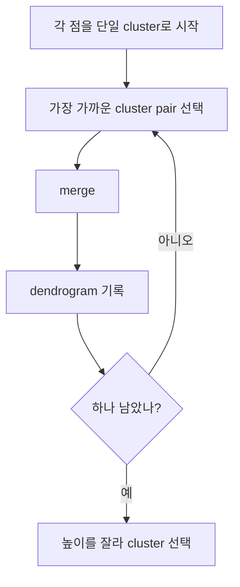

# 계층적 클러스터링 (Hierarchical Clustering)

- Level: Intermediate
- Prerequisites: [AI/Machine-Learning/K-Means.md](K-Means.md), [Math/Linear-Algebra/Vectors.md](../../Math/Linear-Algebra/Vectors.md), [Algorithms/Complexity.md](../../Algorithms/Complexity.md)
- Status: Draft
- Reviewed-by: -
- Depth: Deep-dive (자기완결)

---

## 개념 (Concept)

계층적 클러스터링은 데이터들을 여러 수준의 군집 구조로 묶는 비지도학습 방법이다. 가장 흔한 agglomerative 방식은 각 점을 하나의 군집으로 시작해, 가장 가까운 군집들을 반복적으로 합치며 dendrogram을 만든다.

## 직관 (Intuition)

친척 관계를 족보처럼 그리듯이 데이터도 가까운 것끼리 먼저 묶고, 그 묶음들이 다시 더 큰 묶음으로 합쳐지는 과정을 볼 수 있다. k-means가 군집 수 $k$를 미리 정하는 데 비해, 계층적 클러스터링은 여러 해상도의 군집 구조를 한 번에 보여준다.



## 이론 (Theory)

agglomerative clustering의 핵심은 군집 사이 거리인 linkage 기준이다.

- single linkage: 두 군집의 가장 가까운 점 사이 거리
- complete linkage: 가장 먼 점 사이 거리
- average linkage: 모든 점쌍 거리의 평균
- Ward linkage: 합쳤을 때 within-cluster variance 증가량

linkage 선택에 따라 군집 모양이 달라진다. single linkage는 길게 이어진 chain을 만들기 쉽고, complete/Ward는 더 compact한 군집을 선호한다.

### linkage별 inductive bias

| linkage | 선호 | 취약점 |
|---|---|---|
| single | 연결된 구조, arbitrary shape | chaining effect와 noise |
| complete | compact하고 분리된 군집 | elongated cluster를 쪼갤 수 있음 |
| average | 중간적 성질 | 해석이 덜 직관적일 수 있음 |
| Ward | 분산 증가 최소화 | Euclidean/구형 군집 가정 |

linkage는 단순 구현 세부사항이 아니라 군집 정의 자체다.

### dendrogram 자르기

dendrogram의 높이는 merge distance다. 큰 jump 직전에서 자르거나, 목표 cluster 수를 정하거나, 도메인에서 허용 가능한 최대 군집 내 거리를 기준으로 자를 수 있다. 어떤 기준을 쓰든 downstream 목적과 안정성을 함께 확인해야 한다.

### 거리 행렬의 의미

계층적 클러스터링은 pairwise distance에 크게 의존한다. 표준화, metric, outlier 처리, missing value 처리가 결과를 크게 바꾼다. 한 번 합친 군집은 다시 쪼개지지 않는 greedy 절차라는 점도 중요하다.

## 구현 (Implementation)

작은 데이터에서는 가장 가까운 군집 쌍을 반복적으로 합치는 구조로 이해할 수 있다.

```python
def distance(a, b):
    return abs(a - b)


def single_linkage(c1, c2):
    return min(distance(a, b) for a in c1 for b in c2)


clusters = [{0.0}, {0.2}, {2.0}, {2.3}]
while len(clusters) > 1:
    pairs = [
        (single_linkage(a, b), i, j)
        for i, a in enumerate(clusters)
        for j, b in enumerate(clusters)
        if i < j
    ]
    _, i, j = min(pairs)
    merged = clusters[i] | clusters[j]
    clusters = [c for k, c in enumerate(clusters) if k not in {i, j}] + [merged]
    print(clusters)
```

실제 라이브러리는 거리 행렬과 linkage matrix를 효율적으로 관리하고 dendrogram 시각화를 제공한다.

merge 순서를 저장하면 dendrogram의 뼈대가 된다.

```python
merges = []
# 예: merges.append((cluster_id_a, cluster_id_b, distance, new_size))
```

## 복잡도 (Complexity)

기본 계층적 클러스터링은 거리 행렬 때문에 메모리 $O(n^2)$가 필요하다. 단순 구현은 시간 $O(n^3)$까지 갈 수 있고, 최적화된 구현도 일반적으로 큰 데이터에는 부담이 된다. 대규모 데이터에서는 sampling, approximate nearest neighbor, 다른 clustering 방법을 고려한다.

## 응용 (Applications)

- 탐색적 데이터 분석과 dendrogram 시각화
- 생물정보학의 계통/발현 패턴 분석
- 문서나 고객 세그먼트의 다층 구조 파악
- k를 미리 정하기 어려운 군집 분석

## 흔한 오해 (Common Misunderstandings)

- dendrogram을 어디서 자르느냐에 따라 군집 수가 달라진다.
- linkage 기준이 바뀌면 결과가 크게 달라질 수 있다.
- 거리 척도와 feature scaling을 무시하면 군집 해석이 왜곡된다.
- 계층적 구조가 나온다고 실제 세계에 진짜 계층이 존재한다는 뜻은 아니다.
- dendrogram의 좌우 배치는 시각적 편의를 위한 것이며 군집 간 순서 의미가 약하다.
- 큰 데이터에 무심코 적용하면 거리 행렬 메모리 `O(n^2)`가 먼저 터질 수 있다.

## TMI

- Ward linkage는 Euclidean space와 분산 감소 해석에 잘 맞는다.
- single linkage는 noise point가 군집을 이어 붙이는 chaining effect에 취약하다.
- hierarchical clustering은 예측 모델이라기보다 구조 탐색 도구에 가깝다.

## 연습 / 확인 문제 (Exercises)

- single, complete, average linkage의 차이를 작은 점 집합으로 계산하라.
- feature scaling이 계층적 클러스터링 결과에 미치는 영향을 설명하라.
- dendrogram을 자르는 기준을 세 가지 제안하라.
- single linkage에서 chaining effect가 생기는 점 집합을 만들어라.
- Ward linkage가 Euclidean 거리와 분산 해석에 묶여 있는 이유를 설명하라.

## 이어서 읽기 (Reading Path)

- 이전: [k-평균 클러스터링](K-Means.md)
- 다음: [차원 축소](Dimensionality-Reduction.md)

## 참조 (References)

- [AI/Machine-Learning/K-Means.md](K-Means.md)
- [Math/Linear-Algebra/Vectors.md](../../Math/Linear-Algebra/Vectors.md)
- [Algorithms/Complexity.md](../../Algorithms/Complexity.md)
- [Reference/Books.md](../../Reference/Books.md)
