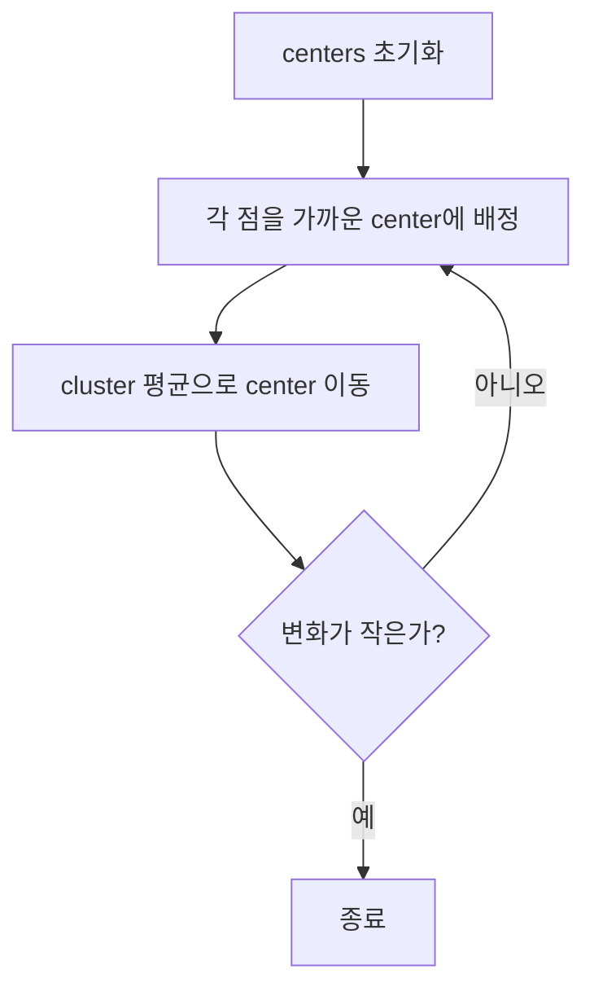

# k-평균 클러스터링 (k-Means Clustering)

- Level: Intermediate
- Prerequisites: [Math/Linear-Algebra/Vectors.md](../../Math/Linear-Algebra/Vectors.md), [Math/Probability-Statistics/Expectation.md](../../Math/Probability-Statistics/Expectation.md)
- Status: Draft
- Reviewed-by: -
- Depth: Deep-dive (자기완결)

---

## 개념 (Concept)

k-means는 레이블 없는 데이터를 $k$개 군집으로 나누고 각 군집 중심과 표본 사이 제곱거리 합을 최소화하는 비지도학습 알고리즘이다.

## 직관 (Intuition)

임시 중심을 놓고 각 점을 가장 가까운 중심에 배정한 뒤, 각 그룹의 평균으로 중심을 옮긴다. 배정과 이동을 반복하면 중심이 안정된다.



## 이론 (Theory)

군집 배정 $c_i$와 중심 $\mu_j$에 대한 목적은

$$J=\sum_{i=1}^n\|x_i-\mu_{c_i}\|_2^2$$

다. Lloyd 알고리즘은 assignment step과 update step을 번갈아 수행하며 각 단계에서 목적값을 증가시키지 않는다. 유한 단계에서 지역 최적점에 도달하지만 전역 최적은 보장하지 않는다. k-means++ 초기화와 여러 번의 restart가 나쁜 초기화를 줄인다.

### 가정과 inductive bias

k-means는 Euclidean 제곱거리를 최소화하므로 구형이고 비슷한 크기의 군집을 선호한다. 길쭉한 군집, 밀도가 다른 군집, 비볼록 모양, 많은 이상치가 있으면 결과가 직관과 달라질 수 있다.

### k 선택

| 방법 | 읽는 법 |
|---|---|
| inertia/elbow | $k$ 증가에 따른 제곱거리 감소가 완만해지는 지점 |
| silhouette | 같은 군집 내 응집도와 다른 군집과의 분리도 비교 |
| stability | bootstrap/restart에서 군집이 얼마나 재현되는지 |
| domain constraint | 실제 사용할 segment 수와 해석 가능성 |

지표는 보조 도구이며, 군집이 실제 의사결정에 유용한지 별도로 검증해야 한다.

### 빈 군집과 이상치

업데이트 단계에서 어떤 중심에 배정된 점이 없으면 평균을 계산할 수 없다. 보통 가장 큰 오차를 내는 점 근처로 재초기화하거나 해당 중심을 제거한다. 이상치는 중심을 크게 끌어당길 수 있어 trimming이나 robust clustering을 고려한다.

## 구현 (Implementation)

```python
import random


def squared_distance(a, b):
    return sum((x - y) ** 2 for x, y in zip(a, b))


def mean(points):
    return [sum(values) / len(points) for values in zip(*points)]


def kmeans(points, k, steps=30):
    centers = random.sample(points, k)
    for _ in range(steps):
        labels = [min(range(k), key=lambda j: squared_distance(p, centers[j])) for p in points]
        centers = [mean([p for p, label in zip(points, labels) if label == j])
                   for j in range(k)]
    return labels, centers
```

빈 군집 처리는 생략했으며 실제 구현은 해당 중심을 재초기화해야 한다.

목적값을 추적하면 수렴 여부를 확인할 수 있다.

```python
def inertia(points, labels, centers):
    return sum(squared_distance(p, centers[label])
               for p, label in zip(points, labels))
```

## 복잡도 (Complexity)

표본 $n$, 차원 $d$, 군집 $k$, 반복 $T$에 대해 시간 `O(Tnkd)`, 중심과 배정 외 데이터 공간 `O(kd+n)`이다.

## 응용 (Applications)

- 고객·문서·이미지 임베딩 군집화
- 색상 양자화와 압축
- prototype 생성과 데이터 요약
- 이상치 탐색의 전처리

## 흔한 오해 (Common Misunderstandings)

- $k$는 알고리즘이 자동으로 정해 주지 않는다.
- 구형이고 비슷한 크기의 군집 가정이 강하다.
- 범주형 특징에 Euclidean mean을 그대로 적용할 수 없다.
- cluster 번호 0과 1에는 순서 의미가 없다.
- 낮은 inertia가 항상 좋은 군집 해석을 뜻하지 않는다. $k$를 늘리면 inertia는 거의 항상 줄어든다.
- 여러 restart 결과가 크게 다르면 데이터 구조나 초기화 민감성을 더 점검해야 한다.

## TMI

- 중심 업데이트가 평균인 이유는 제곱거리 합을 최소화하는 점이 평균이기 때문이다.
- scale이 큰 특징이 거리를 지배하므로 표준화가 중요하다.
- elbow와 silhouette는 $k$ 선택의 보조 지표이지 정답 생성기는 아니다.

## 연습 / 확인 문제 (Exercises)

- 서로 다른 초기화로 목적값이 달라지는 예를 찾아라.
- 표준화 전후 군집 결과를 비교하라.
- 빈 군집 재초기화 정책을 구현하라.
- 길쭉한 두 군집 데이터를 만들고 k-means가 어떻게 잘못 나눌 수 있는지 관찰하라.
- elbow와 silhouette가 서로 다른 $k$를 추천하는 경우 어떤 기준으로 선택할지 설명하라.

## 이어서 읽기 (Reading Path)

- 이전: [k-최근접 이웃](KNN.md)
- 다음: [차원 축소](Dimensionality-Reduction.md)
- 관련: [계층적 클러스터링](Hierarchical-Clustering.md)

## 참조 (References)

- [Math/Linear-Algebra/Vectors.md](../../Math/Linear-Algebra/Vectors.md)
- [Reference/Books.md](../../Reference/Books.md)
- [Reference/Courses.md](../../Reference/Courses.md)
