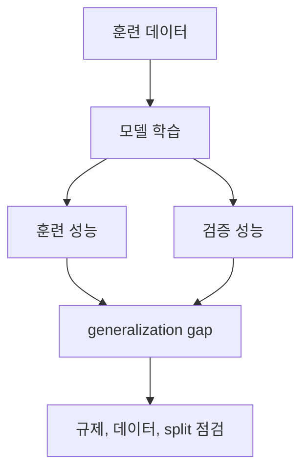

# 과적합과 일반화 (Overfitting and Generalization)

- Level: Intermediate
- Prerequisites: [AI/Machine-Learning/Bias-Variance.md](Bias-Variance.md), [AI/Machine-Learning/Cross-Validation.md](Cross-Validation.md)
- Status: Draft
- Reviewed-by: -
- Depth: Deep-dive (자기완결)

---

## 개념 (Concept)

과적합은 모델이 훈련 데이터의 일반적인 규칙뿐 아니라 우연한 잡음과 표본 특성까지 학습해 새로운 데이터 성능이 나빠지는 현상이다. 일반화는 같은 생성 과정에서 나온 보지 못한 데이터에 성능을 유지하는 능력이다.

## 직관 (Intuition)

문제의 원리를 이해하지 않고 답안 문구를 외운 학생은 같은 시험에서는 완벽하지만 숫자만 바뀌면 틀린다. 훈련 점수와 실제 활용 성능의 간극이 과적합의 신호다.



## 이론 (Theory)

훈련 경험위험 $\hat R(f)$와 모집단 위험 $R(f)=E[\ell(f(X),Y)]$의 차이를 generalization gap이라 한다. 모델 클래스가 유연하고 데이터가 적거나 noisy하면 많은 가설 중 우연히 훈련셋에만 잘 맞는 것을 선택하기 쉽다.

대응 방법은 데이터 추가, 모델 단순화, 규제, early stopping, 올바른 교차 검증, 데이터 증강이다. 중복 샘플이나 미래 정보가 split을 넘는 leakage는 과적합처럼 보이는 문제보다 더 위험하게 평가를 낙관시킨다.

### 과적합과 누출을 구분하기

과적합은 훈련 데이터에 너무 맞춘 결과 validation에서 나빠지는 현상이다. 데이터 누출은 validation이나 test가 실제보다 쉽게 만들어져 성능이 좋아 보이는 문제다.

| 현상 | 관측 신호 | 대응 |
|---|---|---|
| 과적합 | train 좋음, validation 나쁨 | 규제, 데이터 추가, 모델 단순화 |
| 과소적합 | train/validation 모두 나쁨 | 모델/feature 강화, 최적화 개선 |
| 누출 | validation/test가 비정상적으로 좋음 | split과 preprocessing 재설계 |
| 분포 이동 | validation은 좋지만 배포에서 나쁨 | 시간/도메인별 평가, 모니터링 |

### learning curve 읽기

훈련 데이터 크기를 늘릴 때 validation error가 계속 개선되고 train error와의 gap이 줄면 데이터 추가가 도움이 된다. 반대로 두 곡선이 높은 error에서 함께 평평하면 모델 표현력이나 feature가 부족할 가능성이 높다.

### 테스트셋 과적합

테스트셋은 최종 보고를 위한 독립 평가다. 테스트 결과를 보고 하이퍼파라미터, feature, threshold를 반복 수정하면 테스트셋이 validation set이 되어 최종 성능 추정이 낙관적으로 변한다.

## 구현 (Implementation)

```python
def generalization_gap(train_score, validation_score, higher_is_better=True):
    return (train_score - validation_score if higher_is_better
            else validation_score - train_score)


gap = generalization_gap(0.99, 0.78)
print(round(gap, 3))
```

단일 gap만으로 원인을 확정하지 않고 learning curve와 데이터 품질을 함께 확인한다.

간단한 누출 점검 질문을 체크리스트로 남길 수 있다.

```python
leakage_checks = [
    "preprocessing fit이 train split 안에서만 일어났는가?",
    "같은 사용자/문서/환자의 중복 행이 split을 넘지 않는가?",
    "미래 시점 정보가 과거 예측 feature에 들어가지 않았는가?",
    "target 이후에 생성된 컬럼을 사용하지 않았는가?",
]
```

## 복잡도 (Complexity)

과적합은 알고리즘이 아니라 현상이므로 고정 복잡도가 없다. 진단에는 여러 모델·분할 학습이 필요해 기본 학습 비용의 배수가 들며, 데이터 추가는 저장·학습 비용도 늘린다.

## 응용 (Applications)

- 모델 선택과 배포 전 평가
- early stopping 시점 결정
- 데이터 수집·증강 전략
- distribution shift와 leakage 점검

## 흔한 오해 (Common Misunderstandings)

- 훈련 정확도 100% 자체가 항상 나쁜 것은 아니다. 검증 성능과 문제 구조를 봐야 한다.
- 테스트셋을 반복 확인해 개선하면 테스트셋에도 과적합한다.
- 규제 하나만으로 데이터 누출이나 분포 이동을 해결할 수 없다.
- validation 성능이 나쁜 원인이 항상 과적합은 아니다. underfitting이나 pipeline 버그일 수 있다.
- 데이터 증강은 train split 안에서만 설계되어야 한다. validation/test를 보고 증강 정책을 조정하면 선택 편향이 생긴다.
- early stopping도 validation에 맞춘 모델 선택이므로, 최종 평가는 별도 test나 nested protocol이 필요하다.

## TMI

- 대형 신경망은 파라미터가 표본보다 많아도 SGD와 데이터 구조의 implicit bias로 잘 일반화하기도 한다.
- leaderboard에 반복 제출하면 공개 점수에 적응해 숨은 테스트에서 성능이 떨어질 수 있다.
- 데이터 중복 제거는 모델 크기 변경보다 평가 신뢰도를 크게 개선하기도 한다.

## 연습 / 확인 문제 (Exercises)

- 훈련 크기를 늘리며 train/validation learning curve를 그려라.
- 사용자 단위 누출이 생기는 임의 행 분할 예를 만들어라.
- 과적합, underfitting, distribution shift의 관측 신호를 비교하라.
- 같은 테스트셋을 반복 사용해 모델을 고르면 왜 성능 추정이 낙관적으로 되는지 설명하라.
- validation gap이 큰 상황에서 데이터 추가, 규제 강화, 모델 축소 중 무엇을 먼저 시도할지 기준을 세워라.

## 이어서 읽기 (Reading Path)

- 이전: [규제](Regularization.md)
- 다음: [딥러닝](../Deep-Learning/)
- 관련: [PAC 학습 프레임워크](../Theoretical-ML/PAC-Learning.md)

## 참조 (References)

- [AI/Machine-Learning/Bias-Variance.md](Bias-Variance.md)
- [AI/Machine-Learning/Cross-Validation.md](Cross-Validation.md)
- [Reference/Books.md](../../Reference/Books.md)
- [Reference/Courses.md](../../Reference/Courses.md)
