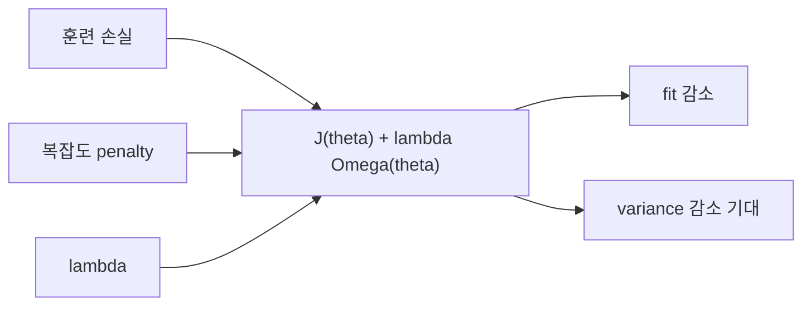

# 규제 (Regularization)

- Level: Intermediate
- Prerequisites: [AI/Machine-Learning/Linear-Regression.md](Linear-Regression.md), [Math/Optimization/Convex-Optimization.md](../../Math/Optimization/Convex-Optimization.md)
- Status: Draft
- Reviewed-by: -
- Depth: Deep-dive (자기완결)

---

## 개념 (Concept)

규제는 훈련 손실만 최소화하지 않고 모델 복잡도나 파라미터에 선호를 추가해 일반화를 개선하는 방법이다. L2(ridge), L1(lasso), early stopping, 데이터 증강 등이 넓은 의미의 규제다.

## 직관 (Intuition)

데이터를 완벽히 외우는 복잡한 설명보다 비슷하게 맞으면서 단순한 설명을 선호한다. 파라미터가 불필요하게 커지는 데 비용을 부과하면 작은 데이터 흔들림에 덜 민감해진다.



## 이론 (Theory)

경험 손실 $J(\theta)$에 penalty를 더한다.

$$J_{reg}(\theta)=J(\theta)+\lambda\Omega(\theta)$$

L2는 $\Omega=\|\theta\|_2^2$로 계수를 부드럽게 줄이고, L1은 $\Omega=\|\theta\|_1$로 일부 계수를 정확히 0으로 만드는 sparse 해를 유도한다. $\lambda$가 클수록 제약이 강해져 편향은 커지고 분산은 보통 줄어든다.

베이즈 관점에서 L2는 Gaussian prior, L1은 Laplace prior를 둔 MAP 추정과 연결된다. 입력 스케일이 다르면 penalty의 의미가 달라지므로 선형 모델은 보통 표준화한다.

### L1과 L2의 기하학

L2 penalty는 원형 제약처럼 모든 계수를 부드럽게 줄인다. L1 penalty는 마름모꼴 제약처럼 축과 만나는 꼭짓점이 있어 일부 계수를 정확히 0으로 만들기 쉽다. 그래서 L1은 feature selection 효과가 있고, L2는 다중공선성에서 계수를 안정화하는 효과가 강하다.

### 무엇을 규제할 것인가

편향 항, normalization 파라미터, embedding, output head 등은 모델과 라이브러리마다 규제 여부가 다르다. 특히 딥러닝에서는 weight decay를 모든 파라미터에 무조건 적용하지 않고 bias와 normalization scale은 제외하는 관행이 흔하다.

### lambda 선택

$\lambda$는 train loss로 고르면 보통 0에 가까운 값이 유리하다. 일반화 목적의 하이퍼파라미터이므로 validation/CV로 선택해야 한다. 로그 스케일 grid나 Bayesian optimization을 사용하고, 최종 test는 선택 후 한 번만 본다.

## 구현 (Implementation)

```python
def l2_gradient_step(weights, data_gradient, lr, strength):
    return [w - lr * (g + 2 * strength * w)
            for w, g in zip(weights, data_gradient)]


weights = [2.0, -1.0]
print(l2_gradient_step(weights, [0.2, -0.1], lr=0.05, strength=0.1))
```

편향 항은 종종 규제하지 않으며 라이브러리의 목적 함수 정규화 방식을 확인한다.

L1은 0에서 미분 불가능하므로 proximal update가 자주 쓰인다.

```python
def soft_threshold(w, alpha):
    if w > alpha:
        return w - alpha
    if w < -alpha:
        return w + alpha
    return 0.0
```

## 복잡도 (Complexity)

L1/L2 penalty와 gradient 계산은 파라미터 수 $d$에 대해 `O(d)`다. 규제 강도 선택에는 교차 검증으로 여러 번 학습하는 비용이 추가된다.

## 응용 (Applications)

- 다중공선성이 있는 선형 모델 안정화
- sparse feature selection
- 신경망의 weight decay, dropout, early stopping
- ill-posed inverse problem 안정화

## 흔한 오해 (Common Misunderstandings)

- 규제는 검증·테스트 데이터 손실에 임의로 더하는 항이 아니다.
- L1이 상관된 특징 중 어떤 것을 고를지는 불안정할 수 있다.
- 강한 규제가 항상 좋은 것은 아니며 underfitting을 만들 수 있다.
- Adam의 L2 penalty와 AdamW의 decoupled weight decay는 같지 않다.
- 규제 강도는 feature scaling에 의존한다. 표준화 없이 L1/L2 계수를 비교하면 의미가 흐려진다.
- dropout, data augmentation, early stopping도 넓은 의미의 규제지만 penalty 항과 같은 방식으로 동작하지 않는다.

## TMI

- elastic net은 L1과 L2를 결합해 sparsity와 안정성을 함께 노린다.
- early stopping은 최적화 반복 수를 제한하는 implicit regularization으로 볼 수 있다.
- 데이터 증강은 예측이 특정 변환에 불변이어야 한다는 도메인 지식을 주입한다.

## 연습 / 확인 문제 (Exercises)

- $\lambda$를 바꾸며 계수 크기와 검증 오차를 비교하라.
- L1과 L2의 등고선이 sparse 해에 미치는 차이를 그려라.
- 표준화 없이 규제했을 때 단위가 큰 특징이 받는 영향을 설명하라.
- bias 항까지 규제했을 때와 제외했을 때 선형 모델의 예측이 어떻게 달라질 수 있는지 실험하라.
- correlated feature 두 개에서 Lasso와 Ridge 계수 안정성을 비교하라.

## 이어서 읽기 (Reading Path)

- 이전: [교차 검증](Cross-Validation.md)
- 다음: [과적합](Overfitting.md)

## 참조 (References)

- [Math/Optimization/Convex-Optimization.md](../../Math/Optimization/Convex-Optimization.md)
- [AI/Machine-Learning/Cross-Validation.md](Cross-Validation.md)
- [Reference/Books.md](../../Reference/Books.md)
- [Reference/Courses.md](../../Reference/Courses.md)
