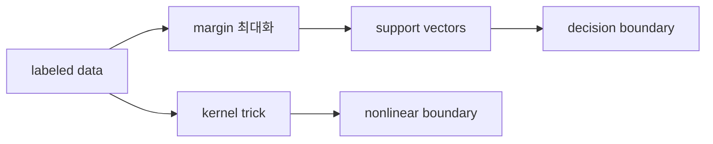

# SVM (Support Vector Machine)

- Level: Intermediate
- Prerequisites: [AI/Machine-Learning/Logistic-Regression.md](Logistic-Regression.md), [Math/Optimization/Convex-Optimization.md](../../Math/Optimization/Convex-Optimization.md), [Math/Linear-Algebra/Vectors.md](../../Math/Linear-Algebra/Vectors.md)
- Status: Draft
- Reviewed-by: -
- Depth: Deep-dive (자기완결)

---

## 개념 (Concept)

SVM은 분류 경계와 가장 가까운 데이터점 사이의 margin을 최대화하는 지도학습 모델이다. 선형 SVM은 초평면으로 분류하고, kernel SVM은 비선형 특징 공간에서 선형 분리를 수행하는 효과를 낸다.

## 직관 (Intuition)

두 클래스를 가르는 선은 많을 수 있다. SVM은 그중 “가장 여유 있게” 가르는 선을 고른다. 경계 근처의 몇 개 점이 결정에 큰 영향을 주며, 이 점들을 support vector라고 부른다.



## 이론 (Theory)

선형 분류기 $f(x)=w^\top x+b$에서 margin을 크게 하려면 $\|w\|$를 작게 만들고, 각 표본이 올바른 쪽에 충분히 떨어져 있게 해야 한다. soft-margin SVM은 slack variable을 허용해 잡음과 겹침을 다룬다.

대표적인 primal 목적은 다음과 같다.

$$
\min_{w,b}\frac{1}{2}\|w\|^2 + C\sum_i \max(0,1-y_i(w^\top x_i+b))
$$

여기서 두 번째 항은 hinge loss이고, $C$는 margin 크기와 훈련 오류 허용 사이의 trade-off를 조절한다. Kernel trick을 쓰면 $x$를 고차원 특징 공간으로 명시적으로 옮기지 않고도 내적 $K(x,x')$만 계산해 비선형 경계를 만들 수 있다.

### hinge loss와 margin

레이블 $y_i\in\{-1,1\}$에 대해 margin score는 $y_i(w^\top x_i+b)$다.

| margin score | hinge loss |
|---|---|
| $\ge 1$ | 0, 충분히 올바른 쪽 |
| $0$과 $1$ 사이 | 맞지만 margin 안쪽 |
| $\le 0$ | 오분류 |

SVM은 단순히 맞히는 것보다 경계에서 충분히 떨어지게 만드는 해를 선호한다.

### C와 gamma

$C$가 크면 훈련 오류를 더 강하게 벌점화해 margin이 좁아지고 과적합 위험이 커질 수 있다. RBF kernel의 $\gamma$가 크면 각 support vector의 영향 범위가 좁아져 복잡한 경계를 만든다. 보통 $C$와 $\gamma$는 로그 스케일 grid에서 교차 검증으로 고른다.

### scaling의 중요성

SVM은 내적과 거리 기반 kernel에 민감하다. 한 feature의 단위가 크면 margin과 kernel 값이 그 feature에 지배된다. 선형 SVM과 RBF SVM 모두 표준화가 사실상 기본 전처리다.

## 구현 (Implementation)

학습된 선형 SVM의 예측은 decision score의 부호로 정한다.

```python
def svm_score(w, b, x):
    return sum(wi * xi for wi, xi in zip(w, x)) + b


def predict(w, b, x):
    return 1 if svm_score(w, b, x) >= 0 else -1


w = [0.8, -0.3]
b = 0.1
print(predict(w, b, [2.0, 1.0]))
```

실무에서는 feature scaling이 매우 중요하며, kernel SVM은 데이터가 크면 학습 비용이 빠르게 증가한다.

hinge loss를 직접 계산하면 margin의 의미가 보인다.

```python
def hinge_loss(y, score):
    return max(0.0, 1.0 - y * score)
```

## 복잡도 (Complexity)

선형 SVM은 대규모 희소 데이터에서도 효율적으로 학습할 수 있다. 일반 kernel SVM은 kernel matrix 때문에 메모리 $O(n^2)$, 학습 시간은 구현과 조건에 따라 더 크게 늘 수 있다. 예측 비용도 support vector 수에 비례한다.

## 응용 (Applications)

- 작은/중간 규모 데이터의 강력한 분류 baseline
- 텍스트 분류와 고차원 희소 feature
- margin 기반 이론 연구
- 비선형 분류를 위한 RBF kernel 사용

## 흔한 오해 (Common Misunderstandings)

- SVM이 항상 딥러닝보다 낫거나 항상 오래된 방법인 것은 아니다. 데이터 규모와 feature에 따라 다르다.
- kernel을 쓰면 무조건 성능이 좋아지는 것은 아니다. 비용과 overfitting 위험도 커진다.
- support vector는 모든 데이터가 아니라 경계 근처에서 결정에 영향을 주는 점들이다.
- $C$가 클수록 항상 좋은 것은 아니다. 훈련 오류를 지나치게 줄이려 할 수 있다.
- SVM score는 기본적으로 잘 보정된 확률이 아니다. 확률이 필요하면 calibration이 필요하다.
- kernel matrix가 커지면 메모리가 먼저 병목이 될 수 있다.

## TMI

- hinge loss는 margin을 직접 반영하는 convex surrogate다.
- maximum margin 관점은 일반화 이론과 깊게 연결된다.
- RBF kernel의 gamma가 너무 크면 각 점 주변에 매우 좁은 영향권이 생겨 과적합하기 쉽다.

## 연습 / 확인 문제 (Exercises)

- hard-margin과 soft-margin SVM의 차이를 설명하라.
- hinge loss가 0이 되는 조건을 쓰라.
- RBF kernel에서 gamma가 너무 클 때 생길 수 있는 문제를 설명하라.
- 같은 데이터에서 feature scaling 전후의 SVM decision boundary를 비교하라.
- $C$와 $\gamma$를 동시에 키웠을 때 train/validation 성능이 어떻게 변하는지 관찰하라.

## 이어서 읽기 (Reading Path)

- 이전: [로지스틱 회귀](Logistic-Regression.md)
- 다음: [앙상블](Ensemble.md)

## 참조 (References)

- [AI/Machine-Learning/Logistic-Regression.md](Logistic-Regression.md)
- [Math/Optimization/Convex-Optimization.md](../../Math/Optimization/Convex-Optimization.md)
- [AI/Theoretical-ML/Convex-Learning.md](../Theoretical-ML/Convex-Learning.md)
- [Reference/Books.md](../../Reference/Books.md)
