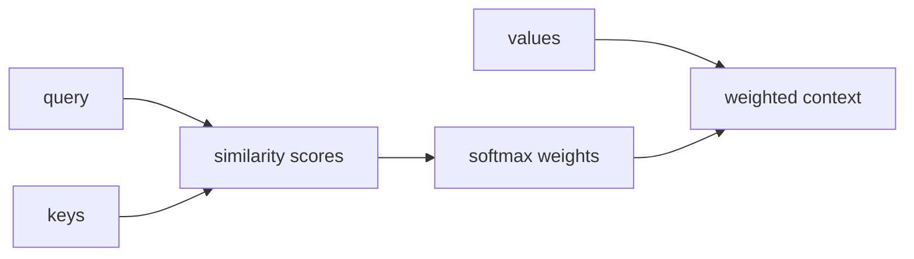

# 어텐션 메커니즘 in NLP (Attention Mechanism)

- Level: Intermediate
- Prerequisites: [RNN-for-NLP.md](RNN-for-NLP.md), [AI/Deep-Learning/Attention.md](../Deep-Learning/Attention.md), [Word-Embeddings.md](Word-Embeddings.md)
- Status: Draft
- Reviewed-by: -
- Depth: Deep-dive (자기완결)

---

## 개념 (Concept)

어텐션은 현재 위치가 시퀀스의 다른 위치들을 얼마나 참고할지 가중합으로 계산하는 메커니즘이다. NLP에서는 번역, 요약, 질의응답처럼 입력의 특정 부분을 동적으로 참조해야 하는 문제에서 핵심 역할을 한다.

## 직관 (Intuition)

문장을 번역할 때 매 단어가 전체 문장을 똑같이 보는 것은 비효율적이다. 현재 번역할 단어와 관련 있는 원문 단어에 더 집중하면 좋다. 어텐션은 이 “어디를 볼지”를 학습한다.

## 이론 (Theory)

Scaled dot-product attention은 query, key, value를 사용한다.

$$
\operatorname{Attention}(Q,K,V)=\operatorname{softmax}\left(\frac{QK^\top}{\sqrt{d_k}}\right)V
$$

RNN encoder-decoder에서는 decoder state가 query가 되고 encoder hidden states가 key/value가 된다. Transformer에서는 self-attention으로 같은 시퀀스 내부 토큰들이 서로를 참조한다.

Multi-head attention은 여러 attention head가 서로 다른 관계를 볼 수 있게 한다.



### NLP에서 attention의 형태

| 형태 | Query | Key/Value | 사용 |
| --- | --- | --- | --- |
| Encoder-decoder attention | decoder state | encoder states | 번역 alignment |
| Self-attention | 같은 sequence token | 같은 sequence token | Transformer |
| Cross-attention | 생성 중 token | 외부 context 또는 encoder | RAG, seq2seq |

attention은 내용 기반으로 연결을 만들지만 위치 정보는 별도로 넣어야 한다. causal task에서는 미래 token을 가리는 mask가 필수다.

### Attention weight 해석

weight가 높은 token은 해당 layer/head의 value 가중합에 많이 반영되었다는 뜻이다. 그러나 여러 layer, residual, MLP가 섞인 최종 예측의 인과 설명으로 바로 해석할 수는 없다. 분석에는 ablation, gradient, counterfactual test를 함께 사용한다.

## 구현 (Implementation)

Attention score를 softmax로 바꿔 value를 가중합한다.

```python
import math


def softmax(xs):
    m = max(xs)
    exps = [math.exp(x - m) for x in xs]
    z = sum(exps)
    return [e / z for e in exps]


scores = [1.0, 2.0, 0.5]
weights = softmax(scores)
values = [10.0, 20.0, 30.0]
context = sum(w * v for w, v in zip(weights, values))
print(round(context, 2))
```

실제 모델은 mask, batch, multi-head projection, residual connection을 포함한다.

## 복잡도 (Complexity)

Self-attention은 길이 $T$에 대해 attention matrix가 $T\times T$이므로 시간과 메모리가 대체로 $O(T^2)$이다. 긴 문맥에서는 sparse attention, chunking, linear attention 같은 변형이 쓰인다.

## 응용 (Applications)

- 기계 번역의 alignment
- Transformer 기반 NLP
- 질의응답의 passage grounding
- 요약에서 중요 문장 참조

## 흔한 오해 (Common Misunderstandings)

- Attention weight가 곧 완전한 설명 가능성은 아니다.
- 모든 head가 사람이 해석하기 쉬운 역할을 갖는 것은 아니다.
- Self-attention은 위치 정보를 자동으로 알지 못하므로 positional encoding이 필요하다.
- 긴 문맥에서 attention 비용은 큰 병목이 될 수 있다.

## TMI

- Bahdanau attention은 RNN seq2seq 번역에서 긴 문장 문제를 크게 완화했다.
- Causal mask는 GPT류 모델이 미래 토큰을 보지 못하게 만든다.
- Cross-attention은 decoder가 encoder 출력이나 외부 context를 참조할 때 쓰인다.

## 연습 / 확인 문제 (Exercises)

- Query, key, value의 역할을 설명하라.
- Self-attention과 cross-attention의 차이를 말하라.
- Attention weight를 설명으로 해석할 때 주의할 점을 정리하라.

## 이어서 읽기 (Reading Path)

- 이전: [RNN for NLP](RNN-for-NLP.md)
- 다음: [Transformer for NLP](Transformer-NLP.md)

## 참조 (References)

- [AI/Deep-Learning/Attention.md](../Deep-Learning/Attention.md)
- [Transformer-NLP.md](Transformer-NLP.md)
- [Reference/Books.md](../../Reference/Books.md)
