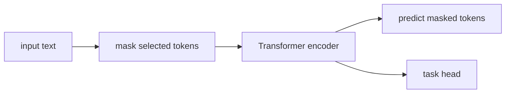

# BERT와 마스크드 언어 모델 (BERT and Masked Language Models)

- Level: Intermediate
- Prerequisites: [AI/Deep-Learning/Transformer.md](../Deep-Learning/Transformer.md), [AI/NLP/Language-Model-Basics.md](Language-Model-Basics.md)
- Status: Draft
- Reviewed-by: -
- Depth: Deep-dive (자기완결)

---

## 개념 (Concept)

BERT는 Transformer encoder를 양방향 문맥으로 사전학습한 언어 표현 모델이다. 일부 token을 가리고 복원하는 masked language modeling으로 문장 양쪽 문맥을 함께 사용한다.

## 직관 (Intuition)

문장 빈칸을 앞뒤 단서로 맞히는 연습을 대규모 text에 수행한 뒤, 분류·질문응답 같은 과제에 작은 head를 붙여 fine-tuning한다.

## 이론 (Theory)

입력은 token, segment, position embedding을 합친다. 선택한 위치 $M$의 target에 대해

$$L=-\sum_{i\in M}\log p(x_i\mid x_{\setminus M})$$

를 최소화한다. encoder self-attention은 causal mask가 없어 모든 입력 위치를 볼 수 있다. BERT류 모델은 representation·understanding task에 강하지만 왼쪽부터 긴 문장을 생성하는 목적에는 decoder model이 더 자연스럽다.



### Fine-tuning head

| 과제 | Head | Loss |
| --- | --- | --- |
| Sequence classification | pooled output + linear | cross-entropy |
| Token classification | token별 linear | token cross-entropy |
| Extractive QA | start/end linear heads | span loss |
| Sentence embedding | pooling + contrastive | contrastive/ranking loss |

task head는 작지만 성능은 pooling, learning rate, sequence length, label 품질에 민감하다. 작은 데이터에서는 layer-wise learning rate decay나 freezing이 안정적일 수 있다.

### `[MASK]` mismatch

사전학습에는 `[MASK]` token이 등장하지만 실제 downstream 입력에는 보통 등장하지 않는다. BERT recipe는 일부 token을 원래 token이나 random token으로 두어 이 mismatch를 완화한다. 그래도 BERT는 left-to-right 생성보다 bidirectional representation에 더 적합하다.

### Domain adaptation

법률, 의료, 코드처럼 도메인 언어가 다른 경우 continued pretraining이 도움이 될 수 있다. 다만 domain corpus 품질, tokenizer coverage, catastrophic forgetting, downstream 평가셋 오염을 함께 관리해야 한다.

## 구현 (Implementation)

```python
def mask_tokens(tokens, positions, mask_token="[MASK]"):
    inputs = tokens.copy()
    labels = {}
    for i in positions:
        labels[i] = tokens[i]
        inputs[i] = mask_token
    return inputs, labels


print(mask_tokens(["나는", "밥을", "먹는다"], [1]))
```

```python
task_heads = {
    "classification": "pooled_output",
    "ner": "token_outputs",
    "extractive_qa": "start_end_logits",
}
```

## 복잡도 (Complexity)

길이 $n$, hidden size $d$에서 encoder attention은 주로 `O(n^2d)`, 모든 층 activation 저장도 큰 비용이다. Fine-tuning은 전체 파라미터 또는 adapter 일부만 갱신할 수 있다.

## 응용 (Applications)

- text classification·NER
- extractive question answering
- semantic retrieval encoder
- domain-specific representation pretraining

## 흔한 오해 (Common Misunderstandings)

- 양방향은 미래를 예측에 몰래 쓰는 causal generation 설정과 목적이 다르다.
- `[CLS]` 표현이 모든 과제에서 최선은 아니다.
- 사전학습 모델도 domain shift와 bias를 가진다.
- tokenizer와 checkpoint vocabulary는 함께 맞아야 한다.

## TMI

- 원 BERT는 masked LM과 next sentence prediction을 함께 사용했다.
- encoder-only model은 token별 contextual representation을 자연스럽게 제공한다.
- adapter·LoRA는 전체 가중치 update 없이 task 적응 비용을 줄인다.

## 연습 / 확인 문제 (Exercises)

- masked LM과 causal LM의 attention 정보 범위를 비교하라.
- token classification과 sequence classification head를 설계하라.
- domain text에서 continued pretraining의 장단점을 설명하라.

## 이어서 읽기 (Reading Path)

- 이전: [단어 임베딩](Word-Embeddings.md)
- 다음: [GPT와 인과적 언어 모델](GPT.md)

## 참조 (References)

- [AI/Deep-Learning/Transformer.md](../Deep-Learning/Transformer.md)
- [Reference/Papers.md](../../Reference/Papers.md)
- [Reference/Books.md](../../Reference/Books.md)
