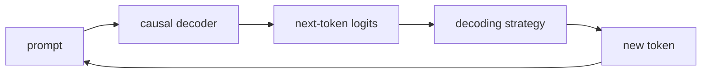

# GPT 계열과 인과적 언어 모델 (GPT and Causal Language Models)

- Level: Intermediate
- Prerequisites: [AI/Deep-Learning/Transformer.md](../Deep-Learning/Transformer.md), [AI/NLP/Language-Model-Basics.md](Language-Model-Basics.md)
- Status: Draft
- Reviewed-by: -
- Depth: Deep-dive (자기완결)

---

## 개념 (Concept)

GPT 계열은 Transformer decoder를 next-token prediction으로 사전학습하는 autoregressive language model 계열이다. causal mask를 사용해 각 위치가 이전 token만 보게 한다.

## 직관 (Intuition)

아주 많은 문장의 이어 쓰기를 연습하며 문법, 패턴, 일부 지식을 파라미터에 압축한다. 생성 시 지금까지의 token에서 다음 token 분포를 만들고 하나를 선택해 반복한다.

## 이론 (Theory)

훈련 목적은

$$L=-\sum_{t=1}^{T}\log p_\theta(x_t\mid x_{<t})$$

이다. inference에서는 greedy, beam search, top-k, nucleus sampling, temperature 등을 사용한다. Pretraining 뒤 instruction tuning과 preference optimization으로 사용자 지시를 따르는 행동을 조정할 수 있지만, objective상 사실성·안전성이 자동 보장되지는 않는다.



### 학습과 추론의 차이

훈련에서는 정답 prefix를 한 번에 넣고 다음 token loss를 병렬로 계산한다. 추론에서는 모델이 방금 생성한 token을 다시 입력으로 넣기 때문에 오류가 누적될 수 있다. KV cache는 과거 key/value 계산을 재사용해 추론 비용을 줄인다.

### Decoding 선택

| 방법 | 특징 | 위험 |
| --- | --- | --- |
| Greedy | 가장 높은 확률 선택 | 반복과 단조로움 |
| Beam search | 여러 후보 유지 | 열린 생성에서 과도하게 보수적 |
| Top-k | 상위 k개에서 sampling | k 선택 민감 |
| Nucleus top-p | 누적 확률 p까지 sampling | 매 step 후보 수 변동 |
| Temperature | 분포 sharpness 조절 | 높으면 오류와 환각 증가 |

사실 기반 답변에서는 decoding보다 retrieval과 검증이 중요하다. 창작에서는 다양성을 조금 열어 두되 안전과 형식 제약을 별도로 둔다.

### Prompt와 학습은 다르다

context에 정보를 넣으면 그 요청 안에서 조건으로 사용할 수 있지만 모델 파라미터가 업데이트되는 것은 아니다. 지속적으로 행동을 바꾸려면 instruction tuning, preference optimization, tool/RAG 설계가 필요하다.

## 구현 (Implementation)

```python
import random


def sample_next(probabilities, tokens):
    return random.choices(tokens, weights=probabilities, k=1)[0]


tokens = ["고양이", "강아지", "자동차"]
print(sample_next([0.6, 0.3, 0.1], tokens))
```

실제 생성기는 logits filtering, stopping, KV cache와 안전한 input/output 처리를 포함한다.

```python
def apply_temperature(logits, temperature):
    return [x / max(temperature, 1e-8) for x in logits]
```

## 복잡도 (Complexity)

훈련 self-attention은 길이 $n$에 대해 `O(n^2d)`가 중심이다. KV cache를 쓰는 autoregressive 생성도 새 token마다 과거 key/value와 attention하므로 context가 길수록 비용이 증가한다.

## 응용 (Applications)

- text·code generation
- question answering·summarization
- conversational interface
- few-shot/in-context task adaptation

## 흔한 오해 (Common Misunderstandings)

- 높은 확률의 문장이 반드시 사실은 아니다.
- context에 문서를 넣는 것과 모델 가중치를 학습하는 것은 다르다.
- temperature 0도 deterministic implementation을 항상 보장하지는 않는다.
- 생성 모델의 출력은 권한 있는 명령이나 신뢰된 데이터로 취급하면 안 된다.

## TMI

- decoder-only model은 next-token objective 하나로 다양한 task 형식을 흡수한다.
- in-context learning은 예시가 context에 있을 뿐 일반적으로 weight update가 아니다.
- KV cache는 속도를 높이는 대신 sequence 길이에 따라 메모리를 사용한다.

## 연습 / 확인 문제 (Exercises)

- causal mask를 행렬로 그려라.
- greedy와 nucleus sampling 결과 다양성을 비교하라.
- next-token objective와 factual verification의 차이를 설명하라.

## 이어서 읽기 (Reading Path)

- 이전: [언어 모델 기초](Language-Model-Basics.md)
- 다음: [AI/LLMs/](../LLMs/)

## 참조 (References)

- [AI/Deep-Learning/Transformer.md](../Deep-Learning/Transformer.md)
- [Reference/Papers.md](../../Reference/Papers.md)
- [Reference/Books.md](../../Reference/Books.md)
