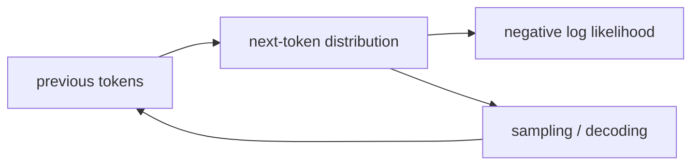

# 언어 모델 기초 (Language Model Basics)

- Level: Intermediate
- Prerequisites: [Math/Probability-Statistics/Probability-Basics.md](../../Math/Probability-Statistics/Probability-Basics.md), [Math/Probability-Statistics/Information-Theory.md](../../Math/Probability-Statistics/Information-Theory.md)
- Status: Draft
- Reviewed-by: -
- Depth: Deep-dive (자기완결)

---

## 개념 (Concept)

언어 모델은 token sequence의 확률을 모델링한다. Autoregressive model은 chain rule로 다음 token 확률을 예측해 전체 sequence 확률을 만든다.

$$p(x_{1:T})=\prod_{t=1}^{T}p(x_t\mid x_{<t})$$

## 직관 (Intuition)

앞 문맥을 보고 자연스럽게 이어질 token에 높은 확률을 준다. 생성은 이 분포에서 다음 token을 고르고 문맥에 붙이는 과정을 반복한다.

## 이론 (Theory)

n-gram은 최근 $n-1$개 token만 보고 빈도로 조건부확률을 추정한다. unseen n-gram에는 smoothing이 필요하다. Neural language model은 문맥을 vector representation으로 압축한다.

평가는 평균 negative log-likelihood와 perplexity를 사용한다.

$$\operatorname{PPL}=\exp\left(-\frac1T\sum_t\log p(x_t\mid x_{<t})\right)$$

tokenization과 데이터셋이 다르면 perplexity를 직접 비교하기 어렵다.



### 확률 모델과 생성기의 차이

언어 모델은 다음 token 분포를 낸다. 생성 품질은 이 분포뿐 아니라 decoding 전략에도 좌우된다. greedy는 가장 높은 확률 token을 고르고, sampling은 분포에서 뽑으며, temperature는 분포의 날카로움을 바꾼다. 같은 모델이라도 decoding 설정이 다르면 출력 다양성과 오류 양상이 달라진다.

### Perplexity 해석

perplexity는 평균적으로 다음 token 선택지가 얼마나 혼란스러운지를 나타내는 지표로 볼 수 있다. 하지만 tokenizer, corpus, normalization, context length가 다르면 직접 비교하기 어렵다. 낮은 perplexity가 특정 task 정확도, 사실성, 안전성을 보장하지도 않는다.

### n-gram에서 neural LM으로

n-gram은 명시적 count로 확률을 추정해 해석이 쉽지만 긴 문맥과 희소성에 약하다. neural LM은 문맥을 dense representation으로 압축해 일반화하지만, 왜 특정 확률을 줬는지 해석하기 어렵고 대규모 학습 비용이 든다.

## 구현 (Implementation)

```python
from collections import Counter, defaultdict


def train_bigram(tokens):
    counts = defaultdict(Counter)
    for left, right in zip(tokens, tokens[1:]):
        counts[left][right] += 1
    return counts


model = train_bigram("나는 밥을 먹고 나는 물을 마신다".split())
print(model["나는"])
```

```python
def bigram_probability(model, left, right, alpha=1.0):
    counts = model[left]
    vocab_size = len({token for counter in model.values() for token in counter})
    return (counts[right] + alpha) / (sum(counts.values()) + alpha * vocab_size)
```

## 복잡도 (Complexity)

n-gram 학습은 token 수 $T$에 `O(T)`, 저장은 관측된 n-gram 수에 비례한다. Neural model 비용은 architecture와 vocabulary·context 길이에 좌우된다.

## 응용 (Applications)

- text generation·completion
- speech recognition·translation scoring
- spelling correction
- representation pretraining

## 흔한 오해 (Common Misunderstandings)

- 낮은 perplexity가 factual accuracy를 보장하지 않는다.
- token 확률은 단어 확률과 항상 같지 않다.
- sampling temperature는 모델 지식을 바꾸지 않고 분포 모양만 조절한다.
- 긴 문맥을 입력할 수 있어도 모두 효과적으로 활용한다는 뜻은 아니다.

## TMI

- add-one smoothing은 단순하지만 큰 vocabulary에서는 지나치게 확률을 퍼뜨린다.
- byte·character·subword tokenization은 vocabulary와 sequence length를 교환한다.
- cross-entropy 최소화는 다음 token MLE와 연결된다.

## 연습 / 확인 문제 (Exercises)

- 작은 corpus의 bigram 확률을 계산하라.
- 같은 문장의 unigram과 bigram 확률을 비교하라.
- temperature가 0에 가까워질 때 sampling을 설명하라.

## 이어서 읽기 (Reading Path)

- 이전: [텍스트 전처리](Text-Preprocessing.md)
- 다음: [단어 임베딩](Word-Embeddings.md), [GPT](GPT.md)

## 참조 (References)

- [Math/Probability-Statistics/Information-Theory.md](../../Math/Probability-Statistics/Information-Theory.md)
- [Reference/Books.md](../../Reference/Books.md)
- [Reference/Courses.md](../../Reference/Courses.md)
