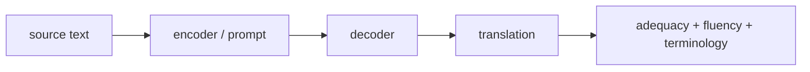

# 기계 번역 (Machine Translation)

- Level: Advanced
- Prerequisites: [Attention-in-NLP.md](Attention-in-NLP.md), [Transformer-NLP.md](Transformer-NLP.md), [Language-Model-Basics.md](Language-Model-Basics.md)
- Status: Draft
- Reviewed-by: -
- Depth: Deep-dive (자기완결)

---

## 개념 (Concept)

기계 번역은 원문 언어의 문장을 목표 언어의 문장으로 변환하는 sequence-to-sequence 작업이다. 현대 번역 모델은 Transformer encoder-decoder 구조나 대규모 언어 모델 기반 생성 방식으로 구현된다.

## 직관 (Intuition)

번역은 단어를 하나씩 사전에서 바꾸는 일이 아니다. 문맥, 어순, 생략된 주어, 문화적 표현, 전문 용어를 모두 고려해 목표 언어에서 자연스러운 문장을 다시 쓰는 작업이다.

## 이론 (Theory)

전통적인 neural machine translation은 조건부 확률을 모델링한다.

$$
P(y_1,\dots,y_T\mid x_1,\dots,x_S)=\prod_t P(y_t\mid y_{<t},x)
$$

Encoder는 원문 표현을 만들고, decoder는 target token을 autoregressive하게 생성한다. Attention은 decoder가 원문의 관련 위치를 참조하게 한다.

평가에는 BLEU, chrF, COMET 같은 자동 지표와 사람 평가가 쓰인다. 자동 지표는 편리하지만 의미 보존과 자연스러움을 완벽히 반영하지 못한다.



### 번역 품질의 축

| 축 | 질문 |
| --- | --- |
| Adequacy | 원문의 의미를 빠뜨리지 않았는가 |
| Fluency | 목표 언어로 자연스러운가 |
| Terminology | 전문 용어와 이름이 일관적인가 |
| Faithfulness | 원문에 없는 내용을 추가하지 않았는가 |
| Formatting | 숫자, 단위, markup을 보존했는가 |

문서 번역에서는 한 문장만 잘 번역하는 것보다 용어, 높임말, 대명사, 문체 일관성이 중요하다.

### Decoding과 길이 편향

beam search는 후보를 넓게 보지만 짧은 번역을 선호하는 편향이 생길 수 있어 length penalty를 쓴다. 너무 큰 beam은 다양성을 줄이고 부자연스러운 고확률 문장을 고를 수 있다. 번역에서는 숫자, 이름, 부정 표현을 별도 검증하는 후처리가 유용하다.

### 데이터와 도메인

일반 병렬 말뭉치로 학습한 모델은 법률, 의료, 특허, 게임 localization에서 용어를 틀릴 수 있다. glossary, translation memory, domain adaptation, human post-editing workflow가 품질을 좌우한다.

## 구현 (Implementation)

디코딩은 보통 greedy 또는 beam search로 수행한다.

```python
def greedy_decode(start_token, step, max_len):
    tokens = [start_token]
    for _ in range(max_len):
        next_token = step(tokens)
        if next_token == "<eos>":
            break
        tokens.append(next_token)
    return tokens
```

실제 번역에서는 subword tokenization, length penalty, terminology constraint, post-editing workflow가 중요하다.

```python
def preserve_placeholder(source, translation, placeholder):
    if placeholder in source and placeholder not in translation:
        return False
    return True
```

## 복잡도 (Complexity)

Transformer 번역 모델은 입력/출력 길이에 따라 self-attention과 cross-attention 비용이 든다. Beam size가 커질수록 디코딩 비용이 증가한다. 긴 문서 번역에서는 문맥 분할과 용어 일관성이 추가 문제다.

## 응용 (Applications)

- 문서와 웹페이지 번역
- 실시간 채팅 번역
- 다국어 검색과 localization
- 저자원 언어 번역 연구

## 흔한 오해 (Common Misunderstandings)

- 높은 BLEU가 항상 좋은 번역을 뜻하지 않는다.
- 문장 단위 번역은 문서 전체 용어 일관성을 놓칠 수 있다.
- 이름, 숫자, 단위, 부정 표현은 작은 오류도 치명적일 수 있다.
- 번역 모델은 원문에 없는 정보를 그럴듯하게 추가할 수 있다.

## TMI

- Back-translation은 target 언어 monolingual data를 활용하는 대표 기법이다.
- Multilingual NMT는 여러 언어쌍을 한 모델에 넣어 transfer를 노린다.
- 전문 번역에서는 glossary와 translation memory가 여전히 중요하다.

## 연습 / 확인 문제 (Exercises)

- Encoder-decoder 번역 모델의 조건부 확률 분해를 설명하라.
- Beam search가 greedy보다 나을 수 있는 이유를 말하라.
- 자동 번역 평가 지표의 한계를 예로 들어라.

## 이어서 읽기 (Reading Path)

- 이전: [관계 추출](Relation-Extraction.md)
- 다음: [질문 응답](Question-Answering.md)

## 참조 (References)

- [Attention-in-NLP.md](Attention-in-NLP.md)
- [Transformer-NLP.md](Transformer-NLP.md)
- [Language-Model-Basics.md](Language-Model-Basics.md)
- [Reference/Books.md](../../Reference/Books.md)
