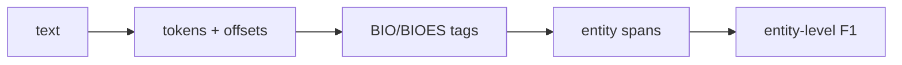

# 개체명 인식 (Named Entity Recognition, NER)

- Level: Intermediate
- Prerequisites: [Text-Classification.md](Text-Classification.md), [RNN-for-NLP.md](RNN-for-NLP.md), [BERT.md](BERT.md)
- Status: Draft
- Reviewed-by: -
- Depth: Deep-dive (자기완결)

---

## 개념 (Concept)

개체명 인식은 텍스트에서 사람, 조직, 장소, 날짜, 제품, 질병 같은 명명된 개체의 span과 type을 찾는 sequence labeling 작업이다. 예를 들어 “Ada가 Seoul에서 일한다”에서 `Ada=PERSON`, `Seoul=LOCATION`을 찾는다.

## 직관 (Intuition)

문장에 형광펜을 칠하며 “이 부분은 사람 이름, 이 부분은 회사 이름”이라고 표시하는 작업이다. 단어 하나의 분류가 아니라 연속된 토큰 span의 경계와 종류를 함께 맞혀야 한다.

## 이론 (Theory)

NER 데이터는 BIO 또는 BIOES 태그로 표현하는 경우가 많다.

```text
Ada      B-PER
works    O
at       O
OpenAI   B-ORG
```

모델은 token representation 위에 token classifier를 올리거나, label transition 제약을 위해 CRF layer를 붙일 수 있다. 평가에는 entity-level precision, recall, F1이 중요하다. 토큰 하나만 맞고 span 경계가 틀리면 entity-level로는 오답일 수 있다.



### Span 경계가 핵심이다

NER은 token별 label accuracy가 아니라 정확한 span과 type을 맞히는 문제다. `New York University`에서 `New York`만 잡으면 token 일부는 맞아도 entity-level로는 틀릴 수 있다. 평가 스크립트가 partial match를 허용하는지 exact match만 보는지 명확히 해야 한다.

### Subword와 character offset

Transformer tokenizer는 한 단어를 여러 subword로 나눈다. 보통 첫 subword에만 label을 주거나 모든 subword에 같은 label을 복제한다. 하지만 최종 결과는 원문 character offset으로 복원해야 검색, 마스킹, UI 하이라이트가 정확해진다.

### 도메인과 label schema

일반 NER의 PERSON/ORG/LOC만으로는 의료 질병명, 법률 조항, 제품명, 계좌번호 같은 도메인 entity를 다루기 어렵다. entity type 정의가 겹치면 annotator agreement가 낮아지고 모델도 애매한 boundary를 배운다.

## 구현 (Implementation)

BIO 태그에서 entity span을 추출하는 단순한 흐름은 다음과 같다.

```python
def extract_entities(tokens, tags):
    entities = []
    current = None
    for tok, tag in zip(tokens, tags):
        if tag.startswith("B-"):
            if current:
                entities.append(current)
            current = {"type": tag[2:], "tokens": [tok]}
        elif tag.startswith("I-") and current:
            current["tokens"].append(tok)
        else:
            if current:
                entities.append(current)
                current = None
    if current:
        entities.append(current)
    return entities
```

실무에서는 subword tokenization과 원문 character offset 매핑을 신중히 처리해야 한다.

```python
def span_text(text, start, end):
    return text[start:end]
```

## 복잡도 (Complexity)

Token classifier는 시퀀스 길이에 선형으로 예측한다. CRF decoding은 라벨 수 $K$, 길이 $T$에 대해 보통 $O(TK^2)$이다. Transformer encoder 비용은 self-attention 때문에 길이에 대해 $O(T^2)$이다.

## 응용 (Applications)

- 정보 추출
- 검색 색인과 지식 그래프 구축
- 의료/법률 문서 구조화
- 개인정보 탐지와 마스킹

## 흔한 오해 (Common Misunderstandings)

- NER은 단순 단어 사전 매칭이 아니다. 문맥에 따라 type이 달라진다.
- Subword 토큰과 원문 span 정렬을 무시하면 평가가 틀어진다.
- Entity-level F1과 token-level accuracy는 다르다.
- 도메인이 바뀌면 entity type과 표기법이 크게 달라질 수 있다.

## TMI

- Gazetteer feature는 고전 NER에서 자주 쓰인 외부 지식이다.
- Nested NER은 entity span이 서로 포함되는 더 어려운 설정이다.
- 개인정보 탐지에서는 false negative 비용이 매우 크므로 threshold와 review workflow가 중요하다.

## 연습 / 확인 문제 (Exercises)

- BIO 태그에서 B와 I의 차이를 설명하라.
- Token-level accuracy가 높아도 entity F1이 낮을 수 있는 이유를 말하라.
- NER에서 character offset이 필요한 이유를 설명하라.

## 이어서 읽기 (Reading Path)

- 이전: [텍스트 분류](Text-Classification.md)
- 다음: [관계 추출](Relation-Extraction.md)

## 참조 (References)

- [Text-Classification.md](Text-Classification.md)
- [BERT.md](BERT.md)
- [AI/PGMs/CRF.md](../PGMs/CRF.md)
- [Reference/Books.md](../../Reference/Books.md)
