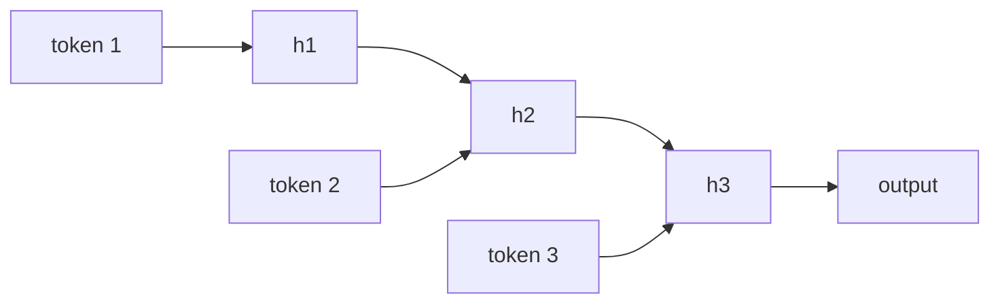

# RNN / LSTM / GRU for NLP

- Level: Intermediate
- Prerequisites: [AI/Deep-Learning/RNN-LSTM-GRU.md](../Deep-Learning/RNN-LSTM-GRU.md), [Text-Preprocessing.md](Text-Preprocessing.md), [Word-Embeddings.md](Word-Embeddings.md)
- Status: Draft
- Reviewed-by: -
- Depth: Deep-dive (자기완결)

---

## 개념 (Concept)

RNN 계열 모델은 토큰 시퀀스를 순서대로 읽으며 hidden state를 갱신하는 신경망이다. LSTM과 GRU는 긴 문맥에서 gradient가 사라지는 문제를 줄이기 위해 gate 구조를 도입한 RNN 변형이다.

## 직관 (Intuition)

문장을 왼쪽에서 오른쪽으로 읽으며 “지금까지 무슨 이야기를 했는지”를 메모장에 적는다고 생각하면 된다. RNN의 hidden state가 이 메모장이고, 다음 단어를 읽을 때마다 메모장을 갱신한다.

## 이론 (Theory)

기본 RNN은 다음처럼 표현할 수 있다.

$$
h_t=f(W_x x_t+W_h h_{t-1}+b)
$$

출력은 token-level tagging, sequence classification, language modeling 등 목적에 따라 $h_t$ 또는 마지막 hidden state에서 만든다. LSTM은 input, forget, output gate와 cell state를 사용해 정보를 더 오래 보존하고, GRU는 update/reset gate로 더 단순한 구조를 제공한다.

RNN은 자연스럽게 순서를 반영하지만, 긴 시퀀스를 순차 처리해야 하므로 병렬화가 어렵다. Transformer가 많은 NLP 작업에서 주류가 된 이유 중 하나다.



### NLP 과제별 출력 설계

| 과제 | 출력 위치 | 예 |
| --- | --- | --- |
| Sequence classification | 마지막 state 또는 pooling | 감성 분석 |
| Token classification | 각 time step | NER, POS tagging |
| Language modeling | 각 위치의 다음 token | 문자/단어 LM |
| Seq2seq | encoder state와 decoder | 번역, 요약 |

마지막 hidden state 하나만 쓰면 긴 문서의 초반 정보가 압축 중 사라질 수 있다. pooling, attention, hierarchical encoder가 대안이 된다.

### BiRNN과 causal 제약

BiRNN은 왼쪽과 오른쪽 문맥을 모두 보므로 NER처럼 전체 문장이 주어진 task에 적합하다. 그러나 실시간 생성이나 causal LM에서는 미래 token을 볼 수 없기 때문에 그대로 사용할 수 없다.

### 실전 학습 문제

RNN은 길이가 긴 batch에서 padding 낭비가 커질 수 있어 bucketing을 사용한다. gradient clipping은 exploding gradient를 줄이고, packed sequence나 mask는 padding token이 loss에 영향을 주지 않게 한다.

## 구현 (Implementation)

개념적으로는 토큰을 하나씩 처리하며 상태를 갱신한다.

```python
def rnn_forward(tokens, init_state, step):
    state = init_state
    states = []
    for token in tokens:
        state = step(token, state)
        states.append(state)
    return states
```

실제 모델은 embedding lookup, recurrent layer, dropout, output projection을 조합한다.

```python
def masked_average(states, mask):
    total = sum(s for s, m in zip(states, mask) if m)
    count = sum(1 for m in mask if m)
    return total / max(count, 1)
```

## 복잡도 (Complexity)

시퀀스 길이 $T$에 대해 순차 의존성이 있어 시간 병렬화가 어렵다. 각 step 비용은 hidden dimension과 layer 구조에 의존한다. Transformer보다 긴 문맥 병렬 학습에는 불리하지만, streaming 처리에는 장점이 있다.

## 응용 (Applications)

- 품사 태깅과 NER의 고전 모델
- 시계열 텍스트 분류
- 문자 단위 언어 모델
- 음성/텍스트 streaming 모델

## 흔한 오해 (Common Misunderstandings)

- LSTM이 모든 장기 의존성을 완벽히 해결하는 것은 아니다.
- 마지막 hidden state 하나만 쓰면 긴 문서의 정보가 손실될 수 있다.
- 양방향 RNN은 미래 토큰을 보므로 causal generation에는 그대로 쓸 수 없다.
- Transformer가 주류여도 RNN 아이디어는 sequence modeling의 기본이다.

## TMI

- BiLSTM-CRF는 NER에서 오랫동안 강력한 구조였다.
- GRU는 LSTM보다 파라미터가 적어 가벼운 모델에 적합할 수 있다.
- Teacher forcing은 sequence generation 학습에서 이전 정답 토큰을 입력으로 주는 기법이다.

## 연습 / 확인 문제 (Exercises)

- RNN hidden state가 어떤 정보를 담는지 설명하라.
- LSTM의 gate가 필요한 이유를 말하라.
- BiRNN이 causal language modeling에 부적합한 이유를 설명하라.

## 이어서 읽기 (Reading Path)

- 이전: [단어 임베딩](Word-Embeddings.md)
- 다음: [어텐션 메커니즘](Attention-in-NLP.md)

## 참조 (References)

- [AI/Deep-Learning/RNN-LSTM-GRU.md](../Deep-Learning/RNN-LSTM-GRU.md)
- [Word-Embeddings.md](Word-Embeddings.md)
- [Reference/Books.md](../../Reference/Books.md)
