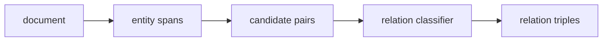

# 관계 추출 (Relation Extraction)

- Level: Advanced
- Prerequisites: [NER.md](NER.md), [BERT.md](BERT.md), [AI/PGMs/CRF.md](../PGMs/CRF.md)
- Status: Draft
- Reviewed-by: -
- Depth: Deep-dive (자기완결)

---

## 개념 (Concept)

관계 추출은 텍스트에서 발견된 개체들 사이의 의미 관계를 식별하는 작업이다. 예를 들어 “Ada works at OpenAI”에서 `(Ada, employed_by, OpenAI)` 같은 관계 triple을 추출한다.

## 직관 (Intuition)

NER이 문장 속 명사를 형광펜으로 표시하는 일이라면, 관계 추출은 표시된 것들 사이에 선을 긋고 “소속”, “위치”, “원인”, “소유” 같은 라벨을 붙이는 일이다.

## 이론 (Theory)

관계 추출 설정은 크게 나눌 수 있다.

- Pipeline: NER로 entity를 찾고, entity pair마다 관계를 분류한다.
- Joint extraction: entity와 relation을 함께 예측한다.
- Document-level RE: 한 문장이 아니라 문서 전체 근거로 관계를 판단한다.

입력 표현은 entity marker를 삽입하거나, entity span representation을 pooling해 pair classifier에 넣는다. Negative pair가 많아 class imbalance가 심한 경우가 흔하다.



### Candidate pruning

모든 entity pair를 보면 후보가 빠르게 폭증한다. type constraint, 문장 거리, dependency path, section 정보, retrieval score로 후보를 줄인다. 다만 너무 강한 pruning은 recall을 낮춰 downstream 지식 그래프가 비게 된다.

### Evidence와 문서 수준 관계

관계 근거가 한 문장 안에 없을 수 있다. coreference, 약어, 표, 이전 문단의 정의를 사용해야 하는 document-level RE에서는 evidence sentence를 함께 예측하거나 저장하는 것이 중요하다. triple만 남기면 나중에 오류 검수가 어렵다.

### Negative class와 평가

대부분의 entity pair는 관계가 없으므로 `no_relation`이 압도적으로 많다. micro F1만 보면 no_relation 처리에 묻힐 수 있어 relation별 precision/recall과 evidence quality를 함께 본다.

## 구현 (Implementation)

Entity pair 후보 생성은 단순히 문장 내 모든 entity 쌍을 만들 수 있다.

```python
def candidate_pairs(entities):
    pairs = []
    for i, e1 in enumerate(entities):
        for j, e2 in enumerate(entities):
            if i != j:
                pairs.append((e1, e2))
    return pairs
```

실무에서는 type constraint, distance limit, dependency path, retrieval로 후보 수를 줄인다.

```python
def type_allowed(e1, e2, allowed):
    return (e1["type"], e2["type"]) in allowed
```

## 복잡도 (Complexity)

문서에 entity가 $n$개 있으면 모든 ordered pair는 $O(n^2)$이다. 문서 수준 관계 추출은 긴 문맥과 많은 후보 때문에 계산량과 annotation 비용이 커진다.

## 응용 (Applications)

- 지식 그래프 구축
- 생물의학 문헌에서 gene-disease relation 추출
- 계약서와 법률 문서 구조화
- 검색과 질의응답의 근거 구조화

## 흔한 오해 (Common Misunderstandings)

- 같은 문장에 두 entity가 있다고 항상 관계가 있는 것은 아니다.
- NER 오류가 relation extraction으로 전파될 수 있다.
- 문장 하나만 보면 관계가 불명확한 경우가 많다.
- 관계 라벨 스키마가 모호하면 annotation agreement가 낮아진다.

## TMI

- Distant supervision은 knowledge base의 triple로 문장을 자동 라벨링하지만 noise가 많다.
- Document-level RE는 coreference resolution과 evidence aggregation이 중요하다.
- Open information extraction은 고정 relation schema 없이 관계구를 추출하려는 접근이다.

## 연습 / 확인 문제 (Exercises)

- Pipeline 방식에서 error propagation이 생기는 이유를 설명하라.
- Entity pair 후보가 $O(n^2)$로 늘어나는 예를 들어라.
- Relation label schema를 설계할 때 고려할 점을 세 가지 말하라.

## 이어서 읽기 (Reading Path)

- 이전: [개체명 인식](NER.md)
- 다음: [기계 번역](Machine-Translation.md)

## 참조 (References)

- [NER.md](NER.md)
- [BERT.md](BERT.md)
- [AI/PGMs/CRF.md](../PGMs/CRF.md)
- [Reference/Books.md](../../Reference/Books.md)
