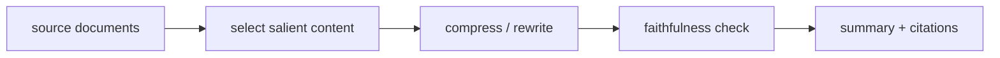

# 텍스트 요약 (Text Summarization)

- Level: Advanced
- Prerequisites: [Transformer-NLP.md](Transformer-NLP.md), [Question-Answering.md](Question-Answering.md), [GPT.md](GPT.md)
- Status: Draft
- Reviewed-by: -
- Depth: Deep-dive (자기완결)

---

## 개념 (Concept)

텍스트 요약은 긴 문서나 대화에서 핵심 정보를 짧게 압축하는 작업이다. 원문 문장을 선택하는 추출식 요약과, 새로운 문장을 생성하는 생성식 요약으로 나뉜다.

## 직관 (Intuition)

좋은 요약은 단순히 문장을 줄이는 것이 아니라, 독자가 알아야 할 핵심을 빠뜨리지 않고 불필요한 세부사항을 덜어내는 일이다. 특히 생성식 요약은 자연스럽지만 원문에 없는 내용을 만들어낼 위험이 있다.

## 이론 (Theory)

요약 작업의 주요 축은 다음과 같다.

- Extractive summarization: 중요한 문장이나 span을 선택한다.
- Abstractive summarization: 원문 의미를 바탕으로 새 문장을 생성한다.
- Query-focused summarization: 특정 질문이나 관심사에 맞춰 요약한다.
- Multi-document summarization: 여러 문서의 중복과 충돌 정보를 통합한다.

평가에는 ROUGE 같은 n-gram overlap 지표와 사람 평가가 쓰인다. 생성 요약에서는 factual consistency와 coverage가 중요하다.



### 좋은 요약의 조건

| 조건 | 의미 |
| --- | --- |
| Coverage | 핵심 정보가 빠지지 않음 |
| Conciseness | 불필요한 반복 제거 |
| Faithfulness | 원문에 없는 사실을 만들지 않음 |
| Coherence | 독립적으로 읽혀도 자연스러움 |
| Usefulness | 사용자의 질문이나 목적에 맞음 |

길이 제한이 강할수록 무엇을 버릴지가 품질을 결정한다. query-focused 요약은 일반 요약보다 사용자의 관심사와 citation alignment가 중요하다.

### Hallucination 줄이기

생성식 요약은 원문 밖 지식을 섞거나 숫자를 바꿀 수 있다. 문장별 근거 span 연결, 추출식 초안 후 재작성, entailment 검증, 금지된 추론 규칙, human review가 도움이 된다. 특히 법률·의료·재무 요약은 불확실하거나 원문에 없는 내용을 명시적으로 배제해야 한다.

### Multi-document 요약

여러 문서에서는 중복 제거뿐 아니라 서로 다른 시점의 업데이트, 출처 간 충돌, 같은 entity의 다른 이름을 처리해야 한다. 최신성과 신뢰도 우선순위를 정하지 않으면 요약이 모순된 문장을 함께 담을 수 있다.

## 구현 (Implementation)

간단한 추출식 요약은 문장 점수 상위 몇 개를 선택한다.

```python
def extractive_summary(sentences, scores, k=2):
    top = sorted(range(len(sentences)), key=lambda i: scores[i], reverse=True)[:k]
    top = sorted(top)
    return " ".join(sentences[i] for i in top)


sentences = ["A happened.", "Details followed.", "Result was important."]
scores = [0.9, 0.2, 0.8]
print(extractive_summary(sentences, scores))
```

실제 시스템은 길이 제한, 중복 제거, 출처 표시, 금칙 정보 제거를 함께 고려한다.

```python
def compression_ratio(source_tokens, summary_tokens):
    return len(summary_tokens) / max(len(source_tokens), 1)
```

## 복잡도 (Complexity)

긴 문서 요약은 context length와 attention 비용이 병목이다. Multi-document 요약은 retrieval, deduplication, contradiction handling이 추가된다. 생성식 요약은 decoding 비용도 고려해야 한다.

## 응용 (Applications)

- 뉴스와 보고서 요약
- 회의록과 상담 로그 요약
- 검색 결과 스니펫
- 법률/의료 문서 핵심 정리

## 흔한 오해 (Common Misunderstandings)

- 짧으면 좋은 요약이라는 뜻은 아니다. 핵심 누락이 문제일 수 있다.
- 생성식 요약은 원문에 없는 사실을 만들 수 있다.
- ROUGE 점수가 높아도 사람이 보기에 좋은 요약이 아닐 수 있다.
- 여러 문서 요약에서는 서로 모순되는 정보를 처리해야 한다.

## TMI

- Faithfulness 평가는 요약 연구에서 매우 중요한 축이다.
- Long-context model이 있어도 정보 선택과 구조화 문제는 남는다.
- 실무에서는 요약과 원문 citation을 함께 제공하면 검토 가능성이 높아진다.

## 연습 / 확인 문제 (Exercises)

- 추출식 요약과 생성식 요약의 장단점을 비교하라.
- 요약 hallucination을 줄이기 위한 방법을 세 가지 제안하라.
- Multi-document summarization에서 중복 제거가 필요한 이유를 설명하라.

## 이어서 읽기 (Reading Path)

- 이전: [질문 응답](Question-Answering.md)
- 다음: [AI/LLMs/](../LLMs/)

## 참조 (References)

- [Transformer-NLP.md](Transformer-NLP.md)
- [Question-Answering.md](Question-Answering.md)
- [GPT.md](GPT.md)
- [Reference/Books.md](../../Reference/Books.md)
