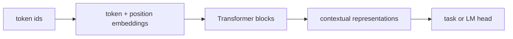

# NLP에서의 Transformer (Transformer for NLP)

- Level: Intermediate
- Prerequisites: [AI/Deep-Learning/Transformer.md](../Deep-Learning/Transformer.md), [AI/NLP/Word-Embeddings.md](Word-Embeddings.md)
- Status: Draft
- Reviewed-by: -
- Depth: Deep-dive (자기완결)

---

## 개념 (Concept)

NLP에서의 Transformer는 토큰 임베딩 위에 self-attention 블록을 쌓아 문맥에 따른 단어 표현을 만드는 모델이다. 입력 사용 방식에 따라 encoder형(BERT), decoder형(GPT), encoder-decoder형(T5, 번역)으로 나뉜다.

## 직관 (Intuition)

같은 단어라도 "bank account"의 bank와 "river bank"의 bank는 뜻이 다르다. self-attention은 각 토큰이 문장 안의 어떤 다른 토큰을 봐야 하는지를 학습해, 문맥에 맞는 표현(contextual embedding)을 만든다. RNN과 달리 모든 위치를 동시에 계산하므로 학습이 빠르고 긴 의존성도 한 번에 연결한다.

## 이론 (Theory)

핵심은 scaled dot-product attention이다. 토큰 표현을 query·key·value로 사영해

$$\operatorname{Attention}(Q,K,V)=\operatorname{softmax}\!\left(\frac{QK^\top}{\sqrt{d_k}}\right)V$$

attention은 순서를 모르므로 positional encoding을 더해 위치를 알린다. 사용 형태에 따라 mask가 다르다.

- **encoder(BERT)**: 양방향 attention. masked language modeling으로 가린 토큰을 복원.
- **decoder(GPT)**: causal mask로 미래를 가림. 다음 토큰 예측(autoregressive)으로 학습.
- **encoder-decoder**: encoder가 입력을 인코딩하고 decoder가 cross-attention으로 참조하며 출력 생성(번역·요약).



### Encoder, decoder, encoder-decoder 선택

| 구조 | Mask | 강한 과제 |
| --- | --- | --- |
| Encoder-only | bidirectional | 분류, NER, reranking, embedding |
| Decoder-only | causal | 생성, 대화, in-context learning |
| Encoder-decoder | encoder 양방향, decoder causal | 번역, 요약, 입력 기반 생성 |

구조 선택은 모델 크기보다 먼저 학습 목표와 serving 패턴을 결정한다. encoder는 입력 이해에 강하고, decoder는 autoregressive 생성과 KV cache에 자연스럽다.

### Contextual embedding

Transformer 표현은 layer마다 의미가 다르다. 낮은 layer는 표면·구문 정보, 높은 layer는 과제·의미 정보가 더 강하게 나타나는 경향이 있다. embedding으로 사용할 때는 `[CLS]`, mean pooling, 마지막 layer, 여러 layer 평균 중 무엇이 좋은지 task별로 평가한다.

### 긴 문맥의 한계

길이 제곱 attention 비용뿐 아니라 위치 인코딩, 학습 길이, retrieval/chunking, lost-in-the-middle 문제가 함께 작동한다. 긴 context window는 "넣을 수 있음"을 뜻하지 "항상 잘 활용함"을 뜻하지 않는다.

## 구현 (Implementation)

```python
def self_attention(x, Wq, Wk, Wv, mask=None):
    Q, K, V = x @ Wq, x @ Wk, x @ Wv
    scores = (Q @ K.T) / sqrt(K.shape[-1])
    if mask is not None:           # causal/padding mask
        scores = scores + mask     # 가릴 위치에 -inf
    weights = softmax(scores, axis=-1)
    return weights @ V
```

## 복잡도 (Complexity)

길이 $n$, hidden size $d$에서 self-attention은 `O(n^2 d)`로 길이의 제곱에 비례한다. 이 때문에 긴 문서에는 sparse·linear attention 등 효율화가 쓰인다. RNN과 달리 시간 방향 병렬화가 가능해 GPU에서 학습 처리량이 높다.

## 응용 (Applications)

- 사전학습 언어 모델(BERT, GPT, T5)의 backbone
- 기계 번역, 요약, 질의응답, 분류, 개체명 인식
- 검색·추천의 텍스트 인코더
- 멀티모달(텍스트-이미지) 모델의 텍스트 타워

## 흔한 오해 (Common Misunderstandings)

- self-attention만으로 모델이 되는 것이 아니다. positional encoding·FFN·residual·normalization이 함께 필요하다.
- attention weight가 곧 "해석 가능한 근거"라고 단정할 수 없다.
- encoder형과 decoder형은 학습 목표와 mask가 달라 용도가 다르다.
- context window가 길다고 모든 위치를 똑같이 잘 쓰는 것은 아니다.

## TMI

- 2017년 "Attention Is All You Need"가 번역 과제에서 RNN을 제치며 NLP의 패러다임을 바꿨다.
- BERT(2018)와 GPT(2018)는 같은 Transformer 블록을 각각 encoder·decoder 방향으로 특화한 사례다.
- positional encoding은 초기엔 sinusoidal이었지만, 이후 learned·rotary(RoPE)·ALiBi 등으로 발전했다.

## 연습 / 확인 문제 (Exercises)

- BERT의 양방향 attention과 GPT의 causal mask가 학습 목표 차이와 어떻게 연결되는지 설명하라.
- $\sqrt{d_k}$로 나누는 scaling이 없으면 softmax가 어떻게 되는지 논하라.
- 길이가 2배가 되면 attention 계산량이 몇 배가 되는지 구하라.

## 이어서 읽기 (Reading Path)

- 이전: [단어 임베딩](Word-Embeddings.md), [AI/Deep-Learning/Transformer.md](../Deep-Learning/Transformer.md)
- 다음: [BERT](BERT.md), [GPT](GPT.md), [AI/LLMs/Transformer-Advanced.md](../LLMs/Transformer-Advanced.md)
- 관련: [텍스트 분류](Text-Classification.md)

## 참조 (References)

- [AI/Deep-Learning/Transformer.md](../Deep-Learning/Transformer.md)
- [AI/NLP/BERT.md](BERT.md)
- [AI/NLP/GPT.md](GPT.md)
- [Reference/Papers.md](../../Reference/Papers.md)
