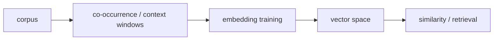

# 단어 임베딩 (Word Embeddings)

- Level: Intermediate
- Prerequisites: [Math/Linear-Algebra/Vectors.md](../../Math/Linear-Algebra/Vectors.md), [AI/NLP/Language-Model-Basics.md](Language-Model-Basics.md)
- Status: Draft
- Reviewed-by: -
- Depth: Deep-dive (자기완결)

---

## 개념 (Concept)

단어 임베딩은 discrete token을 dense vector로 매핑해 의미·문법적 유사성을 geometry에 담는다. Word2Vec, GloVe, FastText는 고정 임베딩이고 Transformer 표현은 문맥에 따라 달라진다.

## 직관 (Intuition)

비슷한 문맥에 나오는 단어를 가까운 vector로 배치한다. one-hot은 모든 단어가 똑같이 멀지만 embedding은 "고양이"와 "강아지"가 "자동차"보다 가깝게 학습될 수 있다.

## 이론 (Theory)

distributional hypothesis는 비슷한 문맥의 단어가 비슷한 의미를 갖는다는 가정이다. Skip-gram은 중심 단어로 주변 단어를 예측하고, CBOW는 주변으로 중심을 예측한다. negative sampling은 전체 vocabulary softmax 대신 관측되지 않은 표본 일부를 사용한다.

cosine similarity는

$$\cos(u,v)=\frac{u^\top v}{\|u\|\|v\|}$$

로 방향 유사성을 잰다. GloVe는 전역 co-occurrence 통계를, FastText는 subword n-gram을 활용한다.



### 고정 embedding과 문맥 embedding

Word2Vec/GloVe 같은 고정 embedding은 token마다 하나의 vector를 가진다. 그래서 "bank"처럼 다의어인 단어의 여러 의미가 하나로 섞인다. BERT/GPT류의 contextual embedding은 같은 token도 문맥에 따라 다른 hidden representation을 만들기 때문에 다의어 처리에 유리하다.

### 유사도와 정규화

cosine similarity는 vector 크기보다 방향을 본다. 빈도나 학습 방식 때문에 norm이 의미를 가질 때도 있으므로, retrieval에서 cosine, dot product, Euclidean distance 중 무엇을 쓸지 검증해야 한다. 대규모 검색에서는 exact nearest neighbor가 비싸므로 ANN index를 사용한다.

### 편향과 데이터 출처

embedding은 corpus의 사회적 편향, 도메인 편중, 시간적 outdated 표현을 담는다. downstream에서 embedding을 쓰면 이런 bias가 분류·추천·검색 순위로 이어질 수 있으므로 segment별 평가와 bias audit이 필요하다.

## 구현 (Implementation)

```python
import math


def cosine(a, b):
    dot = sum(x * y for x, y in zip(a, b))
    na = math.sqrt(sum(x * x for x in a))
    nb = math.sqrt(sum(y * y for y in b))
    return dot / (na * nb)


print(cosine([1, 1, 0], [1, 0.9, 0.1]))
```

```python
def nearest(query, vectors, top_k=3):
    scored = [(word, cosine(query, vector)) for word, vector in vectors.items()]
    return sorted(scored, key=lambda x: x[1], reverse=True)[:top_k]
```

## 복잡도 (Complexity)

vocabulary $V$, 차원 $d$의 embedding table은 `O(Vd)` 공간이다. lookup은 사실상 `O(1)` indexing과 `O(d)` 전송, brute-force 유사도 검색은 `O(Vd)`다.

## 응용 (Applications)

- 검색·추천·semantic similarity
- NLP model input representation
- clustering·visualization
- pretrained feature transfer

## 흔한 오해 (Common Misunderstandings)

- embedding 유사도가 인간 의미를 완벽히 표현하지 않는다.
- 고정 embedding은 다의어의 문맥별 의미를 하나로 섞는다.
- vector arithmetic 예시는 흥미롭지만 보편 법칙이 아니다.
- corpus의 사회적 편향도 embedding에 학습될 수 있다.

## TMI

- embedding matrix는 학습 가능한 lookup table로 볼 수 있다.
- input embedding과 output projection weight를 공유하는 weight tying이 자주 쓰인다.
- approximate nearest neighbor가 대규모 vector 검색을 가속한다.

## 연습 / 확인 문제 (Exercises)

- one-hot과 dense embedding의 저장 공간을 비교하라.
- cosine과 Euclidean 유사도 순위가 달라지는 예를 만들어라.
- 다의어가 고정 embedding에 주는 문제를 설명하라.

## 이어서 읽기 (Reading Path)

- 이전: [언어 모델 기초](Language-Model-Basics.md)
- 다음: [BERT](BERT.md), [GPT](GPT.md)
- 관련: [RNN / LSTM / GRU for NLP](RNN-for-NLP.md)

## 참조 (References)

- [Math/Linear-Algebra/Vectors.md](../../Math/Linear-Algebra/Vectors.md)
- [Reference/Papers.md](../../Reference/Papers.md)
- [Reference/Books.md](../../Reference/Books.md)
