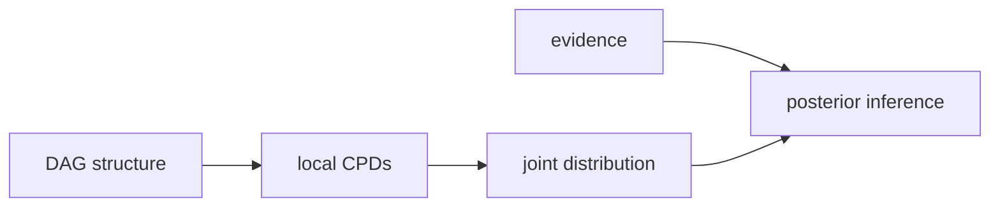

# 베이지안 네트워크 (Bayesian Networks)

- Level: Advanced
- Prerequisites: [Math/Probability-Statistics/Probability-Basics.md](../../Math/Probability-Statistics/Probability-Basics.md), [Math/Discrete/Graph-Theory.md](../../Math/Discrete/Graph-Theory.md), [Math/Probability-Statistics/Bayes-Theorem.md](../../Math/Probability-Statistics/Bayes-Theorem.md)
- Status: Draft
- Reviewed-by: -
- Depth: Deep-dive (자기완결)

---

## 개념 (Concept)

베이지안 네트워크는 확률 변수들의 결합분포를 방향 비순환 그래프(DAG)와 조건부 확률분포(CPD)로 표현하는 모델이다. 각 노드는 확률 변수이고, 간선은 직접적인 조건부 의존 구조를 나타낸다.

## 직관 (Intuition)

모든 변수의 결합분포를 표로 만들면 변수 수가 조금만 늘어도 크기가 폭발한다. 베이지안 네트워크는 “각 변수는 부모 변수들만 알면 나머지 과거 정보와 독립적이다”라는 구조를 이용해 큰 확률표를 작은 조건부 확률표들의 곱으로 쪼갠다.

## 이론 (Theory)

DAG $G$의 변수들을 $X_1,\dots,X_n$이라 하자. 베이지안 네트워크는 결합분포를 다음처럼 인수분해한다.

$$
P(X_1,\dots,X_n)=\prod_{i=1}^{n}P(X_i\mid Pa(X_i))
$$

여기서 $Pa(X_i)$는 $X_i$의 부모 노드 집합이다. 이 인수분해는 local Markov property, 즉 각 변수는 부모가 주어지면 자신의 non-descendant와 조건부 독립이라는 가정에 대응한다.

그래프 구조는 독립성 가정을 담고, 파라미터는 각 노드의 조건부 확률표 또는 조건부 밀도 모델에 들어간다. 이산 변수라면 CPD는 테이블이고, 연속 변수라면 선형 Gaussian CPD나 neural conditional distribution을 사용할 수 있다.

중요한 주의점은 베이지안 네트워크의 방향 간선이 항상 인과를 뜻하지 않는다는 것이다. 관측분포를 효율적으로 표현하기 위한 방향일 수도 있고, 인과 해석을 하려면 추가 가정이 필요하다.



### CPD 크기와 부모 수

이산 변수 $X$가 $r$개 값을 갖고 부모들이 만드는 조합 수가 $q$라면 CPD의 자유 파라미터 수는 $q(r-1)$이다. 부모가 하나 늘 때마다 CPD가 지수적으로 커질 수 있으므로, 그래프 구조는 통계적 가정이자 파라미터 절약 장치다.

### Markov blanket

한 노드의 Markov blanket은 부모, 자식, 자식의 다른 부모들이다. 이 집합을 알면 해당 노드는 네트워크의 나머지 변수와 조건부 독립이다. Gibbs sampling과 feature selection 직관에서 자주 쓰인다.

### 관측, 개입, 인과

베이지안 네트워크에서 $P(Y\mid X=x)$를 계산하는 것은 $X$를 관측한 조건부 분포다. 인과 개입 $P(Y\mid do(X=x))$와 같으려면 그래프가 인과 DAG이고 필요한 조정 조건이 만족되어야 한다.

## 구현 (Implementation)

작은 이산 네트워크에서는 CPD를 사전으로 두고 결합확률을 직접 계산할 수 있다.

```python
P_cloudy = {0: 0.5, 1: 0.5}
P_rain_given_cloudy = {
    0: {0: 0.8, 1: 0.2},
    1: {0: 0.2, 1: 0.8},
}
P_sprinkler_given_cloudy = {
    0: {0: 0.5, 1: 0.5},
    1: {0: 0.9, 1: 0.1},
}


def joint(c, r, s):
    return (
        P_cloudy[c]
        * P_rain_given_cloudy[c][r]
        * P_sprinkler_given_cloudy[c][s]
    )


print(round(joint(c=1, r=1, s=0), 3))
```

실제 추론에서는 모든 조합을 열거하지 않고 변수 소거, belief propagation, sampling을 사용한다.

## 복잡도 (Complexity)

파라미터 수는 각 노드의 부모 수에 지수적으로 의존할 수 있다. 정확한 추론은 그래프의 treewidth에 지수적으로 의존하며, 일반적인 베이지안 네트워크 추론은 NP-hard이다. 그래프가 sparse하고 treewidth가 낮으면 효율적인 정확 추론이 가능하다.

## 응용 (Applications)

- 의료 진단과 고장 진단
- 결측치가 있는 확률 모델링
- 지식 기반 의사결정 시스템
- 인과 그래프 모델의 확률적 기반

## 흔한 오해 (Common Misunderstandings)

- 간선 방향이 항상 시간 순서나 인과 방향을 뜻하지는 않는다.
- 독립성 가정이 틀리면 그래프가 예뻐도 추론 결과는 왜곡된다.
- 베이지안 네트워크가 꼭 Bayesian parameter learning을 의미하는 것은 아니다.
- DAG라서 순환 의존을 직접 표현할 수 없다. 시간 모델은 보통 동적 베이지안 네트워크로 펼친다.

## TMI

- 같은 조건부 독립성을 표현하는 DAG들의 동치류를 Markov equivalence class라고 한다.
- Markov blanket은 한 변수의 부모, 자식, 자식의 다른 부모들로 이루어지며, 그 변수 예측에 필요한 국소 정보를 제공한다.
- 구조 학습은 가능한 DAG 공간을 탐색해야 해서 조합적으로 어렵다.

## 연습 / 확인 문제 (Exercises)

- 세 변수 $A\to B\to C$의 결합분포 인수분해를 써라.
- 부모가 $k$개인 이진 노드 하나의 CPD 파라미터 수를 계산하라.
- 베이지안 네트워크의 방향 간선과 인과 간선의 차이를 설명하라.

## 이어서 읽기 (Reading Path)

- 이전: [인수 분해와 조건부 독립](Factorization.md)
- 다음: [d-분리](d-Separation.md)
- 관련: [나이브 베이즈](Naive-Bayes.md)

## 참조 (References)

- [Math/Probability-Statistics/Probability-Basics.md](../../Math/Probability-Statistics/Probability-Basics.md)
- [Math/Discrete/Graph-Theory.md](../../Math/Discrete/Graph-Theory.md)
- [Math/Probability-Statistics/Bayes-Theorem.md](../../Math/Probability-Statistics/Bayes-Theorem.md)
- [Reference/Books.md](../../Reference/Books.md)
