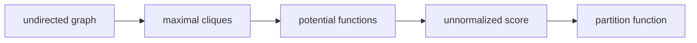

# 클리크와 포텐셜 함수 (Cliques and Potential Functions)

- Level: Advanced
- Prerequisites: [MRF.md](MRF.md), [Graph-Review.md](Graph-Review.md), [Factorization.md](Factorization.md)
- Status: Draft
- Reviewed-by: -
- Depth: Deep-dive (자기완결)

---

## 개념 (Concept)

클리크는 무방향 그래프에서 모든 노드 쌍이 서로 연결된 부분집합이다. 포텐셜 함수는 클리크에 속한 변수들의 특정 할당이 얼마나 잘 맞는지를 나타내는 양수 함수다. MRF는 이런 포텐셜들의 곱으로 결합분포를 표현한다.

## 직관 (Intuition)

여러 변수의 조합이 서로 자연스럽게 어울리면 높은 점수를 주고, 어색하면 낮은 점수를 준다고 생각하면 된다. 포텐셜은 확률이라기보다 “궁합 점수”에 가깝고, 전체 점수를 정규화하면 확률이 된다.

## 이론 (Theory)

MRF의 결합분포는 보통 최대 클리크 집합 $\mathcal{C}$에 대해

$$
P(X)=\frac{1}{Z}\prod_{C\in\mathcal{C}}\phi_C(X_C)
$$

로 표현된다. 포텐셜 $\phi_C(X_C)$는 양수여야 하며, $Z$는 모든 변수 할당에 대한 합으로 정규화한다.

에너지 표현에서는

$$
\phi_C(X_C)=\exp(-E_C(X_C))
$$

이므로 전체 에너지는 클리크 에너지의 합이 된다.

$$
E(X)=\sum_C E_C(X_C)
$$



### Maximal과 maximum

maximal clique는 더 이상 노드를 추가할 수 없는 클리크이고, maximum clique는 그래프에서 크기가 가장 큰 클리크다. MRF factorization에서는 보통 maximal clique를 기준으로 potential을 둔다. 용어를 혼동하면 factor scope를 잘못 잡기 쉽다.

### Log-linear potential

실무에서는 포텐셜을 $\phi_C(x_C)=\exp(w^\top f(x_C))$처럼 feature와 weight의 지수형으로 두는 경우가 많다. 그러면 에너지는 $-w^\top f(x_C)$가 되고, feature는 어떤 국소 패턴을 선호할지 정의한다.

### Partition function의 병목

포텐셜 곱은 정규화 전 점수이므로 확률을 얻으려면 모든 할당에 대한 합 $Z$가 필요하다. 변수 수와 클리크 크기가 커지면 $Z$ 계산이 어려워져 MCMC, variational inference, pseudo-likelihood 같은 근사가 필요하다.

## 구현 (Implementation)

pairwise potential을 사용하면 각 간선의 점수를 곱해 전체 비정규화 점수를 만들 수 있다.

```python
def edge_potential(x, y):
    return 3.0 if x == y else 1.0


def score(assign, edges):
    out = 1.0
    for u, v in edges:
        out *= edge_potential(assign[u], assign[v])
    return out


edges = [("A", "B"), ("B", "C"), ("A", "C")]
print(score({"A": 1, "B": 1, "C": 0}, edges))
```

삼각형 그래프에서는 세 노드 전체가 클리크가 될 수 있으므로 pairwise만으로 충분한지 모델링 의도를 확인해야 한다.

## 복잡도 (Complexity)

클리크 크기가 커질수록 포텐셜 테이블 크기는 변수 도메인 크기에 지수적으로 증가한다. 최대 클리크가 크면 저장과 추론 모두 어려워진다.

## 응용 (Applications)

- MRF의 factor 설계
- 이미지 smoothness prior
- graph cut과 energy minimization 모델
- CRF feature function 설계

## 흔한 오해 (Common Misunderstandings)

- 모든 연결 부분그래프가 클리크는 아니다. 모든 쌍이 직접 연결되어야 한다.
- 포텐셜은 정규화된 확률이 아니다.
- 최대 클리크만 쓰면 작은 클리크 효과가 항상 사라지는 것은 아니다. 모델링 방식에 따라 포함할 수 있다.
- 큰 클리크는 표현력은 크지만 비용도 크다.

## TMI

- log-linear 모델에서는 포텐셜을 feature와 weight의 지수 형태로 자주 쓴다.
- 그래프의 triangulation은 junction tree 구성과 관련된다.
- 포텐셜 설계는 “어떤 국소 패턴을 선호할 것인가”를 명시하는 모델링 작업이다.

## 연습 / 확인 문제 (Exercises)

- 세 노드 path $A-B-C$에서 최대 클리크들을 나열하라.
- 포텐셜 함수와 확률분포의 차이를 설명하라.
- 클리크 크기가 4이고 각 변수가 3값이면 포텐셜 테이블 항목 수를 계산하라.

## 이어서 읽기 (Reading Path)

- 이전: [MRF](MRF.md)
- 다음: [CRF](CRF.md)

## 참조 (References)

- [MRF.md](MRF.md)
- [Graph-Review.md](Graph-Review.md)
- [Factorization.md](Factorization.md)
- [Reference/Books.md](../../Reference/Books.md)
