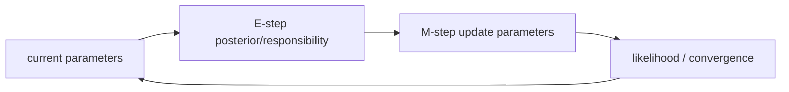

# EM 알고리즘 (Expectation-Maximization)

- Level: Advanced
- Prerequisites: [HMM.md](HMM.md), [Variational-Inference.md](Variational-Inference.md), [Math/Probability-Statistics/MLE.md](../../Math/Probability-Statistics/MLE.md)
- Status: Draft
- Reviewed-by: -
- Depth: Deep-dive (자기완결)

---

## 개념 (Concept)

EM 알고리즘은 잠재변수나 결측 데이터가 있는 확률 모델에서 최대우도 추정을 수행하는 반복 알고리즘이다. E-step에서 잠재변수의 posterior 기대값을 계산하고, M-step에서 그 기대 완전자료 로그우도를 최대화한다.

## 직관 (Intuition)

데이터에 숨은 라벨이 있으면 파라미터를 추정하기 어렵고, 파라미터를 모르면 숨은 라벨도 추정하기 어렵다. EM은 현재 파라미터로 숨은 라벨의 “부드러운 추정”을 만들고, 그 추정을 바탕으로 파라미터를 다시 맞추는 과정을 반복한다.

## 이론 (Theory)

관측 데이터 $x$, 잠재변수 $z$, 파라미터 $\theta$가 있을 때 목표는 $\log p_\theta(x)$를 최대화하는 것이다. EM은 현재 파라미터 $\theta^{old}$에서

$$
Q(\theta,\theta^{old})=
E_{p(z\mid x,\theta^{old})}[\log p_\theta(x,z)]
$$

를 만들고, 이를 최대화하는 $\theta$로 갱신한다.

```text
E-step: p(z | x, θ_old) 계산
M-step: E[log pθ(x, z)] 최대화
```

EM은 각 반복에서 관측 로그우도를 감소시키지 않는다. 하지만 비볼록 문제에서는 local optimum에 수렴할 수 있다.



### ELBO coordinate ascent

EM은 posterior $q(z)$와 파라미터 $\theta$를 번갈아 최적화하는 ELBO coordinate ascent로 볼 수 있다. E-step은 현재 파라미터에서 정확 posterior를 두고, M-step은 그 posterior 기대 아래 complete-data log likelihood를 최대화한다.

### 초기화와 local optimum

GMM에서는 component 평균 초기화가 나쁘면 빈 cluster, singular covariance, local optimum이 생길 수 있다. 여러 random restart, k-means 초기화, covariance regularization, minimum variance floor가 실무적으로 중요하다.

### Hard EM과 soft EM

soft EM은 각 데이터가 여러 component에 속할 responsibility를 사용한다. hard EM은 가장 가능성 높은 component 하나로 할당해 k-means와 비슷해진다. soft assignment는 불확실성을 보존하지만 비용이 더 든다.

## 구현 (Implementation)

Gaussian mixture의 E-step은 각 데이터가 어느 component에서 왔는지 responsibility를 계산한다.

```python
def normalize(xs):
    total = sum(xs)
    return [x / total for x in xs]


def e_step_point(likelihoods, priors):
    unnormalized = [p * l for p, l in zip(priors, likelihoods)]
    return normalize(unnormalized)


priors = [0.4, 0.6]
likelihoods = [0.2, 0.8]
print(e_step_point(likelihoods, priors))
```

M-step에서는 responsibility로 가중 평균, 분산, mixture weight를 다시 계산한다.

```python
def converged(prev_ll, curr_ll, tol=1e-4):
    return abs(curr_ll - prev_ll) <= tol
```

## 복잡도 (Complexity)

한 반복 비용은 모델과 추론 방식에 따라 다르다. GMM은 데이터 수 $n$, component 수 $K$, 차원 $d$에 대해 대략 $O(nKd)$ 이상이 든다. HMM의 Baum-Welch는 forward-backward 비용이 반복마다 필요하다.

## 응용 (Applications)

- Gaussian mixture model 학습
- HMM의 Baum-Welch 알고리즘
- 결측 데이터가 있는 확률 모델
- latent variable model의 기본 학습 틀

## 흔한 오해 (Common Misunderstandings)

- EM은 전역 최적해를 보장하지 않는다.
- E-step이 항상 닫힌형으로 쉬운 것은 아니다. 근사 E-step이 필요할 수 있다.
- 초기화에 민감할 수 있다.
- hard assignment k-means는 GMM EM의 제한적 형태로 볼 수 있지만 완전히 같지는 않다.

## TMI

- EM은 ELBO를 coordinate ascent로 최적화하는 관점으로 해석할 수 있다.
- variational EM은 E-step의 posterior가 어려울 때 변분분포로 근사한다.
- 로그우도는 증가해도 실제 downstream 성능이 항상 좋아지는 것은 아니다.

## 연습 / 확인 문제 (Exercises)

- EM의 E-step과 M-step을 GMM 예로 설명하라.
- EM이 초기화에 민감한 이유를 말하라.
- EM과 변분 추론의 관계를 ELBO 관점에서 설명하라.

## 이어서 읽기 (Reading Path)

- 이전: [변분 추론](Variational-Inference.md)
- 다음: [AI/Causal-Inference/](../Causal-Inference/)

## 참조 (References)

- [HMM.md](HMM.md)
- [Variational-Inference.md](Variational-Inference.md)
- [Math/Probability-Statistics/MLE.md](../../Math/Probability-Statistics/MLE.md)
- [Reference/Books.md](../../Reference/Books.md)
