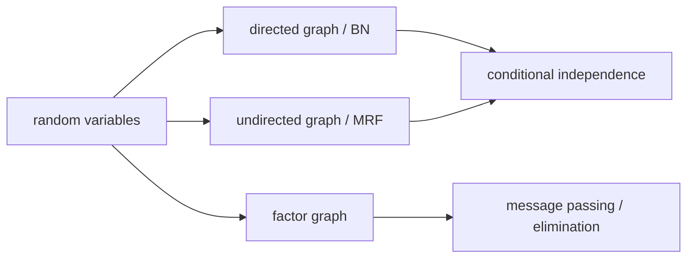

# 그래프 이론 복습 (Graph Review for PGMs)

- Level: Intermediate
- Prerequisites: [Math/Discrete/Graph-Theory.md](../../Math/Discrete/Graph-Theory.md), [Math/Probability-Statistics/Probability-Basics.md](../../Math/Probability-Statistics/Probability-Basics.md)
- Status: Draft
- Reviewed-by: -
- Depth: Deep-dive (자기완결)

---

## 개념 (Concept)

확률 그래프 모델에서 그래프는 확률 변수 사이의 의존 구조를 표현한다. 방향 그래프는 베이지안 네트워크와 인과 그래프에, 무방향 그래프는 마르코프 랜덤 필드와 조건부 랜덤 필드에 주로 사용된다.

## 직관 (Intuition)

확률변수가 많아지면 모든 변수 쌍의 관계를 말로 설명하기 어렵다. 그래프는 “어떤 변수들이 직접 연결되어 있고, 어떤 변수는 다른 변수들을 통해서만 영향을 받는가”를 그림으로 압축한다.

## 이론 (Theory)

PGM에서 자주 쓰는 그래프 용어는 다음과 같다.

- 노드(node): 확률 변수
- 간선(edge): 직접 의존 또는 상호작용
- 경로(path): 노드 사이 연결 순서
- 부모/자식(parent/child): 방향 그래프에서 간선 방향에 따른 관계
- 조상/후손(ancestor/descendant): 방향 경로로 이어진 관계
- DAG: 방향 사이클이 없는 그래프
- clique: 무방향 그래프에서 모든 노드 쌍이 연결된 부분집합

방향 그래프는 조건부 확률의 곱으로 결합분포를 인수분해하기 좋다. 무방향 그래프는 대칭적인 상호작용과 국소 compatibility를 표현하기 좋다.



### 그래프 문법별 의미

| 그래프 | 간선 의미 | 대표 모델 |
| --- | --- | --- |
| DAG | 부모가 자식의 조건부 분포를 정함 | Bayesian network, causal DAG |
| Undirected | 대칭적 compatibility 또는 Markov blanket | MRF |
| Factor graph | 변수와 factor의 명시적 연결 | BP, factorized inference |

같은 변수 집합이라도 어떤 그래프 문법을 쓰느냐에 따라 독립성 판정과 추론 알고리즘이 달라진다.

### Treewidth 직관

그래프가 sparse해도 긴 cycle이나 조밀한 부분구조 때문에 추론 중 큰 factor가 생길 수 있다. treewidth는 변수 소거 과정에서 만들어지는 가장 큰 중간 clique 크기와 관련되며, 정확 추론의 실질 난이도를 좌우한다.

## 구현 (Implementation)

간단한 adjacency list로 그래프를 표현할 수 있다.

```python
graph = {
    "Cloudy": ["Rain", "Sprinkler"],
    "Rain": ["WetGrass"],
    "Sprinkler": ["WetGrass"],
    "WetGrass": [],
}


def parents(graph, node):
    return [u for u, children in graph.items() if node in children]


print(parents(graph, "WetGrass"))
```

PGM 라이브러리는 이 구조 위에 조건부 확률표, factor, inference algorithm을 올린다.

## 복잡도 (Complexity)

그래프 탐색 자체는 보통 $O(|V|+|E|)$이다. 하지만 그래프가 표현하는 확률 추론은 훨씬 어려울 수 있다. 특히 treewidth가 크면 정확 추론 비용이 지수적으로 증가한다.

## 응용 (Applications)

- 베이지안 네트워크 구조 이해
- d-분리와 조건부 독립 판정
- MRF의 clique factorization 이해
- 인과 DAG 학습과 개입 분석

## 흔한 오해 (Common Misunderstandings)

- 그래프 간선이 항상 인과를 뜻하지는 않는다.
- 간선이 없다는 것은 모델이 특정 독립성을 가정한다는 뜻이다.
- 방향 그래프와 무방향 그래프는 같은 관계를 다른 문법으로 표현할 때도 있지만, 의미가 항상 같지는 않다.
- 그래프가 sparse하다고 추론이 항상 쉬운 것은 아니다. treewidth가 중요하다.

## TMI

- moralization은 방향 그래프를 무방향 그래프로 바꾸는 과정 중 하나이며, 부모 노드들을 서로 연결한다.
- factor graph는 변수 노드와 factor 노드를 나눠 추론 알고리즘을 더 명시적으로 표현한다.
- 같은 DAG 독립성을 공유하는 그래프들은 Markov equivalence class를 이룬다.

## 연습 / 확인 문제 (Exercises)

- DAG와 일반 방향 그래프의 차이를 설명하라.
- clique와 connected component의 차이를 예로 보이라.
- 베이지안 네트워크에서 부모 집합이 왜 CPD 크기를 결정하는지 설명하라.

## 이어서 읽기 (Reading Path)

- 이전: [Math/Discrete/Graph-Theory.md](../../Math/Discrete/Graph-Theory.md)
- 다음: [인수 분해와 조건부 독립](Factorization.md)

## 참조 (References)

- [Math/Discrete/Graph-Theory.md](../../Math/Discrete/Graph-Theory.md)
- [Math/Probability-Statistics/Probability-Basics.md](../../Math/Probability-Statistics/Probability-Basics.md)
- [Reference/Books.md](../../Reference/Books.md)
