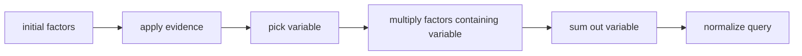

# 변수 소거 (Variable Elimination)

- Level: Advanced
- Prerequisites: [Bayesian-Networks.md](Bayesian-Networks.md), [d-Separation.md](d-Separation.md), [Math/Probability-Statistics/Probability-Basics.md](../../Math/Probability-Statistics/Probability-Basics.md)
- Status: Draft
- Reviewed-by: -
- Depth: Deep-dive (자기완결)

---

## 개념 (Concept)

변수 소거는 확률 그래프 모델에서 관심 없는 변수를 차례로 합산하거나 적분해 질의 확률을 계산하는 정확 추론 알고리즘이다. 전체 결합분포를 완전히 펼치지 않고, factor들을 곱하고 주변화하면서 중간 계산을 줄인다.

## 직관 (Intuition)

많은 변수가 있는 표를 한 번에 만들면 너무 크다. 대신 필요한 작은 표들만 곱하고, 더 이상 필요 없는 변수를 바로 없애면 계산량을 크게 줄일 수 있다. 수학적으로는 곱셈과 덧셈의 순서를 똑똑하게 바꾸는 것이다.

## 이론 (Theory)

예를 들어 질의가 $P(Q\mid E=e)$라면, 증거 $E=e$를 factor에 반영한 뒤 질의 변수와 증거 변수를 제외한 hidden variable들을 제거한다.

```text
1. 초기 factor: 각 CPD
2. 증거 반영: E=e와 맞지 않는 항 제거
3. 제거할 변수 Z 선택
4. Z를 포함한 factor들을 곱함
5. Z에 대해 합산하여 새 factor 생성
6. 모든 hidden variable을 제거한 뒤 정규화
```

소거 순서는 매우 중요하다. 같은 그래프와 같은 질의라도 어떤 변수를 먼저 제거하느냐에 따라 중간 factor 크기가 크게 달라진다. 이 중간 factor의 최대 범위는 treewidth와 연결된다.



### 소거 순서 heuristic

최적 순서를 찾는 것은 어렵기 때문에 min-degree, min-fill 같은 heuristic을 쓴다. min-fill은 변수를 제거할 때 새로 추가될 fill-in edge가 적은 변수를 우선한다. 좋은 순서는 중간 factor scope를 작게 유지한다.

### Sum-product와 max-product

주변확률은 hidden variable을 sum으로 제거한다. MAP/MPE는 일부 변수를 max로 제거한다. 하지만 sum과 max는 일반적으로 교환되지 않으므로 "무엇을 marginalize하고 무엇을 maximize할지" 순서가 중요하다.

### Evidence의 효과

증거를 먼저 반영하면 factor table의 일부 행이 사라져 계산량이 줄 수 있다. 그러나 증거가 collider를 여는 효과도 있으므로 독립성 관점의 영향은 별도로 생각해야 한다.

## 구현 (Implementation)

이진 변수 하나를 factor에서 합산하는 작은 형태는 다음과 같다.

```python
from collections import defaultdict


def sum_out(factor, var):
    # factor: {assignment_tuple: value}
    # assignment_tuple 예: (("A", 0), ("B", 1))
    out = defaultdict(float)
    for assignment, value in factor.items():
        reduced = tuple((k, v) for k, v in assignment if k != var)
        out[reduced] += value
    return dict(out)


factor = {
    (("A", 0), ("B", 0)): 0.12,
    (("A", 0), ("B", 1)): 0.18,
    (("A", 1), ("B", 0)): 0.28,
    (("A", 1), ("B", 1)): 0.42,
}

print(sum_out(factor, "B"))
```

실제 구현에는 factor 곱셈, 변수 순서 선택, 증거 적용, 정규화가 추가된다.

## 복잡도 (Complexity)

변수 소거의 시간과 메모리는 가장 큰 중간 factor 크기에 지수적으로 의존한다. 그래프의 treewidth가 $w$이고 변수 도메인 크기가 최대 $k$라면 대략 $O(nk^{w+1})$ 형태가 된다. 최적 소거 순서를 찾는 문제 자체도 어렵다.

## 응용 (Applications)

- 베이지안 네트워크의 정확 주변확률 계산
- MAP/MPE 추론의 기반
- junction tree 알고리즘의 출발점
- 작은 treewidth를 가진 진단·계층 모델

## 흔한 오해 (Common Misunderstandings)

- 변수 소거는 근사 알고리즘이 아니라 정확 알고리즘이다.
- 항상 빠른 것은 아니다. 그래프 구조가 나쁘면 전체 열거와 비슷하게 폭발한다.
- 질의 변수나 증거 변수를 무심코 소거하면 원하는 분포를 잃는다.
- 좋은 소거 순서는 모델 크기만큼 중요할 수 있다.

## TMI

- min-fill, min-degree 같은 heuristic이 소거 순서 선택에 자주 쓰인다.
- max를 사용하면 MAP류 추론과 연결되지만, sum과 max는 일반적으로 교환되지 않는다.
- factor graph 관점에서는 변수 소거가 메시지 전달과 깊게 연결된다.

## 연습 / 확인 문제 (Exercises)

- $P(A,B,C)=P(A)P(B\mid A)P(C\mid B)$에서 $P(C)$를 변수 소거로 계산하는 순서를 써라.
- 소거 순서가 중간 factor 크기에 영향을 주는 예를 만들어라.
- evidence를 먼저 반영하면 계산량이 줄어드는 이유를 설명하라.

## 이어서 읽기 (Reading Path)

- 이전: [d-분리](d-Separation.md)
- 다음: [신뢰 전파](Belief-Propagation.md)

## 참조 (References)

- [Bayesian-Networks.md](Bayesian-Networks.md)
- [d-Separation.md](d-Separation.md)
- [Reference/Books.md](../../Reference/Books.md)
- [Reference/Courses.md](../../Reference/Courses.md)
