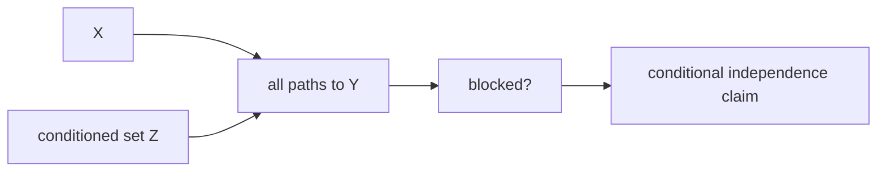

# d-분리 (d-Separation)

- Level: Advanced
- Prerequisites: [Bayesian-Networks.md](Bayesian-Networks.md), [Math/Discrete/Graph-Theory.md](../../Math/Discrete/Graph-Theory.md), [Math/Probability-Statistics/Probability-Basics.md](../../Math/Probability-Statistics/Probability-Basics.md)
- Status: Draft
- Reviewed-by: -
- Depth: Deep-dive (자기완결)

---

## 개념 (Concept)

d-분리는 DAG에서 조건부 독립성을 읽어내는 그래프 판정 규칙이다. 변수 집합 $Z$를 관측했을 때 $X$와 $Y$ 사이의 모든 경로가 막히면, 그래프는 $X$와 $Y$가 $Z$ 조건에서 독립임을 함의한다.

## 직관 (Intuition)

그래프의 경로는 정보가 흘러갈 수 있는 통로처럼 볼 수 있다. 어떤 노드를 관측하면 일부 통로는 막히고, collider를 관측하면 오히려 막혀 있던 통로가 열릴 수 있다. d-분리는 이 통로의 열림/막힘 규칙을 정확히 정한다.

## 이론 (Theory)

DAG의 경로에서 세 노드가 만나는 기본 형태는 세 가지다.

```text
chain:      A → B → C
fork:       A ← B → C
collider:   A → B ← C
```

조건 집합 $Z$에 대해 경로는 다음 규칙으로 막힌다.

- chain/fork의 가운데 노드가 $Z$에 있으면 경로가 막힌다.
- collider의 가운데 노드와 그 후손이 $Z$에 없으면 경로가 막힌다.
- collider나 그 후손을 관측하면 그 경로는 열린다.

모든 경로가 막히면 $X$와 $Y$는 $Z$에 의해 d-separated라고 한다. 베이지안 네트워크의 Markov property에 따라, 그래프가 분포에 충실하다는 적절한 가정 아래 d-분리는 조건부 독립성 $X\perp Y\mid Z$를 읽는 도구가 된다.



### 세 패턴 요약

| 패턴 | 조건화하지 않음 | 가운데 노드 조건화 |
| --- | --- | --- |
| Chain $A\to B\to C$ | 열림 | 막힘 |
| Fork $A\leftarrow B\to C$ | 열림 | 막힘 |
| Collider $A\to B\leftarrow C$ | 막힘 | 열림 |

collider는 가장 자주 실수하는 패턴이다. 공통 결과나 선택 기준을 조건화하면 원래 독립인 원인들 사이에 의존이 생길 수 있다.

### Faithfulness 주의

d-분리는 그래프가 함의하는 독립성을 알려 준다. 실제 분포에서는 파라미터가 우연히 상쇄되어 그래프상 연결된 변수들이 독립처럼 보일 수 있다. 구조 학습에서는 이런 faithfulness 가정의 한계를 염두에 둔다.

### 인과 조정과의 연결

backdoor path를 막으려면 confounder 경로를 차단하되 collider를 열지 않아야 한다. "관련 있어 보이는 변수를 많이 넣기"가 좋은 조정 전략이 아닌 이유가 여기에 있다.

## 구현 (Implementation)

작은 세 노드 패턴은 규칙을 직접 확인할 수 있다.

```python
def path_open(pattern, observed_middle=False, observed_collider_desc=False):
    if pattern in {"chain", "fork"}:
        return not observed_middle
    if pattern == "collider":
        return observed_middle or observed_collider_desc
    raise ValueError(pattern)


print(path_open("chain", observed_middle=True))     # False
print(path_open("fork", observed_middle=False))     # True
print(path_open("collider", observed_middle=False)) # False
print(path_open("collider", observed_middle=True))  # True
```

일반 DAG에서는 Bayes-ball 같은 알고리즘으로 $O(|V|+|E|)$ 수준에서 d-분리 여부를 판정할 수 있다.

## 복잡도 (Complexity)

단순히 모든 경로를 열거하면 경로 수가 지수적으로 늘 수 있다. 실용적인 판정 알고리즘은 그래프 탐색 상태에 방향과 관측 여부를 포함해 선형 시간에 처리한다.

## 응용 (Applications)

- 베이지안 네트워크에서 조건부 독립성 판정
- 인과 그래프의 backdoor 조정 집합 찾기
- 불필요한 변수 조건화를 피하는 모델링
- 그래프 구조 학습에서 독립성 테스트 해석

## 흔한 오해 (Common Misunderstandings)

- collider를 관측하면 독립이 생기는 것이 아니라 의존이 생길 수 있다.
- d-분리는 그래프가 함의하는 독립성이지, 모든 실제 분포의 독립성을 자동으로 보장하지 않는다.
- 독립인 두 변수 사이에 그래프 경로가 전혀 없어야 하는 것은 아니다. 조건화로 막힐 수 있다.
- 조건화를 많이 할수록 항상 좋은 것은 아니다. collider bias가 생길 수 있다.

## TMI

- “Berkson's paradox”는 collider를 조건화해 가짜 상관이 생기는 고전적 예다.
- 인과 추론에서 d-분리는 어떤 변수를 조정해야 하는지 판단하는 핵심 언어가 된다.
- Markov equivalence class에 속한 DAG들은 같은 d-분리 관계를 공유한다.

## 연습 / 확인 문제 (Exercises)

- $A\to B\to C$에서 $B$를 조건화하면 $A$와 $C$는 어떻게 되는가?
- $A\to B\leftarrow C$에서 $B$를 관측하면 왜 $A$와 $C$가 의존할 수 있는가?
- backdoor path와 collider path의 차이를 예로 설명하라.

## 이어서 읽기 (Reading Path)

- 이전: [베이지안 네트워크](Bayesian-Networks.md)
- 다음: [변수 소거](Variable-Elimination.md)

## 참조 (References)

- [Bayesian-Networks.md](Bayesian-Networks.md)
- [Math/Discrete/Graph-Theory.md](../../Math/Discrete/Graph-Theory.md)
- [Reference/Books.md](../../Reference/Books.md)
- [Reference/Courses.md](../../Reference/Courses.md)
