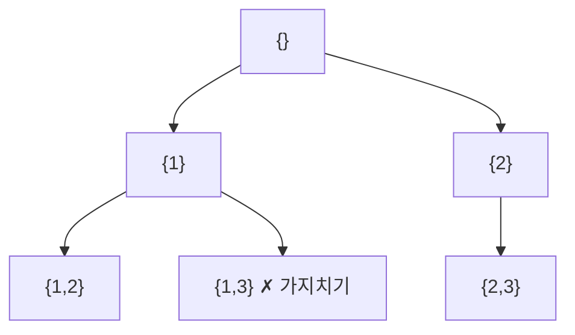

# 백트래킹 (Backtracking)

- Level: Intermediate
- Prerequisites: [Programming/Functions-and-Recursion.md](../Programming/Functions-and-Recursion.md), [Algorithms/BFS-DFS.md](BFS-DFS.md)
- Status: Draft
- Reviewed-by: -

---

## 개념 (Concept)

백트래킹은 해를 **한 조각씩 점진적으로 만들어 가다가**, 현재 부분 해가 조건을 만족할 수 없다고 판단되면 **즉시 되돌아가(backtrack)** 다른 선택을 시도하는 완전 탐색 기법이다. 모든 후보를 무작정 나열하는 대신, 가망 없는 가지를 일찍 잘라(pruning) 탐색 공간을 줄인다.

## 직관 (Intuition)

미로에서 갈림길마다 한 방향을 골라 가다가 막다른 길을 만나면 마지막 갈림길로 돌아와 다른 길을 택한다. 백트래킹은 이 "가 보고 아니면 돌아오기"를 DFS로 체계화한 것이다. "이 길로는 답이 절대 안 나온다"가 보이면 그 즉시 포기하는 가지치기가 효율의 핵심이다.



## 이론 (Theory)

백트래킹은 **상태 공간 트리(state-space tree)** 를 DFS로 탐색하는 것으로 모델링된다. 각 노드는 부분 해, 간선은 "다음 선택"을 뜻한다. 일반 골격은 다음과 같다.

1. 현재 부분 해가 완성됐으면 기록한다.
2. 가능한 다음 선택을 하나씩 시도한다.
3. 그 선택이 유효(promising)하면 적용하고 재귀로 더 들어간다.
4. 돌아오면 선택을 **취소(undo)** 하고 다음 후보로 넘어간다.

가지치기 함수가 "이 부분 해에서 완성 가능한 해가 존재할 수 있는가"를 판단한다. 좋은 가지치기는 지수적 탐색 공간을 실용적 크기로 줄인다. 백트래킹과 완전 탐색(brute force)의 차이가 바로 이 가지치기다.

## 구현 (Implementation)

N-퀸 문제: $N \times N$ 체스판에 서로 공격하지 않게 퀸 $N$개를 놓는다.

```python
def solve_n_queens(n):
    solutions = []
    cols, diag1, diag2 = set(), set(), set()
    placement = []

    def backtrack(row):
        if row == n:                       # 해 완성
            solutions.append(placement[:])
            return
        for col in range(n):
            if col in cols or (row - col) in diag1 or (row + col) in diag2:
                continue                   # 가지치기: 공격받는 칸
            cols.add(col); diag1.add(row - col); diag2.add(row + col)
            placement.append(col)
            backtrack(row + 1)             # 다음 행으로
            placement.pop()                # 선택 취소(backtrack)
            cols.remove(col); diag1.remove(row - col); diag2.remove(row + col)

    backtrack(0)
    return solutions


print(len(solve_n_queens(8)))   # 92
```

## 복잡도 (Complexity)

| 문제 | 최악 시간 |
|---|---|
| 부분집합 생성 | `O(2^n)` |
| 순열 생성 | `O(n!)` |
| N-퀸 | `O(n!)` 상한, 가지치기로 실제는 훨씬 작음 |

최악 복잡도는 완전 탐색과 같지만, 가지치기 덕분에 실제 탐색 노드 수는 크게 줄어든다. 보조 공간은 재귀 깊이에 비례해 보통 `O(n)`이다.

## 응용 (Applications)

- 순열·조합·부분집합 등 조합적 객체 생성
- N-퀸, 스도쿠, 미로 경로 찾기
- 그래프 색칠, 해밀턴 경로
- 제약 충족 문제(CSP), 분기 한정법(branch and bound)의 토대

## 흔한 오해 (Common Misunderstandings)

- 백트래킹은 DFS의 한 응용이지 별개의 자료구조가 아니다. 차이는 "상태를 만들고 → 되돌리는" 점이다.
- 선택을 취소(undo)하지 않으면 다음 가지에 이전 상태가 새어 나가 오답이 된다. 적용과 취소는 짝을 이뤄야 한다.
- 가지치기가 없으면 단순 완전 탐색과 같아 느리다. 백트래킹의 이점은 가망 없는 가지를 빨리 버리는 데 있다.
- 최악 복잡도가 지수라고 해서 항상 느린 것은 아니다. 좋은 가지치기는 평균적으로 매우 빠를 수 있다.

## TMI

- "백트래킹"이라는 용어는 1950년 D. H. 레머가 처음 썼다고 알려져 있다.
- 분기 한정법(branch and bound)은 백트래킹에 "현재까지 최선보다 나빠질 가지"를 자르는 한계(bound)를 더한 것으로, 최적화 문제에서 널리 쓰인다.
- N-퀸의 해의 개수는 닫힌 공식이 없어, 큰 N의 해 개수는 여전히 컴퓨터로만 센다(OEIS A000170).

## 연습 / 확인 문제 (Exercises)

- `[1, 2, 3]`의 모든 순열을 백트래킹으로 생성하라.
- 합이 목표값이 되는 부분집합을 모두 찾는 함수를 작성하고 가지치기를 추가하라.
- 스도쿠 한 판을 백트래킹으로 푸는 함수를 구현하라.

## 이어서 읽기 (Reading Path)

- 이전: [BFS / DFS](BFS-DFS.md)
- 다음: [DP 기초](DP-Basics.md) (겹치는 부분 문제를 만나면)
- 관련: [분할 정복](Divide-and-Conquer.md)

## 참조 (References)

- [Programming/Functions-and-Recursion.md](../Programming/Functions-and-Recursion.md)
- [Algorithms/BFS-DFS.md](BFS-DFS.md)
- [Reference/Books.md](../Reference/Books.md)
- [Reference/Courses.md](../Reference/Courses.md)
