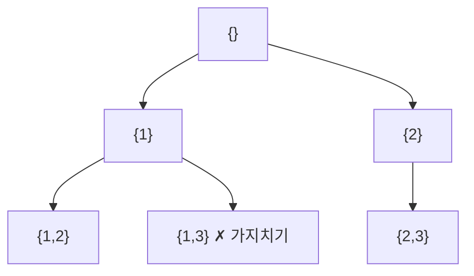

# 백트래킹 (Backtracking)

- Level: Intermediate
- Prerequisites: [Programming/Functions-and-Recursion.md](../Programming/Functions-and-Recursion.md), [Algorithms/BFS-DFS.md](BFS-DFS.md)
- Status: Draft
- Reviewed-by: -
- Depth: Deep-dive (자기완결)

---

## 개념 (Concept)

백트래킹은 해를 **한 조각씩 점진적으로** 만들다가 현재 부분 해가 가망 없으면 **즉시 되돌아가(backtrack)** 다른 선택을 시도하는 체계적 완전 탐색이다. 모든 후보를 무작정 나열하는 brute force와의 차이는 **가지치기(pruning)** 하나다.

## 직관 (Intuition)

미로에서 갈림길마다 한 방향을 택해 가다 막히면 마지막 갈림길로 돌아와 다른 길을 택한다. "가 보고 아니면 되돌리기"를 DFS로 체계화한 것. "이 길로는 답이 절대 안 나온다"가 보이는 즉시 포기하는 가지치기가 효율의 핵심이다.



## 이론 (Theory)

### 1. 상태 공간 트리와 골격

백트래킹은 **상태 공간 트리**(노드=부분 해, 간선=다음 선택)를 DFS로 탐색한다. 골격:

1. 부분 해가 완성이면 기록.
2. 가능한 다음 선택을 하나씩.
3. 유효(promising)하면 적용 + 재귀.
4. 돌아오면 선택을 **취소(undo)** 하고 다음 후보로.

적용과 취소가 **짝**을 이뤄야 한다 — 안 하면 상태가 다음 가지로 새어 오답.

### 2. 가지치기가 전부

가지치기 함수가 "이 부분 해에서 완성 가능한 해가 있을 수 있는가"를 판단한다. 좋은 가지치기는 지수 공간을 실용 크기로 줄인다. 강화 기법:

- **분기 한정(branch and bound)**: 최적화 문제에서 "현재 최선보다 나빠질 가지"를 한계(bound)로 자름.
- **제약 전파(forward checking)**·**MRV 휴리스틱**(가장 제약 많은 변수 먼저): CSP에서 탐색을 급감.
- **반복 심화(IDDFS)**: 깊이 제한을 늘려 가며 DFS의 메모리 + BFS의 최단성.

## 구현 (Implementation)

N-퀸 — 열·대각선 충돌을 집합으로 $O(1)$ 가지치기:

```python
def solve_n_queens(n):
    sols, cols, d1, d2, place = [], set(), set(), set(), []
    def bt(row):
        if row == n:
            sols.append(place[:]); return
        for col in range(n):
            if col in cols or (row-col) in d1 or (row+col) in d2:
                continue                          # 공격받는 칸 → 가지치기
            cols.add(col); d1.add(row-col); d2.add(row+col); place.append(col)
            bt(row + 1)
            place.pop(); cols.discard(col); d1.discard(row-col); d2.discard(row+col)  # 취소
    bt(0)
    return sols

print(len(solve_n_queens(8)))    # 92
```

## 복잡도 (Complexity)

| 문제 | 최악 시간 |
|---|---|
| 부분집합 생성 | $O(2^n)$ |
| 순열 생성 | $O(n!)$ |
| N-퀸 | $O(n!)$ 상한, 가지치기로 실제는 훨씬 작음 |

최악은 완전 탐색과 같지만 가지치기로 실제 방문 노드가 급감한다. 보조 공간은 재귀 깊이 $O(n)$. **워크드 예제(N=4).** row0에 col0 시도→row1은 col2만 가능→row2 막힘→백트랙. 결국 `(1,3,0,2)`,`(2,0,3,1)` 두 해. 가지치기로 $4^4=256$ 대신 수십 노드만 방문.

## 응용 (Applications)

- 순열·조합·부분집합 등 조합적 객체 생성.
- N-퀸·스도쿠·미로, 그래프 색칠, 해밀턴 경로.
- 제약 충족 문제(CSP), 분기 한정 최적화.

## 흔한 오해 (Common Misunderstandings)

- **백트래킹은 DFS의 응용**이지 별개 자료구조가 아니다 — 차이는 "만들고 → 되돌리기".
- **취소(undo)를 빠뜨리면** 이전 상태가 새어 오답.
- **가지치기가 없으면 그냥 완전 탐색** — 이점이 사라진다.
- **최악이 지수라고 항상 느린 건 아니다** — 좋은 가지치기는 평균적으로 매우 빠르다.

## TMI

- "backtracking" 용어는 1950년 D. H. 레머가 처음 썼다고 알려진다.
- 분기 한정은 백트래킹 + 한계(bound)로, 정수 계획·TSP 등 최적화의 표준.
- N-퀸 해의 개수는 닫힌 공식이 없어 큰 N은 여전히 컴퓨터로만 센다(OEIS A000170).

## 연습 / 확인 문제 (Exercises)

- `[1,2,3]` 의 모든 순열을 백트래킹으로 생성하라.
- 합이 목표가 되는 부분집합을 모두 찾고 가지치기(부분합 초과 시 중단)를 추가하라.
- 스도쿠를 백트래킹 + MRV 휴리스틱으로 풀어라.
- N-퀸에서 대각선 충돌을 `row±col` 로 $O(1)$ 판정하는 이유를 설명하라.

## 이어서 읽기 (Reading Path)

- 이전: [BFS / DFS](BFS-DFS.md)
- 다음: [DP 기초](DP-Basics.md)
- 관련: [분할 정복](Divide-and-Conquer.md)

## 참조 (References)

- [Programming/Functions-and-Recursion.md](../Programming/Functions-and-Recursion.md)
- [Algorithms/BFS-DFS.md](BFS-DFS.md)
- [Reference/Books.md](../Reference/Books.md)
- [Reference/Courses.md](../Reference/Courses.md)
