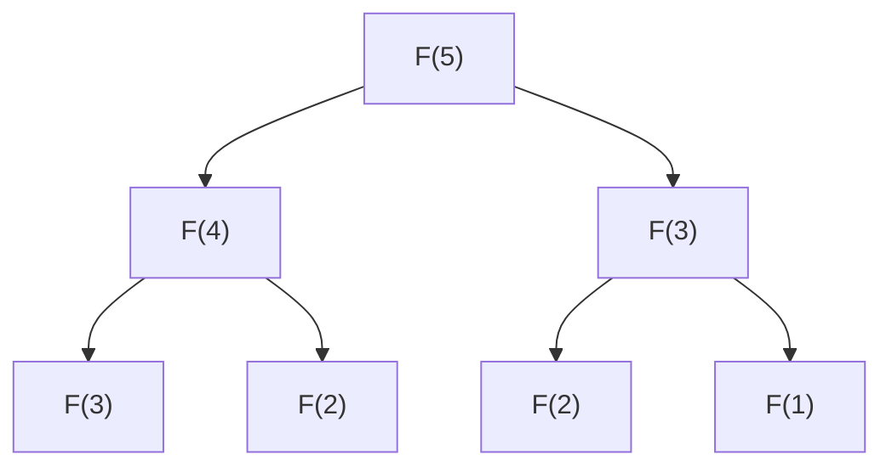

# 동적 계획법 기초 (Dynamic Programming Basics)

- Level: Intermediate
- Prerequisites: [Algorithms/Complexity.md](Complexity.md), [Programming/Functions-and-Recursion.md](../Programming/Functions-and-Recursion.md)
- Status: Draft
- Reviewed-by: -

---

## 개념 (Concept)

동적 계획법(DP)은 큰 문제를 **겹치는 작은 부분 문제**로 나누고, 각 부분 문제의 답을 **한 번만 계산해 저장**해 재사용하는 기법이다. 같은 계산을 반복하는 재귀를 표(table)로 바꿔 지수 시간을 다항 시간으로 줄인다.

## 직관 (Intuition)

피보나치를 단순 재귀로 구하면 $F(n-1)$과 $F(n-2)$를 각각 다시 풀면서 같은 값을 수없이 재계산한다. "이미 구한 답을 적어두고 다시 묻지 않는다"는 한 가지 원칙만 적용해도 계산량이 급감한다. DP는 이 메모의 원칙을 체계화한 것이다.



`F(3)`, `F(2)`가 여러 번 등장한다 — 이 중복을 제거하는 것이 DP다.

## 이론 (Theory)

DP가 적용되려면 두 조건이 필요하다.

- **겹치는 부분 문제(overlapping subproblems)**: 같은 부분 문제가 반복해서 나타난다.
- **최적 부분 구조(optimal substructure)**: 큰 문제의 최적해가 부분 문제의 최적해로 구성된다.

구현 방식은 두 가지다.

| 방식 | 설명 |
|---|---|
| 하향식(top-down, 메모이제이션) | 재귀로 풀되 계산한 값을 캐시에 저장 |
| 상향식(bottom-up, 타뷸레이션) | 작은 부분 문제부터 표를 채워 올라감 |

점화식(recurrence)을 세우는 것이 핵심이다. 피보나치는

$$F(n) = F(n-1) + F(n-2), \qquad F(0)=0,\; F(1)=1$$

계단 오르기(한 번에 1칸 또는 2칸)에서 $n$칸을 오르는 경우의 수도 같은 점화식 $W(n) = W(n-1) + W(n-2)$를 따른다. 동전 거스름돈처럼 최솟값을 구하는 문제는

$$\text{dp}(x) = 1 + \min_{c \in \text{coins}} \text{dp}(x - c)$$

같은 형태가 된다.

## 구현 (Implementation)

```python
# 1) 단순 재귀: O(2^n) — 같은 값을 반복 계산
def fib_naive(n):
    if n < 2:
        return n
    return fib_naive(n - 1) + fib_naive(n - 2)


# 2) 하향식 메모이제이션: O(n)
from functools import lru_cache

@lru_cache(maxsize=None)
def fib_memo(n):
    if n < 2:
        return n
    return fib_memo(n - 1) + fib_memo(n - 2)


# 3) 상향식 타뷸레이션: O(n) 시간, O(1) 공간
def fib_tab(n):
    if n < 2:
        return n
    prev, curr = 0, 1
    for _ in range(2, n + 1):
        prev, curr = curr, prev + curr
    return curr


print(fib_tab(30))   # 832040
```

## 복잡도 (Complexity)

| 방식 | 시간 | 공간 |
|---|---|---|
| 단순 재귀 | `O(2^n)` | `O(n)` (호출 스택) |
| 메모이제이션 | `O(n)` | `O(n)` |
| 타뷸레이션 | `O(n)` | `O(1)`~`O(n)` |

일반적으로 DP의 시간은 `(부분 문제 수) × (한 부분 문제를 푸는 비용)`으로 추정한다.

## 응용 (Applications)

- 최단 경로(벨만-포드, 플로이드-워셜)
- 문자열: 편집 거리, 최장 공통 부분 수열(LCS)
- 배낭 문제, 동전 거스름돈
- 최장 증가 부분 수열(LIS), 구간 DP

## 흔한 오해 (Common Misunderstandings)

- DP는 "재귀 + 메모"만을 뜻하지 않는다. 핵심은 점화식과 최적 부분 구조를 찾는 것이고, 메모이제이션·타뷸레이션은 그 구현 수단이다.
- 모든 재귀가 DP가 되는 것은 아니다. 부분 문제가 겹치지 않으면(예: 병합 정렬) 그냥 분할 정복이다.
- 그리디와 혼동하기 쉽다. 그리디는 매 순간 국소 최적을 택하고, DP는 모든 선택을 부분 문제로 비교한다.
- 메모이제이션과 타뷸레이션의 결과는 같지만, 재귀 깊이·공간 사용·캐시 비용이 달라 상황에 따라 선택이 갈린다.

## TMI

- "dynamic programming"이라는 이름은 1950년대 Richard Bellman이 붙였다. 그는 당시 연구 후원처에 "수학 연구"라는 인상을 피하려고, 멋지지만 반박하기 어려운 단어로 일부러 골랐다고 회고했다. 여기서 "programming"은 코딩이 아니라 "계획법"을 뜻한다.
- 피보나치는 닫힌 공식(비네 공식)도 있지만, 부동소수점 오차 때문에 큰 `n`에서는 정수 DP가 더 안전하다.
- 많은 DP 문제는 "상태를 무엇으로 잡을 것인가"가 8할이다. 상태 정의가 맞으면 점화식과 코드는 거의 따라온다.

## 연습 / 확인 문제 (Exercises)

- 계단 오르기(1칸 또는 2칸)에서 `n`칸을 오르는 경우의 수를 타뷸레이션으로 구하라.
- 동전 `[1, 3, 4]`로 금액 `6`을 만드는 최소 동전 수를 DP로 구하라.
- `fib_naive`와 `fib_memo`의 호출 횟수를 직접 세어 `O(2^n)`과 `O(n)` 차이를 확인하라.

## 이어서 읽기 (Reading Path)

- 이전: [BFS / DFS](BFS-DFS.md)
- 다음: 그리디 (예정 `Greedy.md`), 분할 정복 (예정 `Divide-and-Conquer.md`)

## 참조 (References)

- [Algorithms/Complexity.md](Complexity.md)
- [Programming/Functions-and-Recursion.md](../Programming/Functions-and-Recursion.md)
- [Reference/Books.md](../Reference/Books.md)
- [Reference/Courses.md](../Reference/Courses.md)
