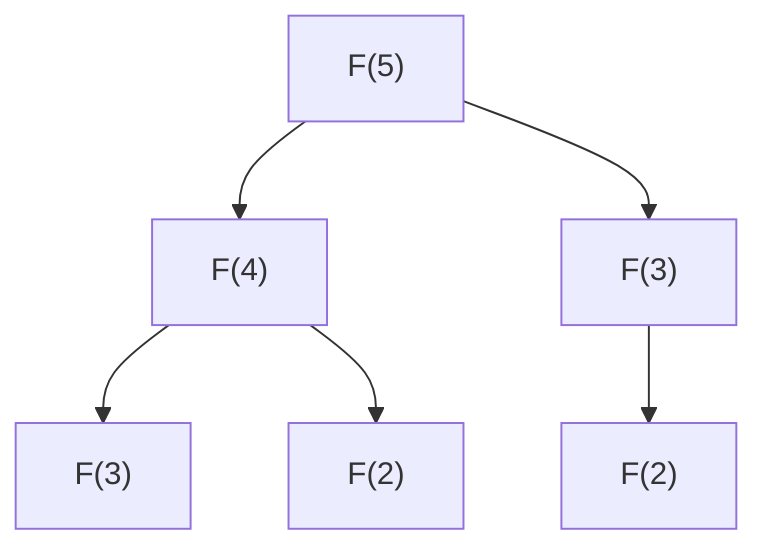

# 동적 계획법 기초 (Dynamic Programming Basics)

- Level: Intermediate
- Prerequisites: [Algorithms/Complexity.md](Complexity.md), [Programming/Functions-and-Recursion.md](../Programming/Functions-and-Recursion.md)
- Status: Draft
- Reviewed-by: -
- Depth: Deep-dive (자기완결)

---

## 개념 (Concept)

동적 계획법(DP)은 문제를 **겹치는 부분 문제**로 나누고 각 답을 **한 번만 계산해 저장·재사용**한다. 같은 계산을 반복하는 재귀를 표로 바꿔 지수를 다항으로 줄인다. [분할 정복](Divide-and-Conquer.md)과 달리 부분 문제가 **겹치고**, [그리디](Greedy.md)와 달리 **모든 선택을 비교**한다.

## 직관 (Intuition)

피보나치를 단순 재귀로 풀면 $F(3)$, $F(2)$ 를 수없이 다시 계산한다. "이미 구한 답은 적어두고 다시 묻지 않는다" 한 원칙으로 계산량이 급감한다. DP는 이 메모 원칙 + **부분 문제 DAG를 올바른 순서로 채우기**다.



## 이론 (Theory)

### 1. 두 필요 조건

- **겹치는 부분 문제**: 같은 부분 문제가 반복 등장(없으면 그냥 분할 정복).
- **최적 부분 구조**: 큰 문제 최적해가 부분 문제 최적해로 구성.

### 2. top-down vs bottom-up

| 방식 | 설명 | 장단 |
|---|---|---|
| 하향식(메모이제이션) | 재귀 + 캐시 | 필요한 상태만 계산, 재귀 깊이 위험 |
| 상향식(타뷸레이션) | 작은 것부터 표 채움 | 깊이 안전, rolling array로 공간 절약 |

부분 문제들은 **DAG**를 이룬다. 타뷸레이션은 이 DAG의 위상 순서로 채우는 것 — 그래서 "어떤 순서로 채우나"가 중요하다.

### 3. 설계의 8할은 상태 정의

DP 시간 $=$ **(상태 수) × (전이 비용)**. 상태를 잘 잡으면 점화식·코드는 따라온다. 예:

$$\text{coin: } dp(x)=1+\min_{c\in C} dp(x-c),\quad dp(0)=0$$
$$\text{LCS: } dp(i,j)=\begin{cases}dp(i{-}1,j{-}1)+1 & a_i=b_j\\ \max(dp(i{-}1,j),\,dp(i,j{-}1)) & \text{else}\end{cases}$$

## 구현 (Implementation)

```python
# 1) 단순 재귀 O(2^n)  2) 메모이제이션 O(n)  3) 타뷸레이션 O(n) 시간 O(1) 공간
from functools import lru_cache

@lru_cache(maxsize=None)
def fib_memo(n):
    return n if n < 2 else fib_memo(n-1) + fib_memo(n-2)

def fib_tab(n):
    prev, curr = 0, 1
    for _ in range(n):
        prev, curr = curr, prev + curr     # rolling: O(1) 공간
    return prev

def coin_min(coins, amount):               # 최소 동전 수
    INF = float("inf")
    dp = [0] + [INF] * amount
    for x in range(1, amount + 1):
        for c in coins:
            if c <= x:
                dp[x] = min(dp[x], 1 + dp[x - c])
    return dp[amount] if dp[amount] < INF else -1
```

## 복잡도 (Complexity)

| 방식 | 시간 | 공간 |
|---|---|---|
| 단순 재귀 | $O(2^n)$ | $O(n)$ 스택 |
| 메모이제이션 | $O(\text{상태})$ | $O(\text{상태})$ |
| 타뷸레이션 | $O(\text{상태}\times\text{전이})$ | $O(\text{상태})$ → rolling로 절감 |

**워크드 예제(coin `[1,3,4]`, amount 6).** dp 채움: dp[1]=1,dp[2]=2,dp[3]=1,dp[4]=1,dp[5]=2(=1+dp[4]),dp[6]=2(=1+dp[3]). 답 2(`3+3`) — 그리디(`4+1+1`=3)보다 나음, DP가 모든 선택을 비교했기 때문.

## 응용 (Applications)

- 최단 경로(벨만-포드, [플로이드-워셜](Floyd-Warshall.md))는 DP다.
- 문자열: 편집 거리, LCS, 회문 분할.
- 배낭, 동전, 최장 증가 부분 수열(LIS, $O(n\log n)$ 변형), 구간 DP.

## 흔한 오해 (Common Misunderstandings)

- **DP = "재귀 + 메모"가 아니다** — 핵심은 점화식·최적 부분 구조, 메모/타뷸레이션은 수단.
- **모든 재귀가 DP는 아니다** — 부분 문제가 안 겹치면 분할 정복.
- **그리디와 혼동** — 그리디는 국소 최적 한 번, DP는 모든 부분 문제를 비교.
- **타뷸레이션 순서가 틀리면** 아직 안 채운 상태를 참조해 오답 — DAG 위상 순서를 지켜야 한다.

## TMI

- "dynamic programming"은 1950년대 Richard Bellman이 후원처에 "수학 연구"라는 인상을 피하려 일부러 멋지고 반박 어려운 이름으로 골랐다 — "programming"은 코딩이 아니라 "계획법".
- 피보나치는 비네 닫힌 공식이 있지만 부동소수점 오차로 큰 $n$ 엔 정수 DP가 안전하다.
- LIS는 DP $O(n^2)$ 지만 "patience sorting + 이진 탐색"으로 $O(n\log n)$ 까지 — DP가 항상 최종 답은 아니다.

## 연습 / 확인 문제 (Exercises)

- 계단 오르기(1·2칸) 경우의 수를 타뷸레이션으로 구하라(점화식 $W(n)=W(n-1)+W(n-2)$).
- 동전 `[1,3,4]`, 금액 6의 최소 동전 수를 DP로 구하고 그리디와 비교하라.
- `fib_naive` 와 `fib_memo` 의 호출 횟수를 세어 $O(2^n)$ vs $O(n)$ 을 확인하라.
- 두 문자열의 LCS 길이를 2D DP로 구하고 실제 부분 수열도 복원하라.

## 이어서 읽기 (Reading Path)

- 이전: [BFS / DFS](BFS-DFS.md)
- 다음: [DP 최적화](DP-Optimization.md)
- 관련: [그리디](Greedy.md), [분할 정복](Divide-and-Conquer.md)

## 참조 (References)

- [Algorithms/Complexity.md](Complexity.md)
- [Programming/Functions-and-Recursion.md](../Programming/Functions-and-Recursion.md)
- [Reference/Books.md](../Reference/Books.md)
- [Reference/Courses.md](../Reference/Courses.md)
