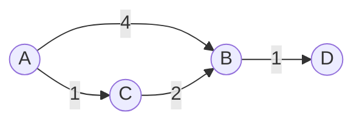

# 다익스트라 최단 경로 (Dijkstra's Algorithm)

- Level: Intermediate
- Prerequisites: [Algorithms/BFS-DFS.md](BFS-DFS.md), [Data-Structures/Heap.md](../Data-Structures/Heap.md), [Data-Structures/Graph-Representation.md](../Data-Structures/Graph-Representation.md)
- Status: Draft
- Reviewed-by: -
- Depth: Deep-dive (자기완결)

---

## 개념 (Concept)

다익스트라는 **음이 아닌 가중치** 그래프에서 한 시작점으로부터 모든 정점까지 **최단 경로**를 구한다. 매 단계 "아직 미확정 정점 중 가장 가까운 것"을 골라 거리를 확정하는 그리디다 — [BFS](BFS-DFS.md)를 가중 그래프로 일반화한 것.

## 직관 (Intuition)

시작점에서 물이 일정 속도로 퍼진다. 어떤 정점에 물이 *처음 닿는 순간*이 그 정점의 최단 거리다. 가장 먼저 닿은(가장 가까운) 정점부터 확정하고, 그 정점을 거쳐 가면 더 가까워지는 이웃의 거리를 **완화(relaxation)** 한다.



## 이론 (Theory)

### 1. 완화와 불변식

`dist[v]` 를 ∞, 시작점만 0. 핵심 연산:

$$\text{if } dist[u]+w(u,v) < dist[v]:\quad dist[v]\leftarrow dist[u]+w(u,v)$$

미확정 중 `dist` 최소 정점을 확정하고 그 간선을 완화 — 모든 정점이 확정될 때까지.

### 2. 정당성 (음이 아닌 가중치가 핵심)

**정리.** 정점 $u$ 를 확정(pop)하는 순간 `dist[u]` 는 최단 거리다. *증명 스케치*: 더 짧은 경로 $P$ 가 있다면 $P$ 는 미확정 영역으로 나가는 첫 간선 $(x,y)$ 를 갖는다. 음이 아닌 가중치라 $dist[y]\le \text{len}(P) < dist[u]$ 가 되어 $y$ 가 먼저 뽑혔어야 한다 — 모순. **음수 간선이 하나라도 있으면 이 보장이 깨져** 다익스트라가 틀린다 → [벨만-포드](Bellman-Ford.md) 또는 Johnson 재가중.

### 3. 우선순위 큐: lazy deletion vs decrease-key

표준 라이브러리 힙은 `decrease-key` 가 없어 **중복 push + pop 시 stale 검사**(`d > dist[u]` 면 skip)로 처리한다(lazy deletion). 더 빠른 탐색이 필요하면 **A***(목표 방향 휴리스틱 $h$, admissible·consistent면 최적)·**양방향 탐색**·전처리(contraction hierarchies)를, 가중치 0/1뿐이면 [0-1 BFS](../Data-Structures/Deque.md).

## 구현 (Implementation)

```python
import heapq

def dijkstra(graph, start, n):           # graph[u] = [(v, w), ...]
    dist = [float("inf")] * n
    dist[start] = 0
    prev = [-1] * n                       # 경로 복원용
    pq = [(0, start)]
    while pq:
        d, u = heapq.heappop(pq)
        if d > dist[u]:                   # stale: 이미 더 짧게 확정됨
            continue
        for v, w in graph[u]:
            nd = d + w
            if nd < dist[v]:              # 완화
                dist[v] = nd; prev[v] = u
                heapq.heappush(pq, (nd, v))
    return dist, prev

def path(prev, t):                        # t까지 경로 복원
    out = []
    while t != -1:
        out.append(t); t = prev[t]
    return out[::-1]
```

## 복잡도 (Complexity)

| 구현 | 시간 |
|---|---|
| 배열 최솟값 탐색 | $O(V^2)$ (밀집에 유리) |
| 이진 힙 + 인접 리스트 | $O((V+E)\log V)$ (희소에 유리) |
| $d$-ary 힙 | $O(E\log_d V)$ ($d\approx E/V$ 튜닝) |
| 피보나치 힙 | $O(E+V\log V)$ (이론 최적) |

공간 $O(V+E)$. **워크드 예제** `0:[(1,4),(2,1)], 2:[(1,2),(3,5)], 1:[(3,1)]`: pop(0,0)→완화 dist[1]=4,dist[2]=1; pop(1,2)→2거쳐 dist[1]=3,dist[3]=6; pop(3,1)→dist[3]=4; pop(4,3 stale)·pop(4,1 stale) skip → `[0,3,1,4]`.

## 응용 (Applications)

- 내비게이션·지도 최단 경로, 게임 경로 탐색(가중 격자).
- 네트워크 라우팅(OSPF 등 링크 상태), 최소 지연/비용 경로.
- 다른 알고리즘의 부품(Johnson APSP의 1단계).

## 흔한 오해 (Common Misunderstandings)

- **음수 가중치에서 동작하지 않는다** — 간선 하나라도 음수면 틀릴 수 있다.
- **stale 검사(`d>dist[u]`)를 빠뜨리면** 중복 처리로 비효율/오답(lazy deletion 구현에서 특히).
- **BFS와 혼동** — BFS는 모든 가중치가 같은 특수 경우.
- **단일 시작점** — 모든 쌍이 필요하면 [플로이드-워셜](Floyd-Warshall.md)이나 각 정점 반복(Johnson).

## TMI

- 데이크스트라가 1956년 약 20분 만에 (연필도 없이) 머릿속으로 고안했고 3년 뒤 발표했다는 일화가 유명하다.
- 피보나치 힙이 이론 최적이지만 상수가 커, 실무는 보통 이진 힙 + 중복 삽입이 더 빠르다.
- 대륙 규모 도로망은 순수 다익스트라 대신 contraction hierarchies로 전처리해 쿼리를 마이크로초로 만든다.

## 연습 / 확인 문제 (Exercises)

- `prev` 로 최단 경로 자체(정점 순서)를 복원하라.
- 음수 간선 하나로 다익스트라가 틀리는 예를 만들어라.
- A*에서 휴리스틱이 admissible/consistent여야 최적인 이유를 설명하라.
- 격자에서 칸마다 이동 비용이 다를 때 최소 비용 경로를 구하라.

## 이어서 읽기 (Reading Path)

- 이전: [BFS / DFS](BFS-DFS.md)
- 다음: [벨만-포드](Bellman-Ford.md)
- 관련: [최소 신장 트리](MST.md), [힙](../Data-Structures/Heap.md), [그리디](Greedy.md)

## 참조 (References)

- [Algorithms/BFS-DFS.md](BFS-DFS.md)
- [Algorithms/Bellman-Ford.md](Bellman-Ford.md)
- [Data-Structures/Heap.md](../Data-Structures/Heap.md)
- [Reference/Books.md](../Reference/Books.md)
- [Reference/Papers.md](../Reference/Papers.md)
