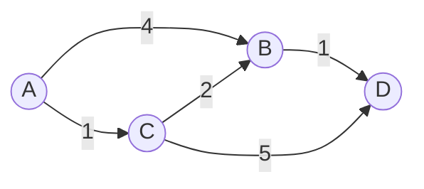

# 다익스트라 최단 경로 (Dijkstra's Algorithm)

- Level: Intermediate
- Prerequisites: [Algorithms/BFS-DFS.md](BFS-DFS.md), [Data-Structures/Heap.md](../Data-Structures/Heap.md), [Data-Structures/Graph-Representation.md](../Data-Structures/Graph-Representation.md)
- Status: Draft
- Reviewed-by: -

---

## 개념 (Concept)

다익스트라 알고리즘은 **음수가 아닌 가중치** 그래프에서, 한 시작 정점으로부터 다른 모든 정점까지의 **최단 경로**를 구하는 알고리즘이다. 매 단계에서 "아직 확정되지 않은 정점 중 시작점에서 가장 가까운 정점"을 골라 거리를 확정하는 그리디 방식이다.

## 직관 (Intuition)

시작점에서 물이 일정한 속도로 퍼져 나간다고 상상하자. 물이 어떤 정점에 처음 닿는 순간이 그 정점까지의 최단 시간이다. 다익스트라는 "가장 먼저 닿은(가장 가까운) 정점부터 하나씩 확정"하며, 그 정점을 거쳐 가면 더 가까워지는 이웃들의 거리를 갱신(완화, relaxation)한다.



## 이론 (Theory)

각 정점의 잠정 거리 `dist[v]`를 무한대로 두고 시작점만 0으로 둔다. 핵심 연산은 **완화(relaxation)** 다.

$$\text{if } dist[u] + w(u,v) < dist[v]: \quad dist[v] \leftarrow dist[u] + w(u,v)$$

확정되지 않은 정점 중 `dist`가 최소인 정점을 골라 확정하고, 그 정점에서 나가는 간선을 완화한다. 이 과정을 모든 정점이 확정될 때까지 반복한다.

정당성은 그리디 선택 속성에서 온다. **가중치가 음수가 아니므로**, 가장 가까운 미확정 정점의 거리는 더 줄어들 수 없다(다른 경로를 돌면 반드시 더 멀어진다). 음수 간선이 있으면 이 보장이 깨져 다익스트라가 틀린 답을 낼 수 있고, 그때는 [벨만-포드](Bellman-Ford.md) 같은 알고리즘을 써야 한다.

## 구현 (Implementation)

최소 힙(우선순위 큐)을 쓴 표준 구현이다.

```python
import heapq


def dijkstra(graph, start, n):
    # graph[u] = (v, weight) 목록
    dist = [float("inf")] * n
    dist[start] = 0
    pq = [(0, start)]                      # (거리, 정점)

    while pq:
        d, u = heapq.heappop(pq)
        if d > dist[u]:                    # 이미 더 짧은 경로로 확정됨
            continue
        for v, w in graph[u]:
            nd = d + w
            if nd < dist[v]:               # 완화
                dist[v] = nd
                heapq.heappush(pq, (nd, v))
    return dist


graph = {0: [(1, 4), (2, 1)], 1: [(3, 1)], 2: [(1, 2), (3, 5)], 3: []}
print(dijkstra(graph, 0, 4))   # [0, 3, 1, 4]
```

## 복잡도 (Complexity)

`V`는 정점 수, `E`는 간선 수다.

| 구현 | 시간 |
|---|---|
| 배열로 최솟값 탐색 | `O(V^2)` |
| 이진 힙 + 인접 리스트 | `O((V + E) log V)` |
| 피보나치 힙 | `O(E + V log V)` |

밀집 그래프($E \approx V^2$)에서는 배열 방식이, 희소 그래프에서는 힙 방식이 유리하다. 공간은 `O(V + E)`다.

## 응용 (Applications)

- 내비게이션·지도의 최단 경로
- 네트워크 라우팅(OSPF 등 링크 상태 프로토콜)
- 게임의 경로 탐색(가중치 격자)
- 최소 지연·최소 비용 경로 일반

## 흔한 오해 (Common Misunderstandings)

- 다익스트라는 **음수 가중치에서 동작하지 않는다.** 음수 간선이 하나라도 있으면 틀릴 수 있다.
- 힙에서 꺼낸 정점이 이미 확정됐는지 검사(`d > dist[u]`)하지 않으면, 같은 정점을 여러 번 처리해 비효율적이거나 오답이 날 수 있다(decrease-key 대신 중복 삽입을 쓰는 구현에서 특히 중요).
- BFS와 혼동하기 쉽다. BFS는 모든 간선 가중치가 같을 때의 특수 경우이고, 다익스트라는 일반 가중치를 다룬다.
- 다익스트라는 단일 시작점 알고리즘이다. 모든 쌍 최단 경로가 필요하면 플로이드-워셜이나 각 정점에서의 반복을 쓴다.

## TMI

- 에츠허르 데이크스트라가 1956년 약 20분 만에 머릿속으로 고안했고, 3년 뒤에야 발표했다는 일화가 유명하다.
- 실제 내비게이션은 순수 다익스트라보다 목표 방향으로 탐색을 유도하는 A* 알고리즘이나 전처리 기법(contraction hierarchies)을 쓴다. 대륙 규모 그래프에서 빠르기 때문이다.
- "decrease-key"를 지원하는 피보나치 힙이 이론상 최적이지만, 상수가 커서 실무에서는 보통 이진 힙 + 중복 삽입이 더 빠르다.

## 연습 / 확인 문제 (Exercises)

- 위 구현을 수정해 최단 경로 자체(정점 순서)도 복원하라(`prev` 배열 사용).
- 음수 간선이 하나 있는 그래프를 만들어 다익스트라가 틀리는 예를 보여라.
- 격자 미로에서 칸마다 이동 비용이 다를 때 최소 비용 경로를 다익스트라로 구하라.

## 이어서 읽기 (Reading Path)

- 이전: [BFS / DFS](BFS-DFS.md)
- 다음: [최소 신장 트리](MST.md), [벨만-포드](Bellman-Ford.md)
- 관련: [힙](../Data-Structures/Heap.md), [그리디 알고리즘](Greedy.md)

## 참조 (References)

- [Algorithms/BFS-DFS.md](BFS-DFS.md)
- [Data-Structures/Heap.md](../Data-Structures/Heap.md)
- [Data-Structures/Graph-Representation.md](../Data-Structures/Graph-Representation.md)
- [Reference/Books.md](../Reference/Books.md)
- [Reference/Papers.md](../Reference/Papers.md)
