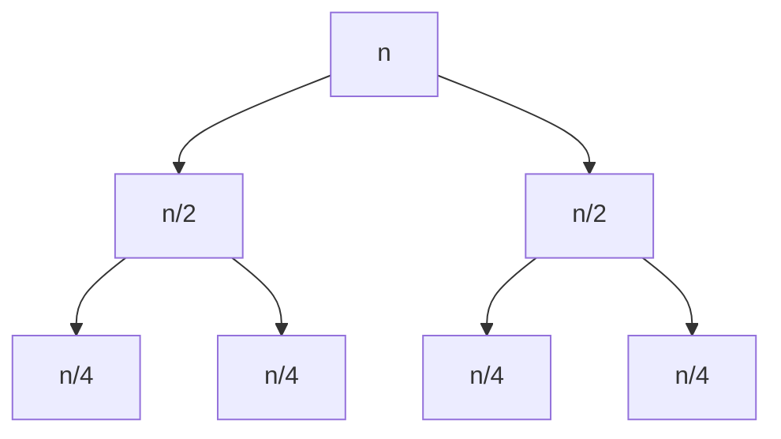

# 분할 정복 (Divide and Conquer)

- Level: Intermediate
- Prerequisites: [Programming/Functions-and-Recursion.md](../Programming/Functions-and-Recursion.md), [Algorithms/Complexity.md](Complexity.md)
- Status: Draft
- Reviewed-by: -
- Depth: Deep-dive (자기완결)

---

## 개념 (Concept)

분할 정복은 문제를 **같은 형태의 작은 부분 문제로 분할(divide)** 해 재귀로 풀고(conquer) **합쳐(combine)** 답을 만드는 설계 기법이다. 병합 정렬·퀵 정렬·이진 탐색·큰 수 곱셈·FFT가 모두 이 틀이다. [동적 계획법](DP-Basics.md)과의 결정적 차이는 **부분 문제가 겹치지 않는다**는 점.

## 직관 (Intuition)

시험지 1,000장을 혼자 채점하는 대신 절반씩 나눠 맡기고, 그들도 다시 절반으로 나눈다. 한 장이 되면 즉시 처리하고 결과를 위로 합치며 올라온다. "문제를 반으로 줄이면 일이 얼마나 빨라지나"가 비용 분석의 전부.



## 이론 (Theory)

### 1. 점화식과 재귀 트리

크기 $n$ 을 $a$ 개의 크기 $n/b$ 부분으로 나누고 분할·합치기에 $f(n)$ 이 들면 $T(n)=a\,T(n/b)+f(n)$. **재귀 트리**로 직관을 얻는다: 깊이 $i$ 에 노드 $a^i$ 개, 각 비용 $f(n/b^i)$. 예 $T(n)=2T(n/2)+n$ — 각 레벨 합이 $n$ 으로 일정, 레벨 $\log_2 n$ 개 → $\Theta(n\log n)$.

### 2. 마스터 정리와 그 한계

$n^{\log_b a}$ 와 $f(n)$ 을 비교:

| 경우 | 조건 | 결과 |
|---|---|---|
| 1 | $f=O(n^{\log_b a-\varepsilon})$ | $\Theta(n^{\log_b a})$ (잎 지배) |
| 2 | $f=\Theta(n^{\log_b a})$ | $\Theta(n^{\log_b a}\log n)$ (균형) |
| 3 | $f=\Omega(n^{\log_b a+\varepsilon})$ + 정칙성 | $\Theta(f)$ (루트 지배) |

세 경우 사이의 **"틈"**(예 $f=n^{\log_b a}\log n$, 다항식 차이가 아닌 경우)엔 마스터 정리가 안 통한다. **불균등 분할**($T(n)=T(n/3)+T(2n/3)+n$)은 **Akra–Bazzi** 정리로 푼다.

### 3. 곱셈을 더 빠르게 — 부분 문제 수를 줄이기

$n$ 자리 곱셈을 단순 분할하면 $a=4$($T(n)=4T(n/2)+n=\Theta(n^2)$)로 이득이 없다. **카라츠바**는 대수적 항등식으로 곱셈을 **3번**으로 줄여 $T(n)=3T(n/2)+n=\Theta(n^{\log_2 3})\approx\Theta(n^{1.585})$. 같은 발상으로 행렬 곱은 **슈트라센**(8→7회, $n^{2.807}$).

## 구현 (Implementation)

```python
def merge_sort(a):
    if len(a) <= 1:                  # 기저: 더 못 나눔
        return a
    mid = len(a) // 2
    L, R = merge_sort(a[:mid]), merge_sort(a[mid:])   # 분할+정복
    out, i, j = [], 0, 0                               # 합치기
    while i < len(L) and j < len(R):
        if L[i] <= R[j]: out.append(L[i]); i += 1
        else:            out.append(R[j]); j += 1
    return out + L[i:] + R[j:]

def fast_pow(x, n):                  # 거듭제곱 O(log n)
    if n == 0: return 1
    half = fast_pow(x, n // 2)
    return half * half * (x if n % 2 else 1)
```

## 복잡도 (Complexity)

| 알고리즘 | 점화식 | 시간 |
|---|---|---|
| 이진 탐색 | $T(n)=T(n/2)+O(1)$ | $O(\log n)$ |
| 병합 정렬 | $T(n)=2T(n/2)+O(n)$ | $O(n\log n)$ |
| 카라츠바 | $T(n)=3T(n/2)+O(n)$ | $O(n^{1.585})$ |
| 슈트라센 | $T(n)=7T(n/2)+O(n^2)$ | $O(n^{2.807})$ |

합치기 보조 공간이 들 수 있다(병합 정렬 $O(n)$). 재귀 깊이는 보통 $O(\log n)$. **워크드 예제.** $T(n)=2T(n/2)+n$ 재귀 트리: 레벨0 비용 $n$, 레벨1 $2\cdot\frac n2=n$, …, 각 레벨 $n$, 레벨 수 $\log_2 n+1$ → 총 $\Theta(n\log n)$.

## 응용 (Applications)

- 정렬(병합·퀵), 탐색(이진 탐색), 선택(quickselect, 중앙값의 중앙값).
- 수치: 카라츠바·슈트라센·FFT.
- 기하: 가장 가까운 두 점 $O(n\log n)$, 최대 부분 배열 분할정복판.

## 흔한 오해 (Common Misunderstandings)

- **분할 정복 ≠ DP** — 부분 문제가 **겹치면** DP(메모이제이션), 안 겹치면 순수 분할 정복.
- **기저 사례를 빠뜨리면 무한 재귀** — "더 못 나누는 크기"를 반드시 정의.
- **항상 빠르지 않다** — 합치기 $f(n)$ 가 크면 이득이 사라진다(경우 3).
- **마스터 정리는 만능이 아니다** — $a,b$ 상수·형태 조건이 필요하고, 틈/불균등 분할엔 안 통한다(Akra–Bazzi).

## TMI

- 카라츠바(1960)는 23세 학생 때 콜모고로프의 "$n$ 자리 곱셈은 $\Omega(n^2)$" 추측을 일주일 만에 반증했다 — 분할 정복의 위력을 알린 고전.
- 퀵 정렬도 분할 정복이지만 "합치기"가 거의 없다(분할에서 정렬이 끝남). 대신 분할 편향 시 $O(n^2)$.
- 실무 정렬은 작은 부분 배열에서 재귀를 멈추고 삽입 정렬로 전환한다(Timsort) — 재귀 오버헤드가 단순 정렬보다 비싼 구간이 있어서.

## 연습 / 확인 문제 (Exercises)

- 배열 최댓값을 분할 정복으로 찾고 점화식을 세워 복잡도를 구하라.
- `x^n` 을 $O(\log n)$ 에 계산하는 고속 거듭제곱을 구현하라.
- $T(n)=4T(n/2)+O(n)$ 을 마스터 정리로 풀어라(경우 1).
- 카라츠바가 왜 곱셈을 4→3회로 줄이는지 대수 항등식으로 보여라.

## 이어서 읽기 (Reading Path)

- 이전: [정렬](Sorting.md)
- 다음: [DP 기초](DP-Basics.md)
- 관련: [이진 탐색](Binary-Search.md), [수학적 귀납법](../Math/Discrete/Induction.md)

## 참조 (References)

- [Algorithms/Complexity.md](Complexity.md)
- [Algorithms/Sorting.md](Sorting.md)
- [Programming/Functions-and-Recursion.md](../Programming/Functions-and-Recursion.md)
- [Reference/Books.md](../Reference/Books.md)
- [Reference/Courses.md](../Reference/Courses.md)
