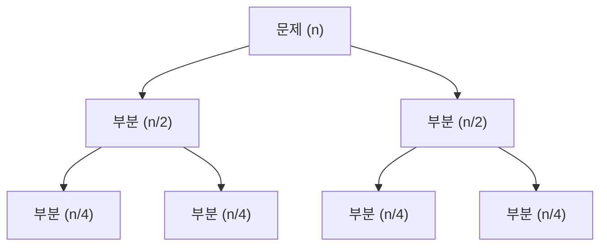

# 분할 정복 (Divide and Conquer)

- Level: Intermediate
- Prerequisites: [Programming/Functions-and-Recursion.md](../Programming/Functions-and-Recursion.md), [Algorithms/Complexity.md](Complexity.md)
- Status: Draft
- Reviewed-by: -

---

## 개념 (Concept)

분할 정복은 큰 문제를 **같은 형태의 작은 부분 문제로 쪼개(divide)** 각각을 재귀로 풀고(conquer), 그 결과를 **합쳐(combine)** 원래 문제의 답을 만드는 알고리즘 설계 기법이다. 합병 정렬, 퀵 정렬, 이진 탐색, 큰 수 곱셈 등 많은 핵심 알고리즘이 이 틀을 따른다.

## 직관 (Intuition)

혼자서 1,000장의 시험지를 채점하는 대신, 절반씩 나눠 두 사람에게 맡기고 그들도 다시 절반씩 나눈다. 더 이상 나눌 수 없을 만큼 작아지면(한 장) 바로 처리하고, 결과를 위로 합치며 올라온다. "문제를 반으로 줄이면 일이 얼마나 빨라지는가"가 핵심 직관이다.



## 이론 (Theory)

분할 정복 알고리즘의 비용은 **점화식(recurrence)** 으로 표현된다. 크기 $n$ 문제를 $a$개의 크기 $n/b$ 부분 문제로 나누고, 분할·합치기에 $f(n)$이 든다면

$$T(n) = a\,T(n/b) + f(n)$$

이 점화식의 해는 **마스터 정리(Master Theorem)** 로 분류한다. $f(n)$과 $n^{\log_b a}$의 크기를 비교한다.

| 경우 | 조건 | 결과 |
|---|---|---|
| 1 | $f(n) = O(n^{\log_b a - \epsilon})$ | $T(n) = \Theta(n^{\log_b a})$ |
| 2 | $f(n) = \Theta(n^{\log_b a})$ | $T(n) = \Theta(n^{\log_b a}\log n)$ |
| 3 | $f(n) = \Omega(n^{\log_b a + \epsilon})$ (정칙성) | $T(n) = \Theta(f(n))$ |

예로 합병 정렬은 $a=2, b=2, f(n)=\Theta(n)$이므로 $n^{\log_2 2}=n$과 같은 경우 2, 따라서 $\Theta(n\log n)$이다.

## 구현 (Implementation)

합병 정렬은 분할 정복의 교과서적 예다.

```python
def merge_sort(a):
    if len(a) <= 1:               # 더 못 나누는 기저 사례
        return a
    mid = len(a) // 2
    left = merge_sort(a[:mid])    # 분할 + 정복
    right = merge_sort(a[mid:])
    return merge(left, right)     # 합치기


def merge(left, right):
    result, i, j = [], 0, 0
    while i < len(left) and j < len(right):
        if left[i] <= right[j]:
            result.append(left[i]); i += 1
        else:
            result.append(right[j]); j += 1
    result.extend(left[i:])
    result.extend(right[j:])
    return result


print(merge_sort([5, 2, 8, 1, 9, 3]))   # [1, 2, 3, 5, 8, 9]
```

## 복잡도 (Complexity)

| 알고리즘 | 점화식 | 시간 |
|---|---|---|
| 이진 탐색 | `T(n) = T(n/2) + O(1)` | `O(log n)` |
| 합병 정렬 | `T(n) = 2T(n/2) + O(n)` | `O(n log n)` |
| 카라츠바 곱셈 | `T(n) = 3T(n/2) + O(n)` | `O(n^1.585)` |

합치기 단계의 보조 공간이 필요할 수 있다(합병 정렬은 `O(n)`). 재귀 깊이는 보통 `O(log n)`이다.

## 응용 (Applications)

- 정렬: 합병 정렬, 퀵 정렬
- 탐색: 이진 탐색
- 수치 계산: 카라츠바 곱셈, 슈트라센 행렬 곱셈, FFT
- 기하: 가장 가까운 두 점 찾기

## 흔한 오해 (Common Misunderstandings)

- 분할 정복과 동적 프로그래밍은 다르다. 부분 문제가 **겹치면** DP(메모이제이션), **겹치지 않으면** 순수 분할 정복이다.
- 기저 사례(base case)를 빠뜨리면 무한 재귀에 빠진다. "더 이상 나눌 수 없는 크기"를 반드시 정의해야 한다.
- 항상 빠른 것은 아니다. 합치기 비용 $f(n)$이 크면 이득이 사라질 수 있다(마스터 정리 경우 3).
- 마스터 정리는 모든 점화식에 적용되지 않는다. $a, b$가 상수이고 형태가 맞아야 하며, 경우 사이의 "틈"에 빠지는 점화식도 있다.

## TMI

- 카라츠바 곱셈(1960)은 "$n$자리 곱셈은 $O(n^2)$이 최선"이라는 당시 통념을 깬 결과로, 분할 정복의 위력을 보여 준 고전이다.
- 퀵 정렬도 분할 정복이지만 "합치기"가 거의 없다(분할에서 정렬이 끝남). 대신 분할이 한쪽으로 치우치면 `O(n^2)`로 나빠진다.
- 실무 정렬 라이브러리는 작은 부분 배열에서 재귀를 멈추고 삽입 정렬로 전환한다(예: 팀소트). 재귀 오버헤드보다 단순 정렬이 빠른 구간이 있기 때문이다.

## 연습 / 확인 문제 (Exercises)

- 배열의 최댓값을 분할 정복으로 찾는 함수를 작성하고 점화식을 세워라.
- 거듭제곱 `x^n`을 `O(log n)`에 계산하는 분할 정복(고속 거듭제곱)을 구현하라.
- `T(n) = 4T(n/2) + O(n)`의 시간 복잡도를 마스터 정리로 구하라.

## 이어서 읽기 (Reading Path)

- 이전: [정렬](Sorting.md), [이진 탐색](Binary-Search.md)
- 다음: [DP 기초](DP-Basics.md) (부분 문제가 겹치는 경우)
- 관련: [수학적 귀납법](../Math/Discrete/Induction.md)

## 참조 (References)

- [Algorithms/Complexity.md](Complexity.md)
- [Algorithms/Sorting.md](Sorting.md)
- [Programming/Functions-and-Recursion.md](../Programming/Functions-and-Recursion.md)
- [Reference/Books.md](../Reference/Books.md)
- [Reference/Courses.md](../Reference/Courses.md)
