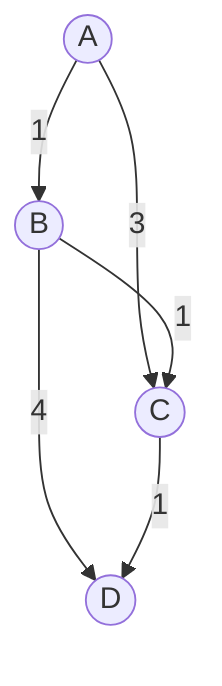

# 최소 신장 트리 (Minimum Spanning Tree)

- Level: Intermediate
- Prerequisites: [Data-Structures/Union-Find.md](../Data-Structures/Union-Find.md), [Data-Structures/Graph-Representation.md](../Data-Structures/Graph-Representation.md), [Algorithms/Sorting.md](Sorting.md)
- Status: Draft
- Reviewed-by: -

---

## 개념 (Concept)

최소 신장 트리(MST)는 **연결된 가중치 무방향 그래프**에서, 모든 정점을 사이클 없이 연결하면서 **간선 가중치의 합이 최소**가 되도록 고른 부분 그래프다. 정점이 $V$개면 MST는 항상 정확히 $V-1$개의 간선을 가진다. 대표 알고리즘으로 크루스칼(Kruskal)과 프림(Prim)이 있다.

## 직관 (Intuition)

여러 도시를 도로로 모두 연결하되 공사비를 최소화하려 한다. 굳이 모든 도시 쌍을 직접 잇지 않아도, 전체가 하나로 이어지기만 하면 된다. MST는 "전부 연결 + 낭비 없는 최소 비용"의 균형점이다. 두 대표 알고리즘은 접근이 다르다 — 크루스칼은 싼 간선부터, 프림은 한 정점에서 나무를 키워 나간다.



## 이론 (Theory)

두 알고리즘 모두 그리디이며, **컷 속성(cut property)** 으로 정당성이 보장된다: 그래프를 두 집합으로 가르는 어떤 컷에서든, 그 컷을 가로지르는 **가장 가벼운 간선은 반드시 어떤 MST에 포함된다.**

| 알고리즘 | 전략 | 핵심 자료구조 |
|---|---|---|
| 크루스칼 | 모든 간선을 가중치 오름차순으로 보며, 사이클을 만들지 않으면 채택 | 유니온-파인드 |
| 프림 | 한 정점에서 시작해, 트리에 닿는 가장 가벼운 간선을 반복 추가 | 최소 힙 |

크루스칼은 간선 중심이라 희소 그래프에, 프림은 정점 중심이라 밀집 그래프에 잘 맞는다. 간선 가중치가 모두 다르면 MST는 유일하다.

## 구현 (Implementation)

크루스칼 + 유니온-파인드:

```python
def kruskal(n, edges):
    # edges: (weight, u, v) 목록
    parent = list(range(n))

    def find(x):
        while parent[x] != x:
            parent[x] = parent[parent[x]]
            x = parent[x]
        return x

    edges.sort()                       # 가중치 오름차순
    total, chosen = 0, []
    for w, u, v in edges:
        ru, rv = find(u), find(v)
        if ru != rv:                   # 사이클이 아니면 채택
            parent[ru] = rv
            total += w
            chosen.append((u, v, w))
    return total, chosen


edges = [(1, 0, 1), (3, 0, 2), (1, 1, 2), (4, 1, 3), (1, 2, 3)]
print(kruskal(4, edges))   # (3, [(0, 1, 1), (1, 2, 1), (2, 3, 1)])
```

## 복잡도 (Complexity)

`V`는 정점 수, `E`는 간선 수다.

| 알고리즘 | 시간 | 비고 |
|---|---|---|
| 크루스칼 | `O(E log E)` | 간선 정렬이 지배적 |
| 프림 (이진 힙) | `O(E log V)` | 희소 그래프 |
| 프림 (배열) | `O(V^2)` | 밀집 그래프에 유리 |

`E log E`와 `E log V`는 $E \le V^2$이므로 같은 차수($\log E = O(\log V)$)다. 공간은 `O(V + E)`다.

## 응용 (Applications)

- 통신·전력·도로망 등 네트워크 설계의 최소 비용 연결
- 클러스터링(간선을 끊어 군집 분리)
- 이미지 분할, 근사 알고리즘(예: 외판원 문제 2-근사)
- 회로 설계, 배관 배치

## 흔한 오해 (Common Misunderstandings)

- MST는 두 정점 사이의 최단 경로를 보장하지 않는다. 전체 합을 최소화할 뿐, 특정 쌍의 경로는 더 길 수 있다(그건 다익스트라의 일).
- MST가 항상 유일하지는 않다. 같은 가중치 간선이 있으면 여러 MST가 가능하다.
- 방향 그래프에는 일반적인 MST 개념이 그대로 적용되지 않는다(그건 최소 신장 樹형도, arborescence 문제다).
- 크루스칼에서 유니온-파인드 없이 매번 사이클을 검사하면 느려진다. 효율은 서로소 집합 자료구조에서 온다.

## TMI

- 가장 오래된 MST 알고리즘은 1926년 보루프카(Borůvka)가 전력망 설계를 위해 고안한 것으로, 크루스칼·프림보다 앞선다.
- 프림 알고리즘은 다익스트라와 골격이 거의 같다. 우선순위 큐의 키가 "시작점까지 거리"가 아니라 "트리까지 거리"라는 점만 다르다.
- 간선 가중치가 서로 다르면 MST는 유일하며, 이 사실은 컷 속성과 사이클 속성으로 간단히 증명된다.

## 연습 / 확인 문제 (Exercises)

- 프림 알고리즘을 최소 힙으로 구현하고 크루스칼 결과와 합이 같은지 확인하라.
- 간선 가중치가 모두 다른 그래프에서 MST가 유일함을 컷 속성으로 설명하라.
- 최대 신장 트리(가중치 합 최대)를 구하려면 크루스칼을 어떻게 바꿔야 하는지 보여라.

## 이어서 읽기 (Reading Path)

- 이전: [그리디 알고리즘](Greedy.md)
- 다음: [최단 경로](Dijkstra.md)
- 관련: [유니온-파인드](../Data-Structures/Union-Find.md), [힙](../Data-Structures/Heap.md)

## 참조 (References)

- [Data-Structures/Union-Find.md](../Data-Structures/Union-Find.md)
- [Data-Structures/Graph-Representation.md](../Data-Structures/Graph-Representation.md)
- [Algorithms/Sorting.md](Sorting.md)
- [Reference/Books.md](../Reference/Books.md)
- [Reference/Papers.md](../Reference/Papers.md)
