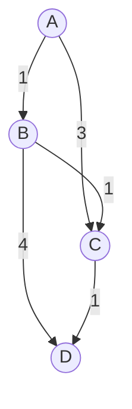

# 최소 신장 트리 (Minimum Spanning Tree)

- Level: Intermediate
- Prerequisites: [Data-Structures/Union-Find.md](../Data-Structures/Union-Find.md), [Data-Structures/Graph-Representation.md](../Data-Structures/Graph-Representation.md), [Algorithms/Sorting.md](Sorting.md)
- Status: Draft
- Reviewed-by: -
- Depth: Deep-dive (자기완결)

---

## 개념 (Concept)

MST는 연결된 가중 무방향 그래프에서 **모든 정점을 사이클 없이 연결하면서 간선 합이 최소**인 부분 그래프다. 정점 $V$ 개면 항상 정확히 $V-1$ 개 간선. 크루스칼·프림·보루프카가 대표.

## 직관 (Intuition)

여러 도시를 도로로 모두 잇되 공사비를 최소화한다. 모든 쌍을 직접 안 이어도 전체가 하나로 연결되기만 하면 된다. "전부 연결 + 낭비 없는 최소 비용"의 균형. 크루스칼은 *싼 간선부터*, 프림은 *한 정점에서 나무를 키워* 같은 답에 도달한다.



## 이론 (Theory)

### 1. 정당성: cut property와 cycle property

- **컷 속성**: 정점을 두 집합으로 가르는 어떤 컷이든, 컷을 가로지르는 **가장 가벼운 간선은 어떤 MST에 포함**된다. (교환 논법: 그 간선을 포함하지 않는 MST가 있다면, 컷을 가로지르는 더 무거운 트리 간선과 바꿔 합을 줄일 수 있어 모순.)
- **사이클 속성**: 어떤 사이클에서 **가장 무거운 간선은 어떤 MST에도 없다**.

두 속성이 그리디(크루스칼/프림)의 매 선택을 정당화한다.

### 2. 세 알고리즘

| 알고리즘 | 전략 | 자료구조 |
|---|---|---|
| 크루스칼 | 간선 오름차순, 사이클 안 만들면 채택 | [유니온-파인드](../Data-Structures/Union-Find.md) |
| 프림 | 한 정점에서 트리에 닿는 최소 간선 반복 추가 | [최소 힙](../Data-Structures/Heap.md) |
| 보루프카 | 각 컴포넌트의 최소 간선 동시 채택, 반복 | DSU, 병렬화 용이 |

크루스칼은 간선 중심(희소에 유리), 프림은 정점 중심(밀집에 유리). **간선 가중치가 모두 다르면 MST는 유일**하다.

## 구현 (Implementation)

```python
def kruskal(n, edges):                  # edges: (w, u, v)
    parent = list(range(n))
    def find(x):
        while parent[x] != x:
            parent[x] = parent[parent[x]]; x = parent[x]
        return x
    edges.sort()                        # 가중치 오름차순이 핵심
    total, chosen = 0, []
    for w, u, v in edges:
        ru, rv = find(u), find(v)
        if ru != rv:                    # 사이클 아니면 채택
            parent[ru] = rv; total += w; chosen.append((u, v, w))
    return total, chosen

print(kruskal(4, [(1,0,1),(3,0,2),(1,1,2),(4,1,3),(1,2,3)]))
# (3, [(0, 1, 1), (1, 2, 1), (2, 3, 1)])
```

## 복잡도 (Complexity)

| 알고리즘 | 시간 | 비고 |
|---|---|---|
| 크루스칼 | $O(E\log E)$ | 간선 정렬 지배 |
| 프림(이진 힙) | $O(E\log V)$ | 희소 |
| 프림(배열) | $O(V^2)$ | 밀집에 유리 |
| 보루프카 | $O(E\log V)$ | 병렬/외부 메모리 |

$E\le V^2$ 라 $\log E=O(\log V)$ — 두 로그 항은 같은 차수. 공간 $O(V+E)$. **워크드 예제.** 정렬된 간선 `1(0-1),1(1-2),1(2-3),3(0-2),4(1-3)`: (0-1) 채택, (1-2) 채택, (2-3) 채택 → 3개($V-1$), 합 3. (0-2)·(1-3)은 사이클이라 스킵.

## 응용 (Applications)

- 통신·전력·도로망 최소 비용 연결, 회로/배관 배치.
- 클러스터링(가장 무거운 $k-1$ 간선을 끊어 $k$ 군집), 이미지 분할.
- 근사: 외판원 문제(TSP) **2-근사**(MST를 2번 순회).

## 흔한 오해 (Common Misunderstandings)

- **MST는 두 정점 최단 경로를 보장하지 않는다** — 전체 합 최소일 뿐(그건 [다익스트라](Dijkstra.md)).
- **MST가 항상 유일하지 않다** — 같은 가중치가 있으면 여러 개.
- **방향 그래프엔 그대로 적용 안 됨** — 그건 최소 신장 arborescence(Chu–Liu/Edmonds).
- **크루스칼에서 DSU 없이 매번 사이클 검사하면 느리다** — 효율은 서로소 집합에서.

## TMI

- 가장 오래된 MST 알고리즘은 1926년 **보루프카**가 전력망 설계로 고안 — 크루스칼(1956)·프림(1957)보다 앞선다.
- 프림은 [다익스트라](Dijkstra.md)와 골격이 거의 같다 — 우선순위 큐 키가 "시작점까지 거리"가 아니라 "트리까지 거리".
- MST는 단일 선형(거의) 시간 결정론 알고리즘이 알려져 있지 않은 흥미로운 문제다(Chazelle의 $O(E\,\alpha(E,V))$ 가 최선급).

## 연습 / 확인 문제 (Exercises)

- 프림을 최소 힙으로 구현하고 크루스칼과 합이 같은지 확인하라.
- 가중치가 모두 다를 때 MST 유일성을 cut property로 논증하라.
- 최대 신장 트리를 구하려면 크루스칼을 어떻게 바꾸는지 보여라.
- MST 기반 TSP 2-근사가 왜 2배 이내인지 설명하라.

## 이어서 읽기 (Reading Path)

- 이전: [그리디 알고리즘](Greedy.md)
- 다음: [다익스트라](Dijkstra.md)
- 관련: [유니온-파인드](../Data-Structures/Union-Find.md), [힙](../Data-Structures/Heap.md)

## 참조 (References)

- [Data-Structures/Union-Find.md](../Data-Structures/Union-Find.md)
- [Data-Structures/Graph-Representation.md](../Data-Structures/Graph-Representation.md)
- [Algorithms/Sorting.md](Sorting.md)
- [Reference/Books.md](../Reference/Books.md)
- [Reference/Papers.md](../Reference/Papers.md)
