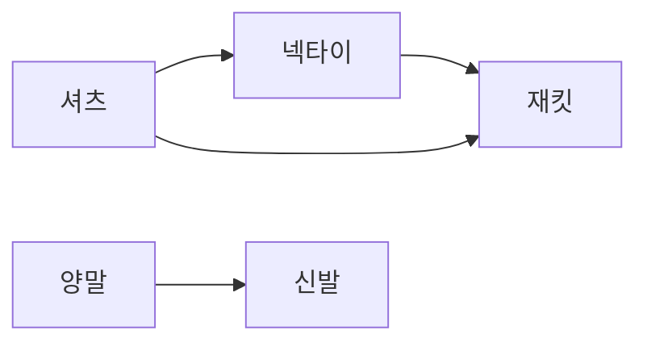

# 위상 정렬 (Topological Sort)

- Level: Intermediate
- Prerequisites: [Algorithms/BFS-DFS.md](BFS-DFS.md), [Data-Structures/Graph-Representation.md](../Data-Structures/Graph-Representation.md)
- Status: Draft
- Reviewed-by: -

---

## 개념 (Concept)

위상 정렬은 **방향 비순환 그래프(DAG)** 의 정점들을, 모든 간선 `u → v`에 대해 `u`가 `v`보다 항상 앞에 오도록 일렬로 나열하는 것이다. "어떤 일을 하기 전에 반드시 끝내야 하는 선행 작업"이 있는 의존 관계를 순서로 푸는 문제다.

## 직관 (Intuition)

수강 과목에 선수 과목이 있을 때, 어떤 순서로 들어야 모든 선수 조건을 어기지 않을까? 옷 입는 순서(양말 → 신발), 빌드 의존성, 작업 스케줄도 같은 구조다. 위상 정렬은 이런 "먼저/나중" 제약을 만족하는 한 줄 순서를 찾아 준다. 사이클이 있으면(서로가 서로의 선행) 그런 순서는 존재하지 않는다.



## 이론 (Theory)

위상 정렬은 **DAG에서만** 존재하며, 보통 여러 개의 유효한 순서가 가능하다. 두 가지 표준 알고리즘이 있다.

| 방법 | 핵심 아이디어 |
|---|---|
| Kahn (BFS 기반) | 진입 차수(in-degree) 0인 정점을 큐에서 꺼내며 제거, 인접 정점의 진입 차수를 감소 |
| DFS 기반 | DFS 후 탈출 순서(post-order)의 역순이 위상 순서 |

Kahn 알고리즘은 사이클 탐지도 겸한다. 모든 정점을 처리하기 전에 큐가 비면(진입 차수 0인 정점이 더 없으면) 사이클이 존재한다는 뜻이다. 즉 위상 정렬에 성공한 정점 수가 전체보다 적으면 그래프에 사이클이 있다.

## 구현 (Implementation)

Kahn 알고리즘:

```python
from collections import deque


def topological_sort(graph, n):
    # graph[u] = u에서 나가는 정점 목록, 정점은 0..n-1
    indeg = [0] * n
    for u in range(n):
        for v in graph[u]:
            indeg[v] += 1

    queue = deque(u for u in range(n) if indeg[u] == 0)
    order = []
    while queue:
        u = queue.popleft()
        order.append(u)
        for v in graph[u]:
            indeg[v] -= 1
            if indeg[v] == 0:
                queue.append(v)

    if len(order) != n:
        raise ValueError("사이클이 존재한다")   # DAG가 아님
    return order


graph = {0: [1, 2], 1: [3], 2: [3], 3: []}
print(topological_sort(graph, 4))   # [0, 1, 2, 3] (한 가지 유효 순서)
```

## 복잡도 (Complexity)

| 표현 | 시간 | 공간 |
|---|---|---|
| 인접 리스트 | `O(V + E)` | `O(V)` |
| 인접 행렬 | `O(V^2)` | `O(V)` |

`V`는 정점 수, `E`는 간선 수다. 각 정점과 간선을 한 번씩 처리한다.

## 응용 (Applications)

- 작업 스케줄링, 빌드 시스템(Make, 패키지 의존성)
- 강의 선수 과목 순서 결정
- 스프레드시트 셀 재계산 순서
- DAG에서의 DP 진행 순서 결정

## 흔한 오해 (Common Misunderstandings)

- 위상 정렬 결과는 유일하지 않다. 제약을 만족하는 순서가 여러 개일 수 있다.
- 무방향 그래프나 사이클이 있는 방향 그래프에는 위상 순서가 **존재하지 않는다.** DAG 조건이 필수다.
- "정렬"이라는 이름 때문에 값 크기 정렬과 혼동하기 쉽다. 위상 정렬은 값이 아니라 **의존 순서**를 정렬한다.
- Kahn에서 큐 대신 우선순위 큐를 쓰면 사전순으로 가장 빠른 위상 순서를 얻을 수 있지만, 그러면 복잡도가 `O(V + E log V)`로 늘어난다.

## TMI

- DFS 기반 위상 정렬에서 "탈출 시각 역순"이 정답이 되는 것은, 한 정점이 의존하는 모든 정점이 자신보다 먼저 탈출하기 때문이다.
- 위상 정렬은 사이클 탐지 도구로도 자주 쓰인다. 정렬에 실패하면 곧 사이클이 있다는 뜻이다.
- 빌드 도구가 "circular dependency detected" 오류를 내는 것이 바로 위상 정렬 실패다.

## 연습 / 확인 문제 (Exercises)

- DFS 기반 위상 정렬을 구현하고 Kahn 결과와 비교하라.
- 주어진 방향 그래프에 사이클이 있는지 위상 정렬로 판별하는 함수를 작성하라.
- 선수 과목 목록이 주어질 때 수강 가능한 순서를 출력하라(불가능하면 그 사실을 보고).

## 이어서 읽기 (Reading Path)

- 이전: [BFS / DFS](BFS-DFS.md)
- 다음: [최단 경로](Dijkstra.md), [강한 연결 요소](SCC.md)
- 관련: [그래프 표현](../Data-Structures/Graph-Representation.md)

## 참조 (References)

- [Algorithms/BFS-DFS.md](BFS-DFS.md)
- [Data-Structures/Graph-Representation.md](../Data-Structures/Graph-Representation.md)
- [Math/Discrete/Graph-Theory.md](../Math/Discrete/Graph-Theory.md)
- [Reference/Books.md](../Reference/Books.md)
- [Reference/Courses.md](../Reference/Courses.md)
